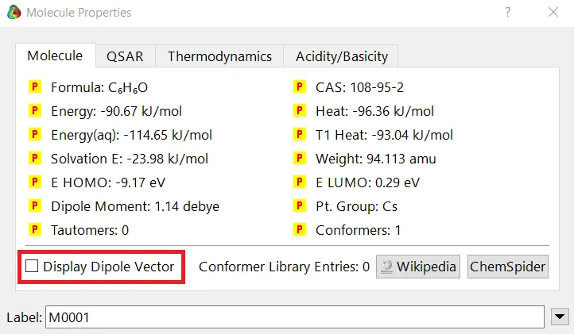
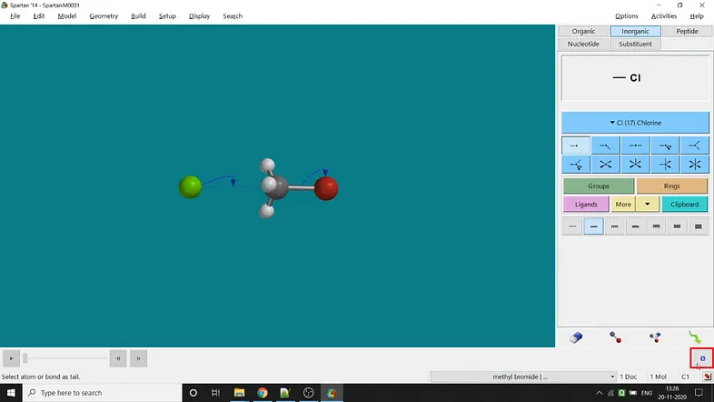
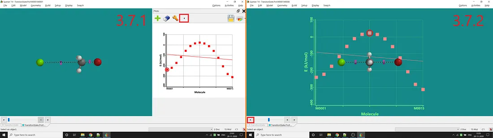

import DiffProperties from "./figures/different-properties-value-studying-procedure.gif";
import DifferentSurface from "./figures/different-types-of-surface.gif"
import BondDistanceConstrain from "./figures/getting-spectral-plots.gif"
import SpectralPlots from "./figures/getting-spectral-plots.gif"
import EntireKinetic from "./figures/entire-kinetic-study-process.gif"

_This is the continuation of the Spartan series, and it’ll be the last one. In Part-1, I have talked about the essential features that Spartan provides us. Also, I have discussed how to build molecules in Spartan (both in 2D and 3D formats), all types of models and output files available in Spartan. Furthermore, I have discussed bond breaking-bond making and energy optimisation. For those, who didn’t check the Part-1 yet, please read it before going further —_

[//]: <> (REFERENCE ARTICLE PART STARTS HERE)

 

<a
class="refLink"
href="/tutorial/blogs/2020/basic-introduction-to-computational-chemistry-tools-spartan-part-1">

  

    

      <h4>Basic Introduction to Computational Chemistry Tools: Spartan (Part-1)</h4>
      <h6>Although much of its discovery process is descriptive and
qualitative, chemistry is fundamentally quantitative...</h6>
    

    

      

      
      

   

  

</a>

 

[//]: <> (REFERENCE ARTICLE PART ENDS HERE)

In Part-2, I have discussed different types of parameters measuring available in Spartan. Also, I have talked about different types of constraining methods available in Spartan. For those, who checked the Part-1 but didn’t check the Part-2 yet, please read it before going further —

[//]: <> (REFERENCE ARTICLE PART STARTS HERE)

 

<a
class="refLink"
href="/tutorial/blogs/2020/basic-introduction-to-computational-chemistry-tools-spartan-part-2">

  

    

      <h4>Basic Introduction to Computational Chemistry Tools: Spartan (Part-2)</h4>
      <h6>This is the continuation of Spartan - Part 1. In the Part-I, I have talked about the essential features that Spartan...</h6>
    

    

      

      
      

   

  

</a>

 

[//]: <> (REFERENCE ARTICLE PART ENDS HERE)

In the last part, i.e. in Part-3, I will discuss studies about different simple property values such as energy, heat, point group, weight etc. Also, I’ll show how to get different spectra (mainly IR and Raman spectra) and calculate simple kinetic properties.

⁕ ⁕ ⁕

## Step Towards Advanced Level Calculations:
#### Different Properties Study: 
We can quickly study different parameters for a molecule in Spartan. I have calculated for a _**Phenol**_ molecule. Now, I have calculated its properties for -88 (result in Figure 3.1), and for the method, I have used the [**semi-empirical _PM3_ method**](https://en.wikipedia.org/wiki/PM3_(chemistry)) (for faster calculation). For phenol, the molecule is **neutral**, and the number of the **unpaired electron is zero**. We can set all these methods and parameters by clicking the _Calculations option_ under the _Setup option_. After setting all the parameters, we have to click _submit_, following the file's saving procedure. It will take some time for saving(for [PM3](https://en.wikipedia.org/wiki/PM3_(chemistry)), it’s significantly less, but if you use the better method like [DFT](https://en.wikipedia.org/wiki/Density_functional_theory) or [MP2](https://en.wikipedia.org/wiki/M%C3%B8ller%E2%80%93Plesset_perturbation_theory), it will require much more time). However, after saving, we can see the molecule's general properties by clicking the _Properties option_ under the _Display option_ (Figure 3.2). Now, the availability of the different types of properties depends on the method one chooses.

**Figure 3.1:** Different properties value for Phenol molecule after using PM3 semi-empirical method 

#### Measuring Angle: 
One can measure the angle created by 3 atoms in a molecule by the _Bond Angle option_ under the _Geometry option_. The 3 atoms can be bonded or non-bonded. The bond angle can be measured in the optimized state or the unoptimized state. Here also, the bond angle between those specific atoms can be seen at the bottom-right corner (Figure 2.2) of the window and labelling on the atoms can also be seen.

  

**Figure 3.2:** Different properties value studying procedure

**Small Tip:** If you want to know the molecule's dipolar direction, you can click the bottom-left checkbox of the properties display window (marked in red colour in Figure 3.1). Finally, click on the crossbar to view your molecule with the dipole vector (Figure 3.3).

#### Surfaces:
The surface signifies electronic distribution in a molecule. Surfaces can be of different types, such as _**HOMO, LUMO, density, electrostatic potential map, local ionisation potential**_ etc. One can find the _Surfaces option_ under both the _Setup_ and the _Display options_. However, at first, there will be no option available. One has to click the add button to add different surfaces and then check the checkbox corresponding to that specific type of surface. In my example, I have shown only one kind of surface (mainly used one), i.e. _**electrostatic potential map**_ (Figure 3.4). After selecting the surface (by double-clicking on that), if one checks the _Properties_ (under the _Display_ section), he will be able to see various properties and options related to the _surface_. One can select the colour range manually or reset that to set automatically according to their energies. However, we can also change our surface view (**Dot**, **Mesh**, **Solid** or **Transparent**) by changing _style_ from that _properties option_ or simply from the _style option_ available on the bottom-right side of the screen (Figure 3.4).

  

**Figure 3.4:** Different types of surface in Sparta

#### Spectra:
Spectra is one of the essential things for understanding the structures and properties of a molecule. We can easily visualise the expected spectral plot using Spartan. I have used the [HF method](https://en.wikipedia.org/wiki/Hartree%E2%80%93Fock_method) with a [3–21G basis set](https://gaussian.com/basissets/) for simplifying the calculation and saving time. If I used the [PM3 semi-empirical method](https://en.wikipedia.org/wiki/PM3_(chemistry)), it would not give all type of spectrum and also, if I would use DFT or MP2 method, it would take much more time. However, this [HF method](https://en.wikipedia.org/wiki/PM3_(chemistry)) also took almost 2–3 mins (depends on your computer speed) for me. So, I cut out the time taken for saving the file. At first, one has to select the method by choosing the _Calculations option_ under the _Setup option_. Select all types of spectra needed and submit them for saving the file. After completing the saving, one has to select the _Spectra option_ under the _Display option_. One can see **a big green-coloured plus sign option** on the left side of the screen. By clicking that, one can view all the available spectra for that molecule (I have selected _**IR, Raman, 1H-NMR and UV/Vis spectra**_). The next step is only to choose the needed spectra, and the spectra will be visible on the screen (Figure 3.5). Also, one can zoom in or zoom out for better viewing.

  

**Figure 3.5:** Getting spectral plots

#### Kinetics Study:
Studying kinetics for a reaction is the most discussed topic in the field of theoretical and computational studies. The energy profile diagram corresponding to a reaction is fundamental in theoretical studies. I have used the [**semi-empirical PM3 method**](https://en.wikipedia.org/wiki/PM3_(chemistry)) for faster calculation. Now let’s jump into the procedure. I have used a simple [**SN2**](https://en.wikipedia.org/wiki/SN2_reaction) reaction (substitution of _bromide ion by chloride ion in **Methyl bromide**_ molecule) for giving an example (Figure 3.8). The whole process is described in Figure 3.8. Now, I’m demonstrating all the steps one by one —

**Step 1:** After drawing Methyl bromide, one has to optimise its energy and then we have to draw the chloride ion. Otherwise, the molecule and chloride ion will rearrange themselves to gain the lowest energy.

**Step 2:** Now, the next step is to draw the transition state. One has to select the _Transition State option_ under the _Search option_ in the **Spartan’14** version (In **Spartan’18**, the _Transition State option_ is available under the option _Build_). For [**SN2**](https://en.wikipedia.org/wiki/SN2_reaction) reaction in Methyl bromide, bromine will leave the molecule as bromide ion and chlorine will attack the molecule as chloride ion and attached with the carbon atom. That’s why _after selecting the transition State option, one has to choose the C — Br bond and then click the Br atom twice for showing the C — Br bond-electron movement towards the Br atom._ To display the chloride ion attack, one has to _select chloride ion first, then carbon atom and finally again chloride ion._ The next step is to click the blue-coloured loop-like sign at the bottom-right corner of the window (marked in Figure 3.6).

**Figure 3.6:** Locking the transition state structure

**Step 3:** Next step is to constrain the bond distance in the time of reaction. For that, select the _Constrain Distance option_ under the _Geometry option_. At first, select the C — Br bond and then constrain by clicking the lock sign (the detailed process in part-1). Next, one has to check the profile option. It’ll give us two textboxes for providing the bond distances at the time of before substitution and after the substitution. I have given _standard C — Br bond length (1.935 Å) to the bond length after substitution (5 Å, assuming there will be no interaction between C and bromide ion in this distance)._ One has to give the number of steps, i.e. points in the energy profile diagram (I have taken 15). Also, one has to constrain the C — Cl bond distance. I have given the _bond length before substitution (5 Å, assuming there will be no interaction between C and chloride ion in this distance) to standard C — Cl bond length (1.775 Å)._ You can see the number of steps that will be automatically set for this (15, same as previous).

**Step 4:** Next step is to run the calculation by selecting the _Calculations option_ under the _Setup option_. Select **Energy Profil**e in the first option. Now you can use any method according to your requirement. I have used the [**semi-empirical PM3 method**](https://en.wikipedia.org/wiki/PM3_(chemistry)). It’ll not give that much satisfactory result. I have used only for faster calculation and demonstration purpose. Set the whole specie's charge _(charge is -1 for my example)_ and the total number of unpaired electrons _(total number of unpaired electrons, for my example, is 0)_. Submit the values for saving and calculating the parameters.

**Step 5:** After saving, one has to select the _Spreadsheet option_ under the _Display option_ (Spartan’14). Click the _Add option_ and then **E (stands for energy)** option under the _Columns option_. Then click _Apply_ and finally _Ok_. Now you will be able to see all the energy points in the spreadsheet.

**Step 6:** The last step is to add energy to the Y-axis. For that, one has to select the _Plots option_ under the _Display option_ (in Spartan’14). Next, one has to click the big green-coloured plus sign button for adding energy as the Y-axis (by selecting **E** in the opened up tab and clicking _Add_). Now you can see the plot like Figure 3.7.1. You can also add the plot on the molecule to see the changes at the reaction time by clicking the arrow button marked in Figure 3.7.1. You can also move back and forth along the points using the arrow button marked in Figure 3.7.2.

**Figure 3.7:** Standard plot after adding E as Y-axis (3.7.1) and Plot w.r.t molecular structure change at the time of reaction (3.7.2)

  

**Figure 3.2:** The entire kinetics study process

## Note:
This is the last part of my Spartan series. I have only demonstrated all the essential features provided by Spartan. However, one can use it for better calculations like DFT or MP2 methods.

## References:
- • [Spartan Manual](https://dasher.wustl.edu/chem478/software/spartan-manual.pdf)
- • [PM3 (Wikipedia)](https://en.wikipedia.org/wiki/PM3_(chemistry))
- • [Hartree-Fock (Wikipedia)](https://en.wikipedia.org/wiki/Hartree%E2%80%93Fock_method)
- • [Basis set](https://gaussian.com/basissets/)
- • [DFT (Wikipedia)](https://en.wikipedia.org/wiki/Density_functional_theory)
- • [MP2 (Wikipedia)](https://en.wikipedia.org/wiki/M%C3%B8ller%E2%80%93Plesset_perturbation_theory)
- • [SN2 reaction (Wikipedia)](https://en.wikipedia.org/wiki/SN2_reaction)

⁕ ⁕ ⁕

Thank you for reading.

I hope you found this **_“Basic Introduction to Computational Chemistry Tools: Spartan (Part-3)”_** article helpful. Please share if you like and leave any comment to let me know your thoughts.

You can connect with me on <i><b><a href="https://www.linkedin.com/in/aritraroy24/" target="_blank">LinkedIn</a></b></i>, <i><b><a href="https://twitter.com/royaritra24" target="_blank">Instagram</a></b></i>, <i><b><a href="https://twitter.com/aritraroy24" target="_blank">Twitter</a></b></i> or <i><b><a href="https://github.com/aritraroy24" target="_blank">GitHub</a></b></i>.

