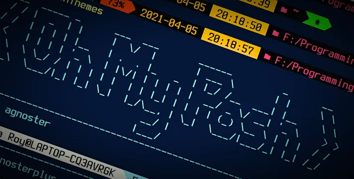
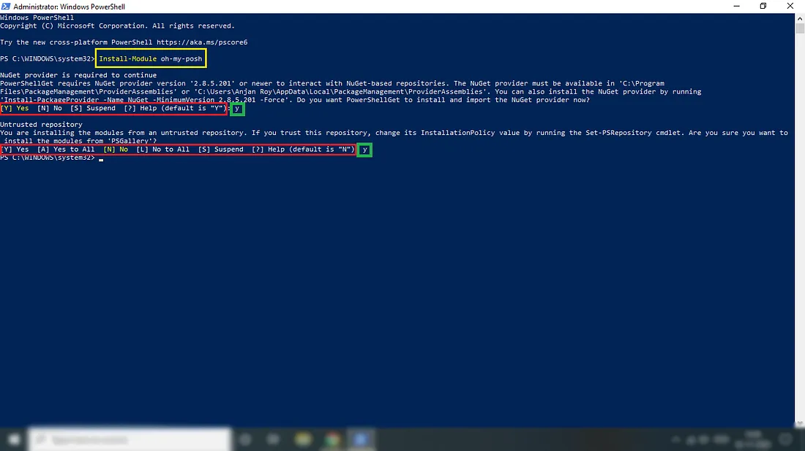
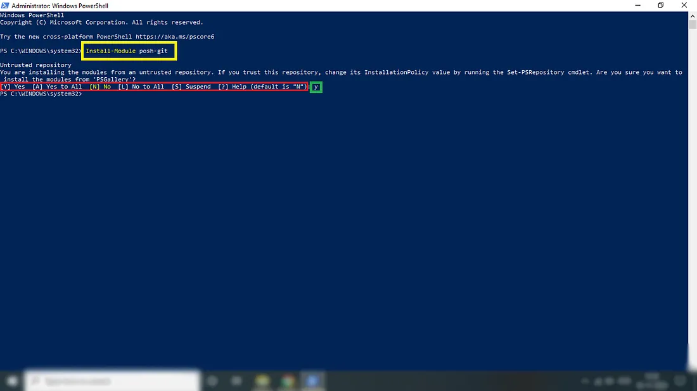
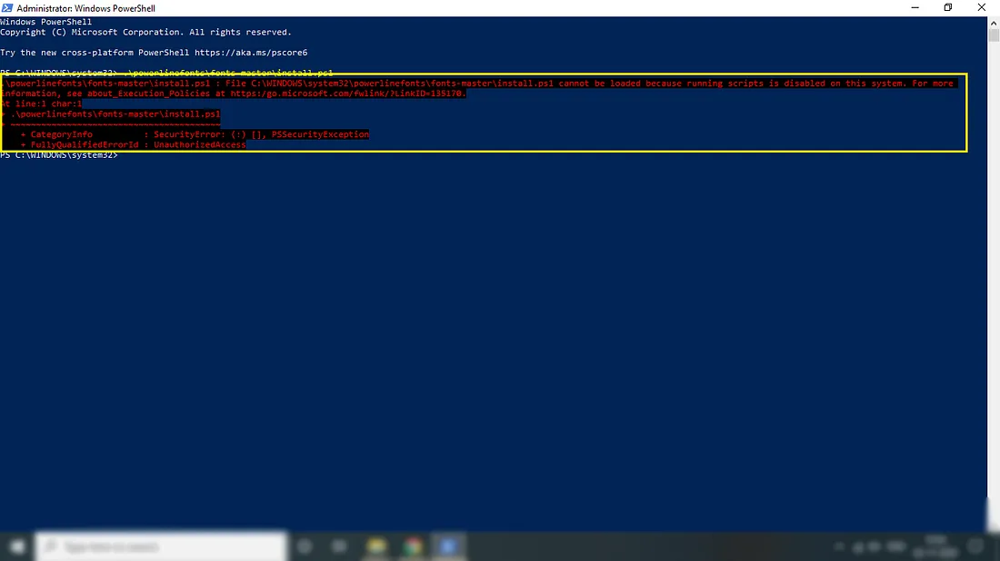
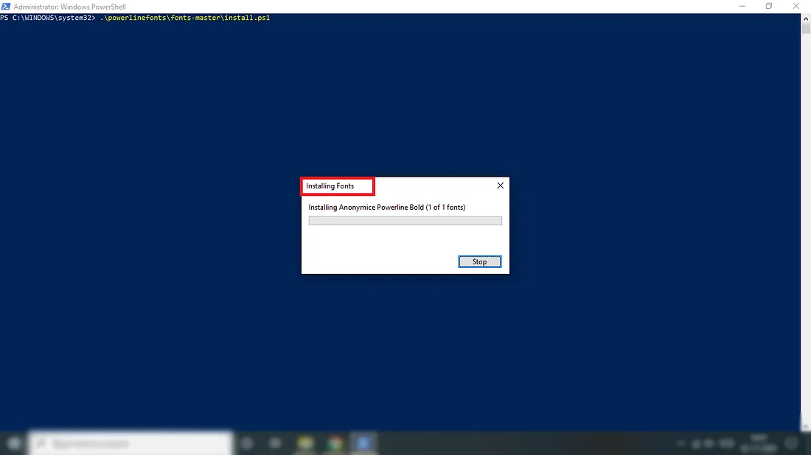
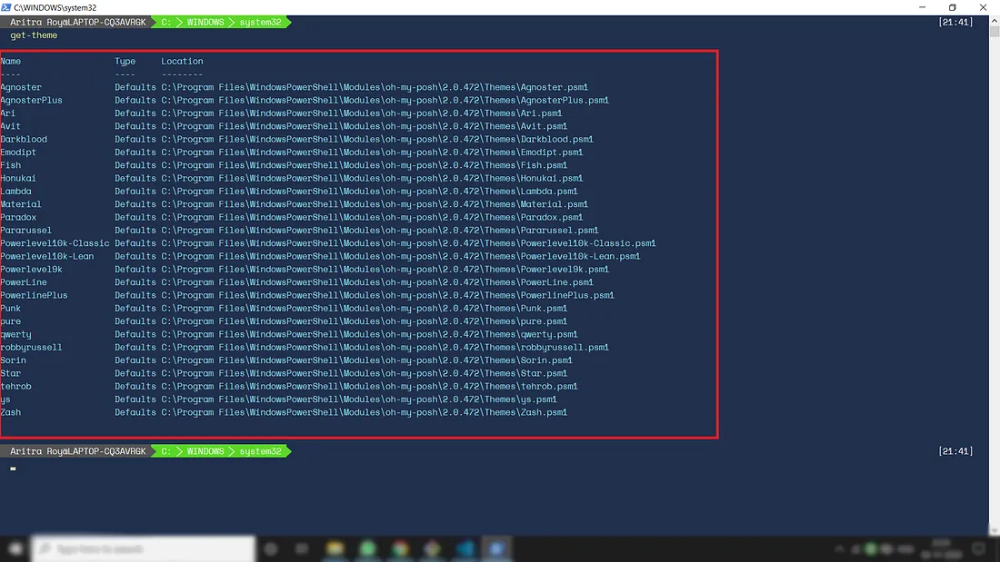
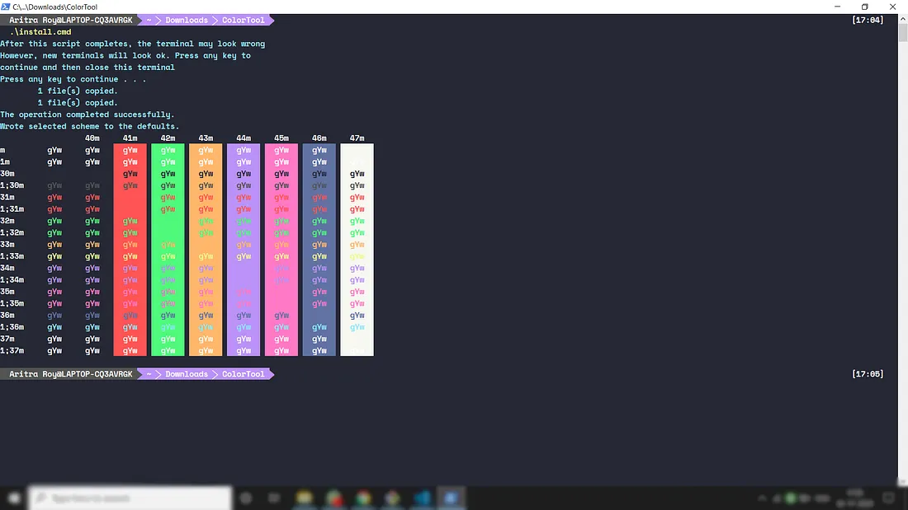
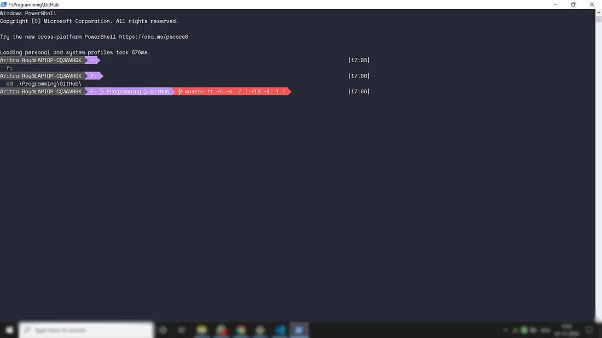

import SetFontFromConsole from "./figures/setting-the-font-from-powershell-console.gif";

<div>

_<span style="font-size:30px;">F</span>or an awesome programming experience, customizing the working environment is the most wanted thing for a programmer. For that reason, every IDE provides different themes. But those, who work using the Windows PowerShell terminal, <a href="https://github.com/JanDeDobbeleer/oh-my-posh" target="_blank">oh-my-posh</a> and <a href="https://github.com/dahlbyk/posh-git" target="_blank">posh-git</a> (recommended for Git users) are definitely the right and easy choice._

**oh-my-posh** is a PowerShell module that helps to decorate our PowerShell window using different in-built and self-customized themes. **posh-git** is a PowerShell module that integrates _Git_ and _PowerShell_ by providing \_Git status summary informatio_n that can be displayed in the PowerShell prompt, e.g. — posh-git also provides tab completion support for common git commands, branch names, paths and more. However, those who don’t use Git can use only oh-my-gish for their customised terminal window for a lovely attractive working environment.

<div class="biggerParagraph">
  𝐔𝐏𝐃𝐀𝐓𝐄 :𝙒𝘼𝙄𝙏✋✋✋… 𝙤𝙝-𝙢𝙮-𝙥𝙤𝙨𝙝 𝙑𝟑 𝙄𝙨 𝙊𝙪𝙩. 𝙋𝙡𝙚𝙖𝙨𝙚 𝙍𝙚𝙖𝙙 𝙈𝙮 𝙇𝙖𝙩𝙚𝙨𝙩 𝘼𝙧𝙩𝙞𝙘𝙡𝙚 𝙤𝙣 𝙩𝙝𝙚
  𝙤𝙝-𝙢𝙮-𝙥𝙤𝙨𝙝 𝙈𝙤𝙙𝙪𝙡𝙚 𝙐𝙨𝙞𝙣𝙜 𝙩𝙝𝙚 𝙁𝙤𝙡𝙡𝙤𝙬𝙞𝙣𝙜 𝙇𝙞𝙣𝙠. 𝙏𝙝𝙚𝙣 𝘾𝙤𝙢𝙚 𝘽𝙖𝙘𝙠 𝘼𝙜𝙖𝙞𝙣 𝙛𝙤𝙧 𝙏𝙝𝙚
  𝙥𝙤𝙨𝙝-𝙜𝙞𝙩 𝙋𝙖𝙧𝙩.
</div>

[//]: <> (REFERENCE ARTICLE PART STARTS HERE)

<div> <div>

<a
class="refLink"
href="/tutorial/blogs/2021/oh-my-posh-v3">

  <div class="refContainer">
    <div class="refLeft">
      <h4>Oh-My-Posh V3 is Out in the Market🎉🎉🎉</h4>
      <h6>Terminal Customisation Is Now Hassle-Free</h6>
    </div>
    <div class="refRight">
      <p>
      
      </p>
   </div>
  </div>
</a>

</div> </div>

[//]: <> (REFERENCE ARTICLE PART ENDS HERE)

<p class="sectionDivider">⁕ ⁕ ⁕</p>

## Requirements

Basically, we don’t need any extra type of tool for installing these modules. The only two requirements are —

- • Windows PowerShell
- • Administrator Mode

## Process

#### _Step 1: Installation of modules:_

This step is mainly divided into two parts, (1) Installation of oh-my-posh, (2) installation of posh-git. For both installations, I’m giving two possible methods using a simple line of command or manually. For beginners, I’ll recommend them for going with the command line procedure. Now, if you are not a programmer or don’t use Git, then you don’t need to install posh-git. If you use Git, then I’ll highly recommend you for installing posh-git.

<br></br>

##### (1) Installation of oh-my-posh:

For installing oh-my-posh one can type the following code in the PowerShell terminal window,

```
Install-Module oh-my-posh
```

One can also install it manually from the following URL,

```
https://github.com/JanDeDobbeleer/oh-my-posh
```

While installation computer can ask you permission for installing a higher version of NuGet. One can simply press enter (default selection is “yes”) or can type “y” and then press enter. Then, one has to give another permission for installing modules from an untrusted repository. Don’t worry, it’ll not affect your computer. Simply type “y” and press enter for installation (please be sure here you have to write “y” as the default selection is “n” for this process)[Figure 1].

<div><div>



<sup>**Figure 1:** Installation of oh-my-posh</sup>

</div></div>

##### [2] Installation of posh-git:

For installing posh-git one has to type the following line of code in the PowerShell terminal window,

```
Install-Module posh-git
```

Another way of installation is a manual one. For that, one needs to use the following URL —

```
https://github.com/dahlbyk/posh-git
```

For this installation also, one has to permit installing modules from an untrusted repository. Simply type “y” and press enter for installation (please be sure here you have to write “y” as the default selection is “n” for this process)[Figure 1.2].

<div><div>



<sup>**Figure 2:** Installation of posh-git</sup>

</div></div>

#### _Step 2: Setting some cool fonts:_

Now, let’s download some cool fonts for our PowerShell which windows supported. For that, one has to perform the following several steps —

[1] Typing the following one-line command in the PowerShell terminal window,

```
Invoke-WebRequest -Uri 'https://github.com/powerline/fonts/archive/master.zip' -OutFile .\powerlinefonts.zip
```

[2] The above command downloads different fonts supported by Windows PowerShell in zip format. The next step is extracting the fonts from the **zip** file by typing the following command in the terminal —

```
Expand-Archive .\powerlinefonts.zip
```

[3] Now we have to install all the fonts by using the following command —

```
.\powerlinefonts\fonts-master\install.ps1
```

Now, probably you’ll get an error like shown in Figure 3,

<div><div>



<sup>**Figure 3:** Probable error while installing custom fonts</sup>

</div></div>

Now, one will have to tell the [Execution Policy](https://ss64.com/ps/set-executionpolicy.html) for moving forward. _We will need to set to Execution Policy to **Bypass**, so that we may run this script. So, we have to type **Set-ExecutionPolicy Bypass** in the terminal and run the **.\powerlinefonts\fonts-master\install.ps1** command again_. Now, one will be able to see a window showing _‘Installing Fonts’_ [Figure 4] —

<div><div>



<sup>**Figure 4:** A window showing fonts installation</sup>

</div></div>

[4] now we can clean up the downloaded zip file using two following commands —

```
Remove-Item .\powerlinefonts.zip
Remove-Item .\powerlinefonts -Recurse
```

[5] The last step is setting the font for PowerShell. Right-click on the PowerShell window top-bar for more options, go to _Properties_ and then to _Font_. Select any font from the available options and click _OK_ [Figure 5].

<div><div>


<br></br>

<sup>**Figure 5:** Setting the font from PowerShell console</sup>

</div></div>

#### _Step 3: Importing modules and setting theme:_

After setting the font, we have to import the two modules using the following commands —

```
Import-Module oh-my-posh
Import-Module posh-git
```

As you are all set up, you can see all the themes using the get-theme command [Figure 6].

<div><div>



<sup>**Figure 6:** Getting all the available themes</sup>

</div></div>

Now, you can set any theme as you like using the set-theme [theme-name] command like following,

```
set-theme Agnoster
```

But till now this theme is not set yet as permanent. For that, type the following two commands in the terminal —

```
if (!(Test-Path -Path $PROFILE )) { New-Item -Type File -Path $PROFILE -Force }

notepad $PROFILE
```

Now, it’ll open a notepad window. Please add these 3 lines to the file and save it.

```
Import-Module oh-my-posh
Import-Module posh-git
Set-Theme Agnoster
```

These will set the Agnoster theme permanently for Windows PowerShell.

#### _Step 4: Setting execution policy to default:_

After setting the theme successfully set your execution policy to default by using the following command —

```
Set-ExecutionPolicy Default
```

<p class="sectionDivider">⁕ ⁕ ⁕</p>

It’s all set up. But if you want to set your background colour and also the other colours of the theme manually (other than colours provided by PowerShell), there is a secret procedure. For that, you have to download the **Dracula Theme for PowerShell** from [_**here**_](https://raw.githubusercontent.com/waf/dracula-cmd/master/dist/ColorTool.zip) after doing all the previous steps. Unzip the folder, navigate to inside the folder _**ColoTool**_ and run _**install.cmd**_. Now your terminal should look like Figure 7,

<div><div>



<sup>**Figure 7:** Terminal after running **install.cmd**</sup>

</div></div>

Now close the PowerShell window and start again. This time the PowerShell window should look like Figure 8 —

<div><div>



<sup>**Figure 8:** PowerShell window after installing Dracula theme</sup>

</div></div>

If you want to set your colour, then do the necessary changes in **RGB colour percentages in Dracula-ColorTool.itermcolors** file situated inside the _install_ folder under the _ColorTool_ folder.

After setting your favourite colour, please again set the font as it’ll be unset after installing the Dracula theme. Have fun with your customized PowerShell terminal.

## Note

- • All available fonts do not work properly in the terminal. Sometimes you can see unsupported signs (e.g. — git sign etc.). If you encounter such type of error, please set a different font using trial and error method. You’ll be all set.<br></br>
- • You must do all the operations in Administrator Mode. Otherwise, you’ll end up with thousands of errors.

## References

- • [How to install powerline fonts in windows (Medium)](https://medium.com/@slmeng/how-to-install-powerline-fonts-in-windows-b2eedecace58)<br></br>
- • [Spice up your powershell prompt (YouTube)](https://www.youtube.com/watch?v=3Q5tOjdqysg&t=4s)<br></br>
- • [posh-git](https://github.com/dahlbyk/posh-git)<br></br>
- • [oh-my-posh](https://github.com/JanDeDobbeleer/oh-my-posh)<br></br>
- • [Dracula theme](https://github.com/dracula/powershell)<br></br>

<p class="sectionDivider">⁕ ⁕ ⁕</p>

<div class="citationBlockquote">
Thank you for reading.

I hope you found this **_“Customize Your Windows PowerShell With oh-my-posh & posh-git”_** article helpful. Please share if you like and leave any comment to let me know your thoughts.

You can connect with me on <i><b><a href="https://www.linkedin.com/in/aritraroy24/" target="_blank">LinkedIn</a></b></i>, <i><b><a href="https://twitter.com/royaritra24" target="_blank">Instagram</a></b></i>, <i><b><a href="https://twitter.com/aritraroy24" target="_blank">Twitter</a></b></i> or <i><b><a href="https://github.com/aritraroy24" target="_blank">GitHub</a></b></i>.

</div>

</div>
