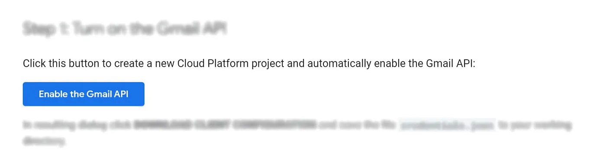
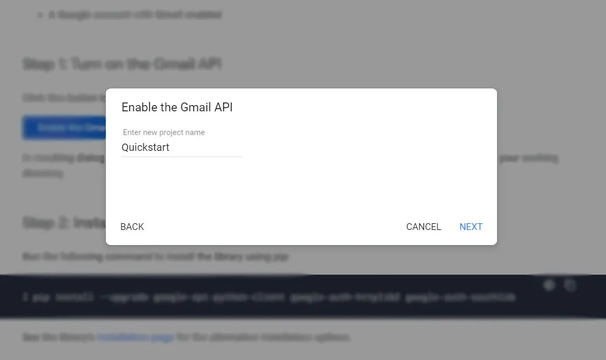
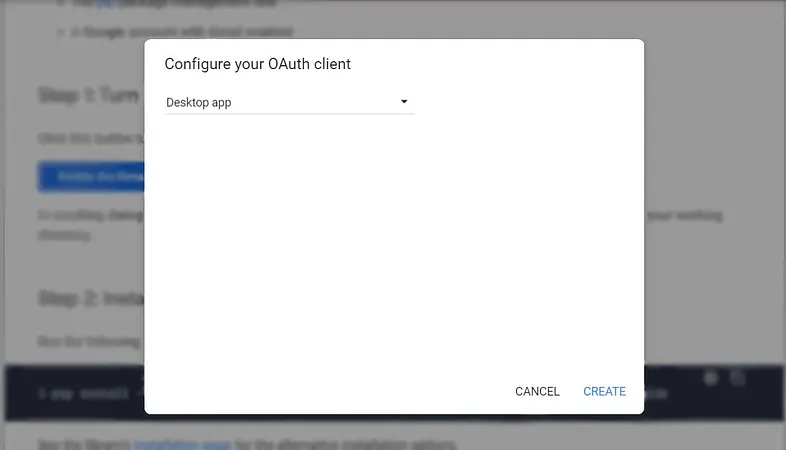
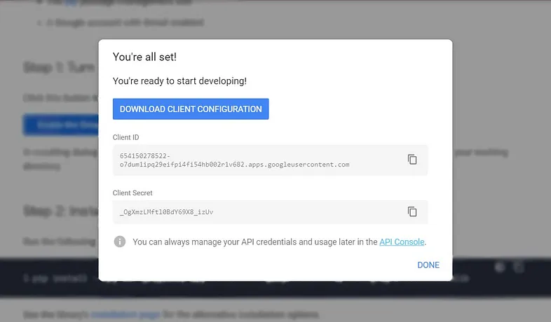
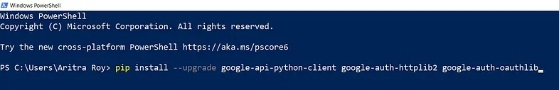
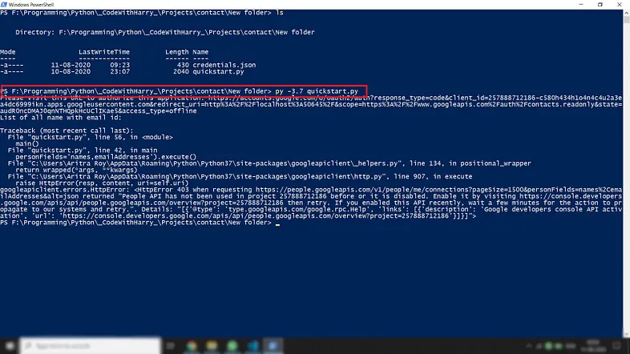
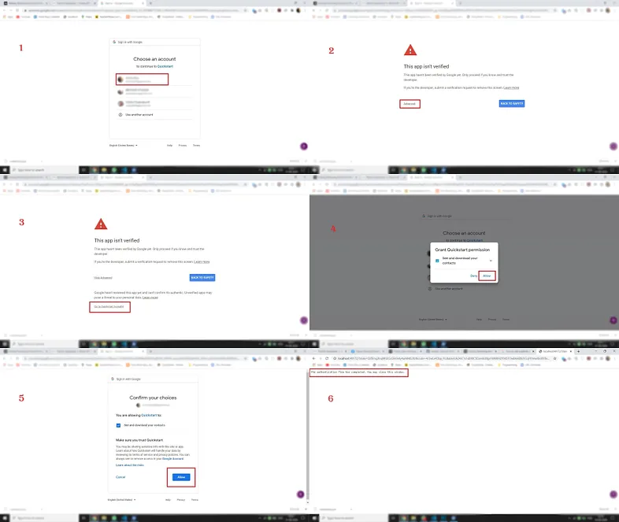
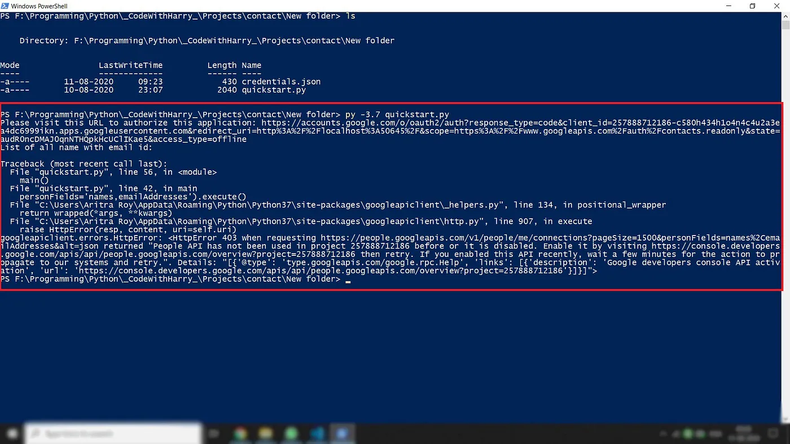
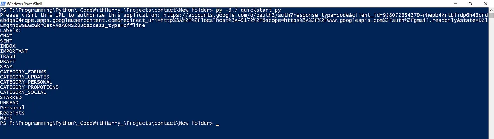
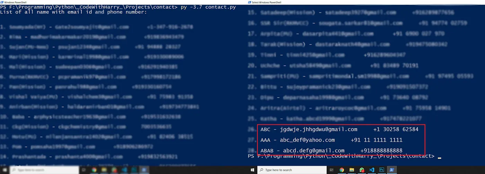

<div>

_<span style="font-size:30px;">T</span>hough <a href="https://en.wikipedia.org/wiki/Guido_van_Rossum" targe="_blank">Guido van Rossum</a> has created <a href="https://www.python.org/" target="_blank">python</a> as a hobby project in the 90’s decade, it has become the most popular language now. Due to its ability to work in various fields and easy syntax, python is now used in Big-Data Analysis, ML & AI, Deep-learning, image-processing, as well as in web development, game development, and so on. Moreover, it has plenty of libraries that one can use to easily and quickly complete the task._

Receiving the phone no and email id can be obtained from Google contact by using their API service. To access one’s google contact, we need that particular user’s permission via the API access level. Here ‘Gmail API’ comes to rescue us easily. Though Google provides two more API, aka <a href="https://developers.google.com/contacts/v3" target="_blank">Contact API version 3.0</a>(stopped working from June 15, 2021 ) and <a href="https://developers.google.com/gmail/api/quickstart/python#step_1_turn_on_the" target="_blank">People API</a>, from my point of view, the <a href="https://developers.google.com/gmail/api" target="_blank">‘Gmail API’</a> seems to be a lot easier to do the job.

## Requirements
We’ve used python to fetch the phone no and email id from Google contacts. For this, the followings are required —

- • <a href="https://www.python.org/downloads/" target="_blank">Python 3.x</a>
- • The <a href="https://pypi.python.org/pypi/pip" target="_blank">pip</a> package management tool
- • A Google account with Gmail enabled

## Process
#### _Step 1: Turning on the Gmail API_
[1] Go to the link below to enable the Gmail API-
[Link to enable Gmail API](https://developers.google.com/gmail/api/quickstart/python#enable_the_api)
<br></br>

<div><div>



<sup>**Figure 1:** Turning on the Gmail API</sup>

</div></div>

[2] Then, one will need to provide a project name and click on the ‘Next’ button.

<div><div>



<sup>**Figure 2:** Provide a project name</sup>

</div></div>

[3] The next step is configuring the OAuth client. If one wants to retrieve the data on his computer, he’ll need to set it as the ‘Desktop app’. Otherwise, one can choose his choice according to his requirement and click on the ‘Create’ button.

<div><div>



<sup>**Figure 3:** Configure the OAuth client</sup>

</div></div>

[4] The final step of ‘Enabling Gmail API’ is to download the ‘Client Configuration’. Note that one has to download the ‘Client Configuration’ specifically in the project folder to enable the API successfully.

<div><div>



<sup>**Figure 4:** Download the client configuration</sup>

</div></div>

#### _Step 2: Installing the Google Client Library_
We have to use/install Google Client Library python library to access it. To install it via pip —

```python
pip install --upgrade google-api-python-client google-auth-httplib2 google-auth-oauthlib
```

<div><div>



<sup>**Figure 5:** Installing the Google Client Library</sup>

</div></div>

#### _Step 3: Setting up with code_

<div class="biggerParagraph">
  Sample code given by Google Client
</div>

```python title="SampleCode.py"
from __future__ import print_function
import pickle
import os.path
from googleapiclient.discovery import build
from google_auth_oauthlib.flow import InstalledAppFlow
from google.auth.transport.requests import Request

# If modifying these scopes, delete the file token.pickle.
SCOPES = ['https://www.googleapis.com/auth/gmail.readonly']

def main():
    """Shows basic usage of the Gmail API.
    Lists the user's Gmail labels.
    """
    creds = None
    # The file token.pickle stores the user's access and refresh tokens, and is
    # created automatically when the authorization flow completes for the first
    # time.
    if os.path.exists('token.pickle'):
        with open('token.pickle', 'rb') as token:
            creds = pickle.load(token)
    # If there are no (valid) credentials available, let the user log in.
    if not creds or not creds.valid:
        if creds and creds.expired and creds.refresh_token:
            creds.refresh(Request())
        else:
            flow = InstalledAppFlow.from_client_secrets_file(
                'credentials.json', SCOPES)
            creds = flow.run_local_server(port=0)
        # Save the credentials for the next run
        with open('token.pickle', 'wb') as token:
            pickle.dump(creds, token)

    service = build('gmail', 'v1', credentials=creds)

    # Call the Gmail API
    results = service.users().labels().list(userId='me').execute()
    labels = results.get('labels', [])

    if not labels:
        print('No labels found.')
    else:
        print('Labels:')
        for label in labels:
            print(label['name'])

if __name__ == '__main__':
    main()
```

Please note that the project name(given at the time of enabling Gmail API) and the python file name should be the same. We’ve run the python file from ‘Windows PowerShell’ —

<div><div>



<sup>**Figure 6:** Running the python file from 'Windows Powershell'</sup>

</div></div>

It’ll open a localhost browser window for accessing your Google account(from where the contacts will be retrieved), and the following steps are —

<div><div>



<sup>**Figure 7:** Steps to access the required Google account</sup>

</div></div>

[a] Choosing one Gmail account from where the contacts will be retrieved<br></br>
[b] There’ll be an alert message saying _‘This app isn’t verified’_. The ‘Advanced’ option should be clicked<br></br>
[c] After that _‘Go to Quickstart(unsafe)’_ option should be clicked for further proceeding. Note that the project name will replace this ‘Quickstart’ word if one chooses a different project name while Enabling the Gmail API _(step 1)_.<br></br>
[d] The _‘Allow’_ option should be selected for permitting our application.<br></br>
[e] Again, the _‘Allow’_ option should be selected for allowing our application to see and download our contacts from Google Contacts.<br></br>
[f] After completing all the previous steps, a message saying _‘The authentication flow has completed. You may close this window.’_ It should be shown in the browser window. The browser window can be closed now.<br></br>

After closing the window, if we take a look in the Windows PowerShell, we’ll be able to see that our program has finished all the tasks giving us a message like the following —

<div><div>



<sup>**Figure 8:** Powershell message after completing the authentication flow</sup>

</div></div>

Now, if we run the specific python file from Windows PowerShell, it’ll give a result like below —

<div><div>



<sup>**Figure 9:** Fetched different folder and contact headings printed on the Powershell screen</sup>

</div></div>

Note that it has fetched different folder headings and contact headings only while using the sample code given by the ‘Gmail API Guide’.

<div class="biggerParagraph">
  Code to retrieve Email and Phone No.
</div>

```python title="main.py"
from __future__ import print_function
import pickle
import os.path
from googleapiclient.discovery import build
from google_auth_oauthlib.flow import InstalledAppFlow
from google.auth.transport.requests import Request
import json

# If modifying these scopes, delete the file token.pickle.
SCOPES = ['https://www.googleapis.com/auth/contacts.readonly']

def main():
    """Shows basic usage of the People API.
    Prints the name of the first 10 connections.
    """
    creds = None
    # The file token.pickle stores the user's access and refresh tokens, and is
    # created automatically when the authorization flow completes for the first
    # time.
    if os.path.exists('token.pickle'):
        with open('token.pickle', 'rb') as token:
            creds = pickle.load(token)
    # If there are no (valid) credentials available, let the user log in.
    if not creds or not creds.valid:
        if creds and creds.expired and creds.refresh_token:
            creds.refresh(Request())
        else:
            flow = InstalledAppFlow.from_client_secrets_file(
                'credentials.json', SCOPES)
            creds = flow.run_local_server(port=0)
        # Save the credentials for the next run
        with open('token.pickle', 'wb') as token:
            pickle.dump(creds, token)

    service = build('people', 'v1', credentials=creds)

    # Call the People API
    print('List of all name with email id and phone number:\n')
    results = service.people().connections().list(
        resourceName='people/me',
        pageSize=1500,
        personFields='names,emailAddresses,phoneNumbers').execute()
    connections = results.get('connections', [])
    i=1
    for person in connections:
        names = person.get('names', [])
        emails = person.get('emailAddresses', [])
        phones = person.get('phoneNumbers')

        if names and emails:
            name = names[0].get('displayName')
            email = emails[0]['value']
            phone = phones[0]['value']
            print(f"\n{i}. {name} - {email}     {phone}")
            i+=1

if __name__ == '__main__':
    main()
```

All the steps up to ‘authentication,’ i.e. previously described _process 1_, must be performed. After that, if one runs the above code, that’ll give a result like the following —

<div><div>



<sup>**Figure 10:** Fetched names, email ids, phone numbers associated with that specific Google account</sup>

</div></div>

Note that, All the names, email ids, and phone numbers have been retrieved from ‘Google Contacts’ associated with that Google account.

## Note
- • [One can’t fetch all the emails and phone numbers from Google Contacts if he doesn’t take permission from the user via the API access level.](https://stackoverflow.com/questions/24883509/retrieve-all-contacts-from-gmail-using-python)
- • It is an easy way to retrieve all the email ids and phone numbers from _‘Google contacts’_ without _‘Django’_.
- • One can manipulate the results according to his choice whether to fetch only name-email id or name-phone number or name-both or anything by changing as per his requirement.
- • The output can be used in any further work, such as sending mail using a voice assistant or making a phone call.
- • The ‘Client Configuration’ will be downloaded as credentials.json
- • All the details will be saved in the token.pickle file, and no further retrieving will be occurred if there is no change.
- • All the files should be in the same folder path for the process
- • This project has been done in windows 10. But one can further take it forward for Linux and iOS.

<p class="sectionDivider">⁕ ⁕ ⁕</p>

<div class="citationBlockquote">
Thank you for reading.

I hope you found this **_“Retrieving Email and Phone No. for a Desktop App from Google Contacts using Python and Gmail API”_** article helpful. Please share if you like and leave any comment to let me know your thoughts.

You can connect with me on <i><b><a href="https://www.linkedin.com/in/aritraroy24/" target="_blank">LinkedIn</a></b></i>, <i><b><a href="https://twitter.com/royaritra24" target="_blank">Instagram</a></b></i>, <i><b><a href="https://twitter.com/aritraroy24" target="_blank">Twitter</a></b></i> or <i><b><a href="https://github.com/aritraroy24" target="_blank">GitHub</a></b></i>.

</div>

</div>