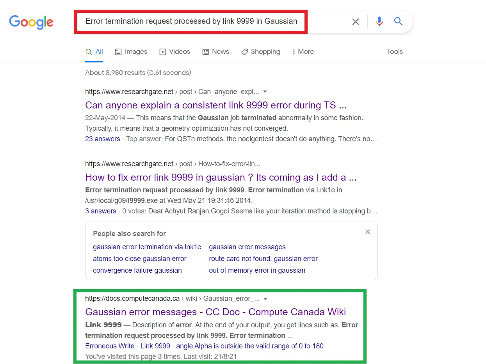
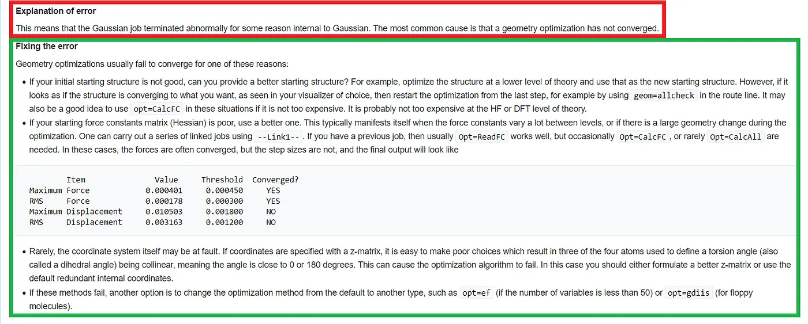
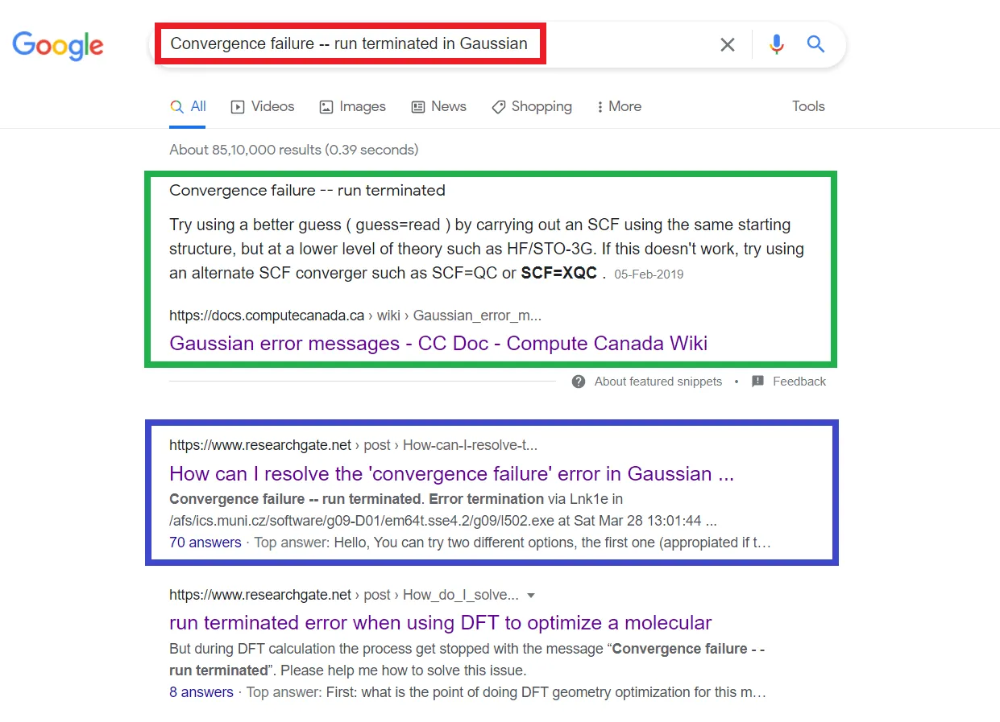
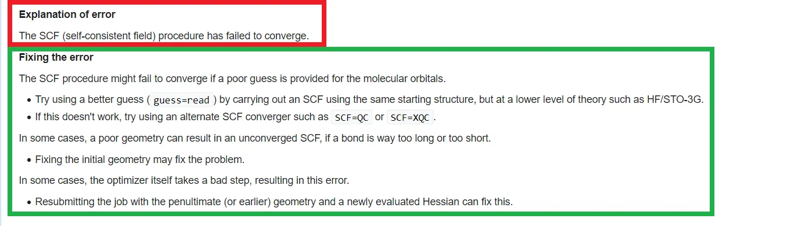
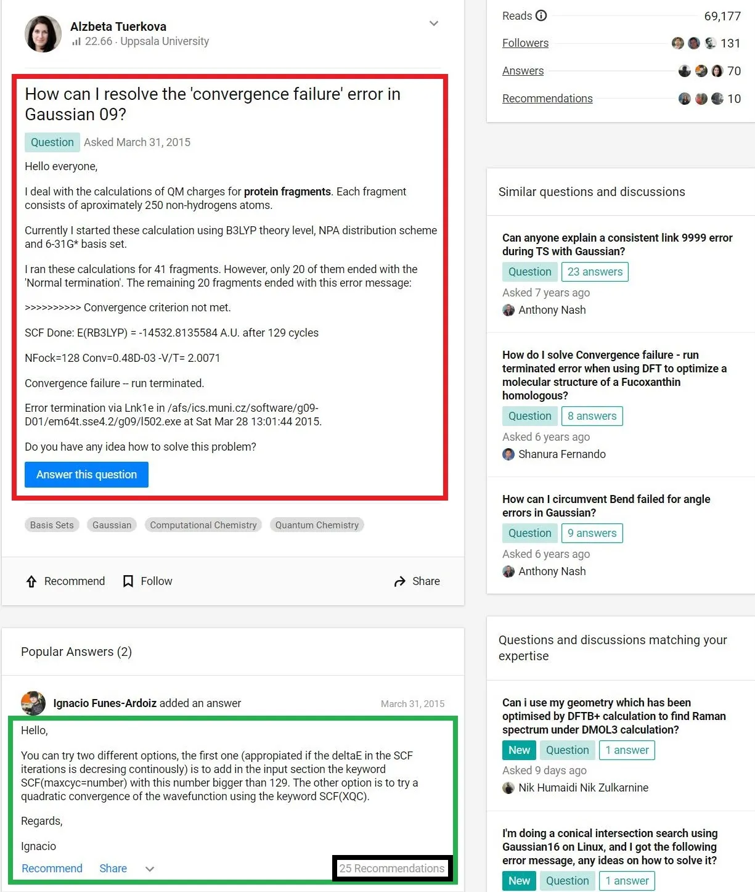
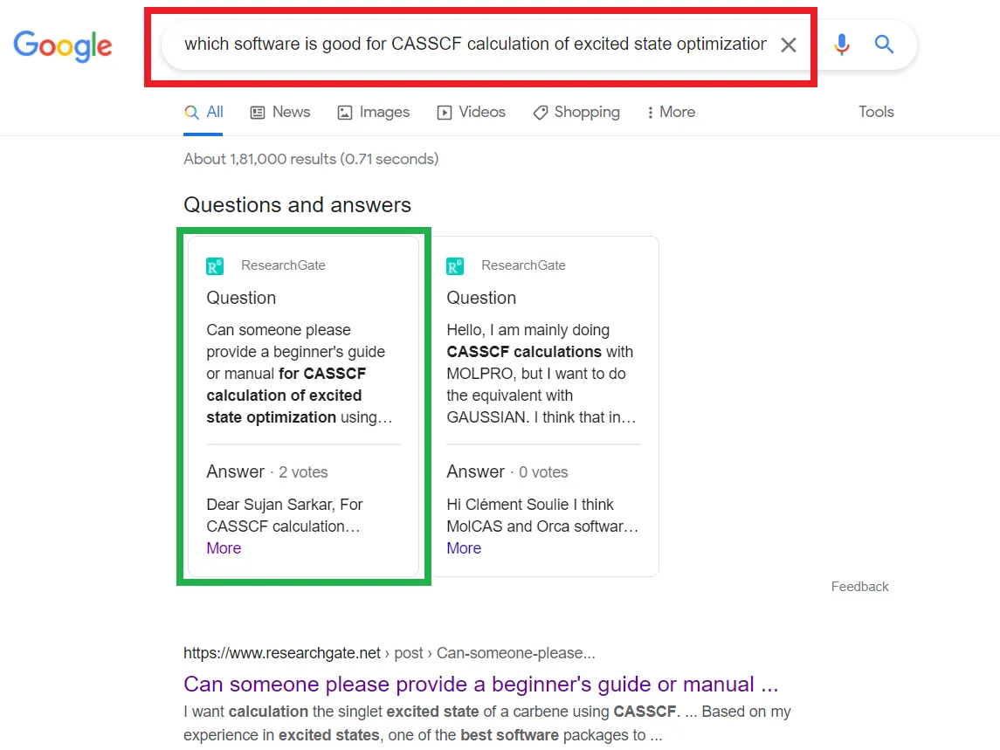
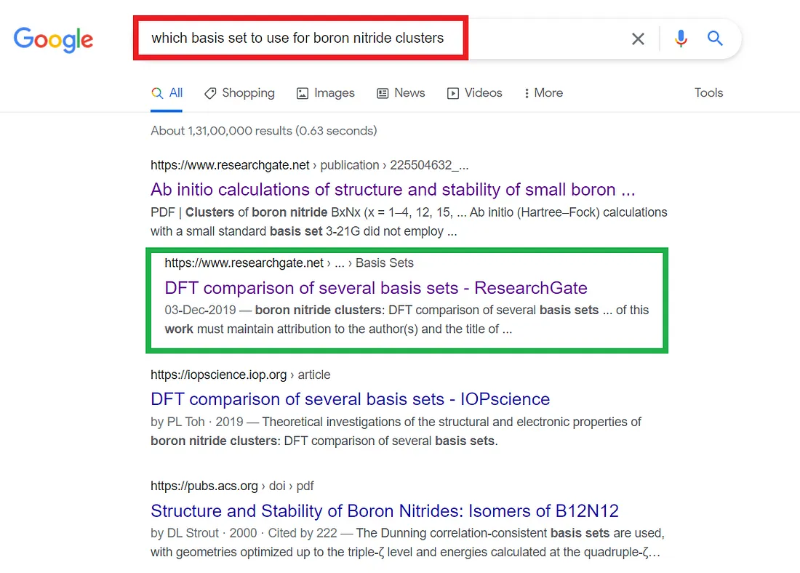
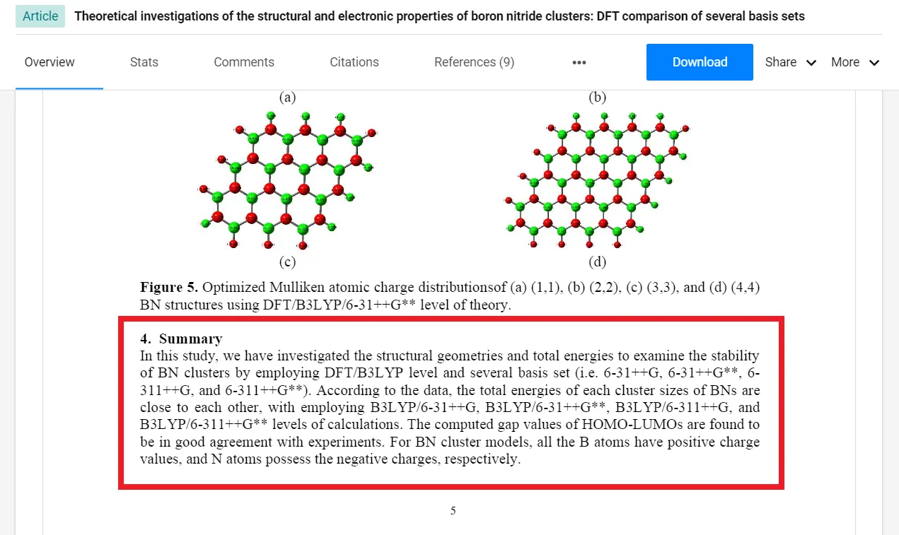

<div>

_<span style="font-size:30px;">I</span>t is pretty unbelievable if you say you have not heard the word **Googling**. Anyway, if you somehow haven’t heard the word yet, here is the definition for you. But before going to the description of Googling, let’s talk about its origin— **Google**. <a href="https://www.google.com/" target="_blank">Google</a> is the most used <a href="https://en.wikipedia.org/wiki/Searchengine" target="_blank">search engine</a> all over the world provided by <a href="https://en.wikipedia.org/wiki/Google" target="_blank">Google LLC</a>. It has dominated 92.47% of the total market. Due to this type of dominance in the market, Google has become a transitive verb, i.e., **Googling, which means to search something on Google search engine**. Now, one typical quote about googling says, “So it turns out that being an adult is mostly googling how to do stuff.” — Well, it’s identical in the computational research field also as like other work fields. Here, I’ll guide you in googling for your next computational chemistry project, and I have used <b><a href="https://gaussian.com/glossary/g09/" target="_blank">Gaussian 09W</a></b> for the quantum computational jobs. So, no more introduction, let’s jump into the central part —_

<p class="sectionDivider">⁕ ⁕ ⁕</p>

## Error Handling

#### Link 9999

At the end of the output file, i.e., out the file, you will find like below lines —

```
Error termination request processed by link 9999.
Error termination via Lnk1e in /disc30/g98/l9999.exe.
```

A few pages above, the following lines appear:

```
Maximum Force            0.020301     0.000450     NO
RMS     Force            0.007068     0.000300     NO
Maximum Displacement     0.078972     0.001800     NO
RMS     Displacement     0.023716     0.001200     NO
Predicted change in Energy=-3.132299D-05
Optimization stopped.
   -- Number of steps exceeded,  NStep=  34
   -- Flag reset to prevent archiving.
                     ----------------------------
                     ! Non-Optimized Parameters !
                     ! (Angstroms and Degrees)  !
```

Now, before going to dig into the whole process, let me clear you one thing —

<div class="biggerParagraph">
  FOR GOOGLING, THE MOST ESSENTIAL THING IS TO FIND OUT THE RIGHT KEYWORD TO
  GOOGLE
</div>

By the above line, I mean you can have more than one line, or even if you have only one line, the right keyword can be one or two words. Let’s have a look at the above error — we have more than 10 lines. But the exact keyword for googling is **“Error termination request processed by link 9999 in [which software you are using]”**. Now, let's see what we get as a result after googling —

<div><div>



<sup>**Figure 1:** Google Search Result for “Error 9999”</sup>

</div></div>

Google has done its job based on your search (indicated by the red box in Figure 1). Now, you have to find out the exact query to get out of this error issue. You can get a vague idea about what to do if you check the first two links. But if you go to the <a href="https://docs.computecanada.ca/wiki/Gaussian_error_messages" target="_blank">third link</a> (indicated by the green box in Figure 1), you can find the exact answer to your problem (Figure 2) —

<div><div>



<sup>
  **Figure 2:** Explanation of error 9999 (marked in red coloured box) and
  fixing procedure (marked in green coloured box)
</sup>

</div></div>

You are instructed to use the above keywords while running geometry optimization to escape the error. Depending on what system you are studying, you can use corresponding keywords like **geom=allcheck** or **Opt=ReadFC** or **Opt=CalcFC** or **Opt=CalcAll**, etc., in your Gaussian input.

#### Convergence failure — run terminated

At the end of the output file, you can get two types of messages —

```
>>>>>>>>>> Convergence criterion not met.
SCF Done:  E(RHF) =  -2131.95693715     A.U. after  257 cycles
            Convg  =    0.8831D-03             -V/T =  2.0048
            S**2   =   0.0000
Convergence failure -- run terminated.
Error termination via Lnk1e in /disc30/g98/l502.exe.
Job cpu time:  0 days  0 hours  5 minutes  0.5 seconds.
File lengths (MBytes):  RWF=   15 Int=    0 D2E=    0 Chk=    8 Scr=    1
```

or, also you can get the following error statement —

```
>>>>>>>>>> Convergence criterion not met.
SCF Done:  E(UHF) =  -918.564956094     A.U. after   65 cycles
            Convg  =    0.4502D-04             -V/T =  2.0002
            S**2   =   0.8616
Annihilation of the first spin contaminant:
S**2 before annihilation     0.8616,   after     0.7531
Convergence failure -- run terminated.
Error termination via Lnk1e in /disc30/g98/l502.exe.
Job cpu time:  0 days  0 hours  3 minutes 56.2 seconds.
File lengths (MBytes):  RWF=   11 Int=    0 D2E=    0 Chk=    8 Scr=    1
```

Now here, the _googling keyword is_ **“Convergence failure — run terminated in [which software you are using]”**(marked by the red box in Figure 3). Here you’ll end up with the result like the following Figure 3.

<div><div>



<sup>
  **Figure 3:** Google Search Result for Error “Convergence failure — run
  terminated”
</sup>

</div></div>

Now in Figure 3, the green box and the blue box both indicate answers. Similarly, you can end up with many solutions to a single question. You have to find out which best suits your problem, and accordingly, you have to troubleshoot that. Now at first, let’s look at the solution with the green box (Figure 4) —

<div><div>



<sup>
  **Figure 4:** Explanation of the Convergence error (marked in red coloured
  box) and fixing procedure (marked in green coloured box)
</sup>

</div></div>

Considering the above result, we can use **guess=read at a lower level of theory like HF/STO-3G** or **SCF=QC** or **SCF=XQC** or **fixing initial geometry** etc., in the Gaussian input.

Now, let’s consider the second result as well from ResearchGate (a powerful community in the research area) from Figure 5—

<div><div>



<sup>**Figure 5:** Solution of the convergence error from ResearchGate</sup>

</div></div>

In Figure 5, the red coloured box indicates the exact error we encountered, and the green coloured box provides the answer to the error. Now, you can see a black coloured box at the bottom-right corner of Figure 5, which indicates how many people have already found the solution helpful — so, the more the recommendation number, the more the chance the solution will work for you. Let’s look at the solution now — it has a similar answer to the previous one. So, you can carry out your work considering any of the solutions.

However, you can end up with different solutions for your problem. You have to take a trial and error method procedure to get the final result, as one error can have more than one reason for these types of errors. Similarly, you can try the googling process to handle any error in your computational work.

## Choosing Appropriate Software

Let’s assume, you have to do a CASSCF calculation for excited state optimization. Now you are not sure which software is good for doing your job. If you study the software itself, you’ll learn that every software has advantages and disadvantages. You can learn more about some popular softwares from one of my previous blogs —

[//]: <> (REFERENCE ARTICLE PART STARTS HERE)

<div> <div>

<a
class="refLink"
href="/tutorial/blogs/2021/top-12-softwares-for-computational-lab">

  <div class="refContainer">
    <div class="refLeft">
      <h4>Top 12 Softwares to Enhance Your Research in Computational Lab</h4>
      <h6>Make Your Research Life Smoother!!!😃😃😃</h6>
    </div>
    <div class="refRight">
      <p>
      
      </p>
   </div>
  </div>
</a>

</div> </div>

[//]: <> (REFERENCE ARTICLE PART ENDS HERE)

So, to find out which software is better to do that CASSCF calculation, we can google **“which software is good for CASSCF calculation of excited state optimization”**. You’ll get one question-answer section having almost the same topic (green coloured box in Figure 6).

<div><div>



<sup>**Figure 6:** Google result of choosing best software for CASSCF calculations</sup>

</div></div>

If you explore the question-answer thread (Figure 7), you’ll find out that the question is not about choosing the software, but rather more likely a guide or manual to start the calculation using Gaussian (marked with the red box). But if you look down, you can find one answer saying that <a href="https://gaussian.com/" target="_blank">Gaussian</a> is not good for CASSCF calculations — instead, <a href="https://www.molcas.org/" target="_blank">Molcas</a> or <a href="https://gitlab.com/Molcas/OpenMolcas" target="_blank">OpenMolcas</a> or <a href="https://www.molpro.net/" target="_blank">Molpro</a>. So, it becomes very clear which software is suitable for the CASSCF calculation for excited state optimization.

<div><div>


<sup>
  **Figure 7:** Solution for which software is better for CASSCF
  calculations
</sup>

</div></div>

## Choosing Basis Set

Let’s assume, you have to work with boron nitride. To get a good result, taking a good basis set first is one of the most crucial parts. Taking a bad guess in the basis set can lead to a bad result. However, this setting the basis set process can also be done by googling.

<div><div>



<sup>**Figure 8:** Google search result for basis set for boron nitride</sup>

</div></div>

If you google **“which basis set to use for boron nitride clusters”** (Figure 8), you will end up with one PDF which is actually a journal paper available for free in ResearchGate. They have investigated which exactly on a similar topic. They have summarised that 6–31++G, 6–31++G**, 6–311++G, and 6–311++G**, all basis sets are giving almost the same result with a DFT/B3LYP level of theory (red coloured box in Figure 9). Hence, you can use any of the basis sets to get a good result. However, here comes the role of time complexity. Taking a smaller basis set like 6–31++G will give the result faster than any other three basis set. So, in this case, **6–31++G** basis set will be appropriate for optimization and other calculations.

<div><div>



<sup>**Figure 9:** Result of which basis set is better to use</sup>

</div></div>

However, you may think boron nitride is already known, so you get a basis set that has been studied previously. But for an unknown molecule, how can googling help to find the basis set? Don’t worry, maybe the exact same study you’ll not find out for sure. But you can find out similar known structures and used basis sets for their calculations. Accordingly, you can choose your basis set.

<p class="sectionDivider">⁕ ⁕ ⁕</p>

You can get more out of google. But the procedure is similar to what I have shown here. Maybe the query will be different, but you have to follow three simple steps only —

- • Choose the exact **keyword for googling**
- • Explore maximum search results
- • Not found the solution? **Change the keyword and google again!!!**

<p class="sectionDivider">⁕ ⁕ ⁕</p>

<div class="biggerParagraph">
  If you can’t find the solution by Googling, may be you have to work out on
  your own by surveying research papers (Googling the paper again😉😉😉). If you
  stuck with any problem you can reach me out also — I’ll be happy to help if I
  know that!!!
</div>

<p class="sectionDivider">⁕ ⁕ ⁕</p>

<div class="citationBlockquote">
Thank you for reading.

I hope you found this **_“Fascinating Power of Googling in Computational Chemistry”_** article helpful to fascinate your computational research work by **Googling**. Please share if you like and leave any comment to let me know your thoughts.

You can connect with me on <i><b><a href="https://www.linkedin.com/in/aritraroy24/" target="_blank">LinkedIn</a></b></i>, <i><b><a href="https://twitter.com/royaritra24" target="_blank">Instagram</a></b></i>, <i><b><a href="https://twitter.com/aritraroy24" target="_blank">Twitter</a></b></i> or <i><b><a href="https://github.com/aritraroy24" target="_blank">GitHub</a></b></i>.

</div>

</div>
