import MoleculeKetcherInterface from "./figures/drawing-molecules-using-ketcher-drawing-interface.gif"
import moleculesSMILES from "./figures/loading-moleules-using-smiles.gif"
import ExportPDFCollection from "./figures/exportin-as-pdf-and-more-sequence-in-collection.gif"
import DrawingReactants from "./figures/drawing-reactants.gif"
import AllPredictions from "./figures/studying-all-predictions.gif"

  “The question of whether a computer can think is no more interesting than the question of whether a submarine can swim.” — [Edsger W. Dijkstra](https://en.wikipedia.org/wiki/Edsger_W._Dijkstra)

_If you are conversant about the tech world, I’m sure you have got the point of the above line. If not, then a brief intro about AI and its utilisation in every branch of life. AI stands for **Artificial Intelligence**. Yeah, you got it right!!! **Artificial Intelligence is an approach to make a computer, a robot, or a product think how intelligent humans think**, i.e. the intelligence demonstrated by machines is known as Artificial Intelligence._

Sounds cool? Yeah, the definition is cool. But way cooler its applications. **Where is it used? You should ask the other way around — where not.** Yeah, you read it right; almost everywhere, it is being used nowadays. The uses of Artificial Intelligence would broadly fall under the data processing category, which would include the following —

- • Searching within data and optimising the search to give the most relevant results
- • Logic-chains for if-then reasoning which can be applied to execute a string of commands based - • on parameters
- • Pattern-detection to identify significant patterns in extensive data set for unique insights
- • Applied probabilistic models for predicting future outcomes

You can learn more about Artificial Intelligence using the following link —

[//]: <> (REFERENCE ARTICLE PART STARTS HERE)

 

<a
class="refLink"
href="https://becominghuman.ai/introduction-to-artificial-intelligence-5fba0148ec99"
target="_blank">

  

    

      <h4>Introduction to Artificial Intelligence</h4>
      <h6>"The science and engineering of making intelligent machines, especially intelligent computer programs". -John McCarthy-</h6>
    

    

      

      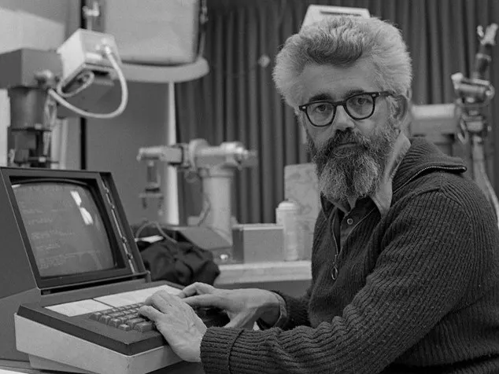
      

   

  

</a>

 

[//]: <> (REFERENCE ARTICLE PART ENDS HERE)

But as the heading says, the blog is to ease your following synthetic approach; I’ll jump into AI in the chemistry field. Yes, AI is used in this field as well. _Initially, research in AI applied to chemistry has primarily been fueled by the need to accelerate drug discovery and reduce its huge costs and the time to market for new drugs. So far, AI has made significant progress towards the [acceleration of drug discovery R&D](https://doi.org/10.1021/acs.chemrev.8b00728). However, **AI applications in chemistry are not limited to drug discovery**, as discussed in a [review](https://doi.org/10.1038/s41586-018-0337-2) published in 2018 (Nature). Two widespread usages are —_

**(1) [Product Prediction](https://pubs.acs.org/doi/10.1021/acscentsci.7b00064)**   
**(2) [Retrosynthetic Analysis](https://chemrxiv.org/articles/preprint/AI-Driven_Synthetic_Route_Design_with_Retrosynthesis_Knowledge/13386092/1)**

However, here I’ll show the practical approach to use it, not any theory and stuffs behind it. Though it’s always better to get the theory and stuff behind, so if you are interested, please consider [these articles](https://chemintelligence.com/blog).

⁕ ⁕ ⁕

[**IBM**](https://www.ibm.com/in-en) gives us free AI tools in the Cloud for Digital Chemistry (**IBM RXN for Chemistry**). Using a simple Ketcher drawing interface, one can sketch any structures and perform like predicting **Chemical Reactions** and **Retrosynthesis Pathways**. Don’t worry; stay calm and relaxed, and I’ll guide you step by step for both processes.

## Step 1: Getting Started
The very first thing you have to do is going to the site provided by IBM using [this link](https://rxn.res.ibm.com/) —
Now you can see a blue button at the top-right corner (marked by the red box) of your screen saying **“Get Started!”** [Figure 1], click the button to sign up.

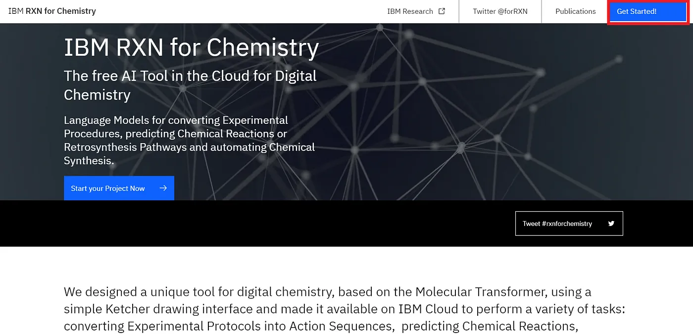

**Figure 1:** Getting Started!!!

## Step 2: Going to Registration Page
The next step is to sign up as you are first time using IBM RXN. You can do so by using the blue coloured **“Login”** button (marked by the red box)[Figure 2] —

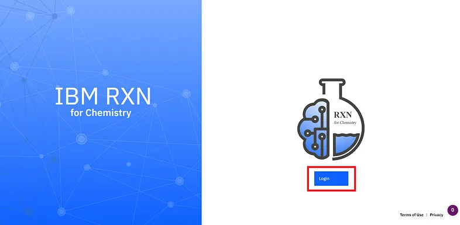

**Figure 2:** The first step of the registration process

## Step 3: Registering Yourself
This is the time to register yourself. Now you can choose three different options — a) **Login with Facebook** (marked by the black box), b) Login with Google (marked by the green box) and last c) **Sign up!** (marked by the red box) [Figure 3A]. Here I’m using Google authentication [Figure 3B]; You can register using any of the three processes.

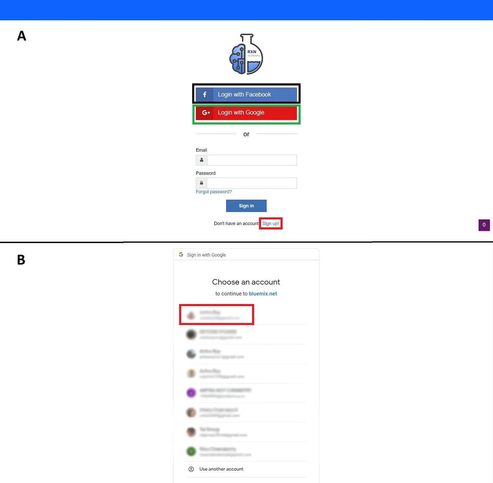

**Figure 3:** Available registration options (A) and Registering with Google (B)

## Step 4: Creating a Project
Now you are good to start your project. Create a new project using the blue button saying **“Create a new project now!”** (marked by the red box)[Figure 4A]. Then give a name to your project and click the button **“Create Project”** (marked by the red box)[Figure 4B].

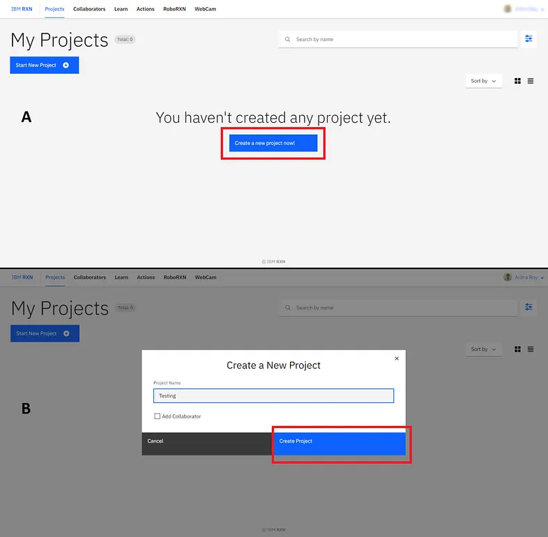

**Figure 4:** Create a new project (A) and Giving a name to it (B) 

## Step 5: Doing AI-Based Retrosynthesis/Reaction:
This step can be separated into two central parts as follows —

#### A) AI-Based Retrosynthesis:
This part also can be separated into various small parts —

_**[1]. Drawing the Target Molecule:**_ You can sketch a 2D molecule using the Ketcher drawing interface [Figure 5]. It is like drawing molecules in [ChemDraw](https://perkinelmerinformatics.com/products/research/chemdraw/), and I’m pretty sure you have used it.

  

**Figure 5:** Drawing molecules using Ketcher drawing interface

Also, you can type or paste the **SMILES** (Simplified Molecular Input Line Entry System) code for a molecule and load the corresponding molecule using the _Load in Ketcher_ option in your workspace [Figure 6].

  

**Figure 6:** Loading molecule using SMILES code

_**[2]. Starting Retrosynthetic Analysis:**_ Once you have done importing the target molecule, you are good to go to perform your retrosynthetic analysis; it’s as simple as that. Just click the blue coloured button saying **“New Retrosynthesis”** (marked by the red box)[Figure 7].

**Figure 7:** Starting retrosynthetic analysis

_**[3]. Setting AI Model & Parameters:**_ The next step is choosing your AI model, quality of the retrosynthesis analysis, and other parameters using the Advanced Option. However, I’ve used all the defaults and kept the quality of analysis fast (worst quality) for getting a fast result. Then start your analysis process by using the blue coloured button saying **“Run retrosynthesis”** (marked by the red box)[Figure 8].

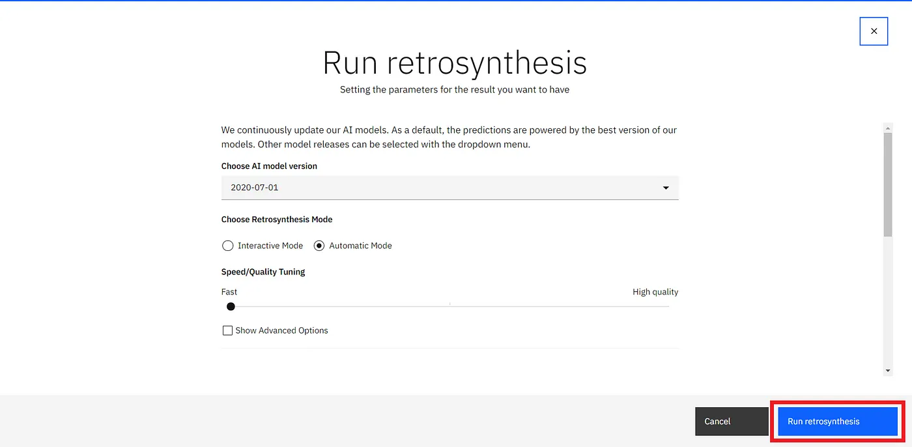

**Figure 8:** Setting all the parameters, quality and AI model

_**[4]. Live Update Window:**_ Now, you can see a window popping up (marked by the red box)[Figure 9]. You can see the approximate timing to finish up the job. You can leave the window and come back later for the result, or you can stay there.

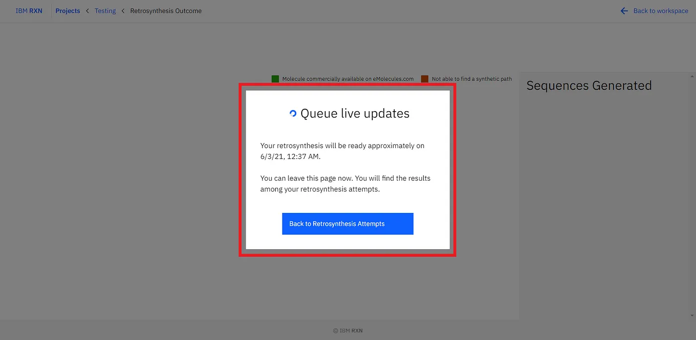

**Figure 9:** Live Update Window

_**[5]. Result Analysis:**_ After the job is finished, you can see a green coloured popup coming up from the bottom-right corner of the screen (marked by the red box)[Figure 10]. The default selected process is the best process according to the AI-based retrosynthetic analysis.

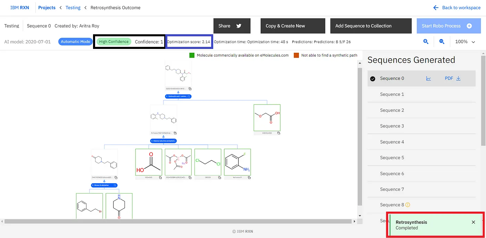

**Figure 10:** Result analysis

You can find other retrosynthetic approaches followed by the first one [Figure 11], strictly named **Sequence 0** and so on. However, you can check the **Confidence** (marked by the black box)[Figure 10]and **Optimization score** (marked by the blue box)[Figure 10] to know how convenient the result is. _As you can understand the Sequence 0 has the highest confidence and highest optimisation score always._ You can export one sequence by using the PDF option [Figure 11]. Also, you can add one or more sequences to your collection for further study [Figure 11].

  

**Figure 11:** Considering all results, exporting one sequence as PDF format and adding one or more sequences to the collection

Now you can see your collection by going to the main project folder and then clicking the VIEW RETROSYNTHESIS option (marked by the red box)[Figure 12A]. The sequence I’ve added to my collection is shown in Figure 12B] (marked by the red box).

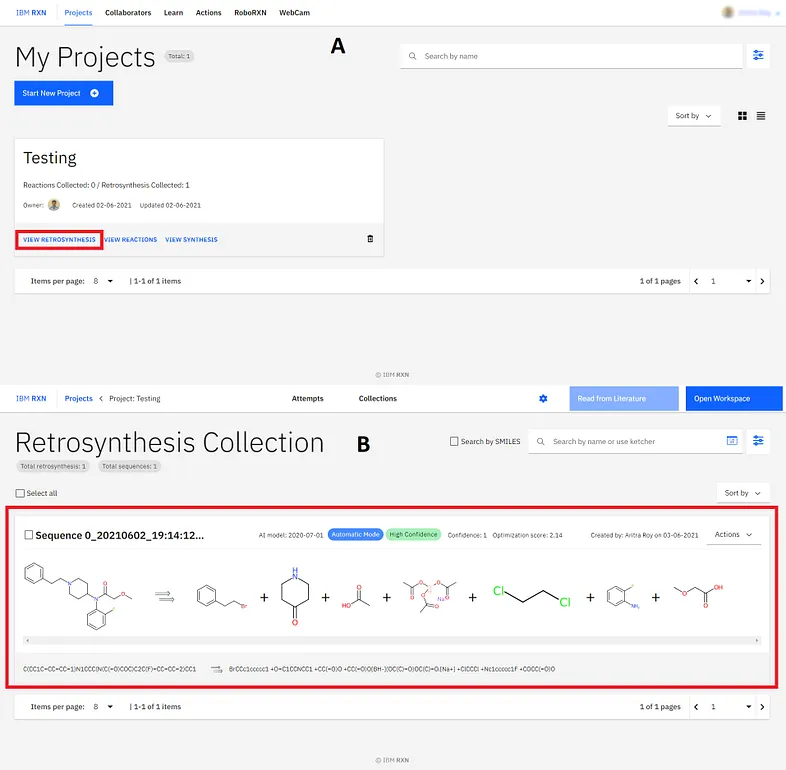

**Figure 12:** Studying collected sequences

#### B) AI-Based Reaction Prediction:
This part also can be separated into various small parts —

_**[1]. Drawing the Reactants:**_ Like the previous target molecule drawing, you can draw reactants using the Ketcher drawing interface [Figure 13]. Also, you can load the reactant molecules using their SMILES code (same as the previous one). The most important thing you don’t have to give any ‘+’ sigh to indicate the reaction between the reactants. You can draw all the required reactants side by side.

  

**Figure 13:** Drawing Reactants

_**[2]. Starting Reaction Prediction:**_ The next thing is to start the reaction prediction using the blue coloured button saying **“New Reaction”** (marked by the red box)[Figure 14A]. In the next step, you have to choose the AI model (I’ve kept it default) and then click **“Run Prediction”** (marked by the red box)[Figure 14B]. On the next screen, you’ll see a green popup saying _“Prediction Started”_ (marked by the red box)[Figure 14C]. The next screen shows the prediction is being made by the AI model [Figure 14D].

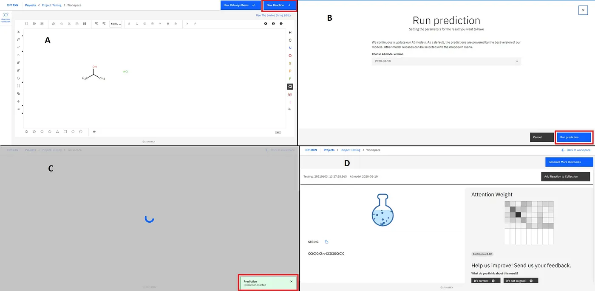

**Figure 14:** Starting new reaction (A), Running prediction (B) and Running the prediction process (C and D)

_**[3]. Getting Result:**_ Now, here, you will get only one prediction for the reaction, and you will get the notification in the green coloured popup (marked by the red box)[Fig.-1.15]. To get more predictions, you have to click **“Generate More Outcomes”** (marked by the green box)[Figure 15].

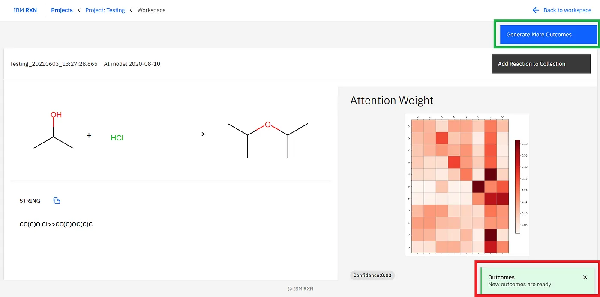

**Figure 15:** Getting Results and generating more outcomes

After the job completion, you can find all the possible predicted products using different pathways [Figure 16] and also add the reaction to your collection like previous.

  

**Figure 16:** Studying all predictions

Now you can see your collection by going to the main project folder and then clicking the VIEW REACTIONS option (marked by the red box)[Figure 17A]. The sequence I’ve added to my collection is shown in Figure 17B] (marked by the red box).

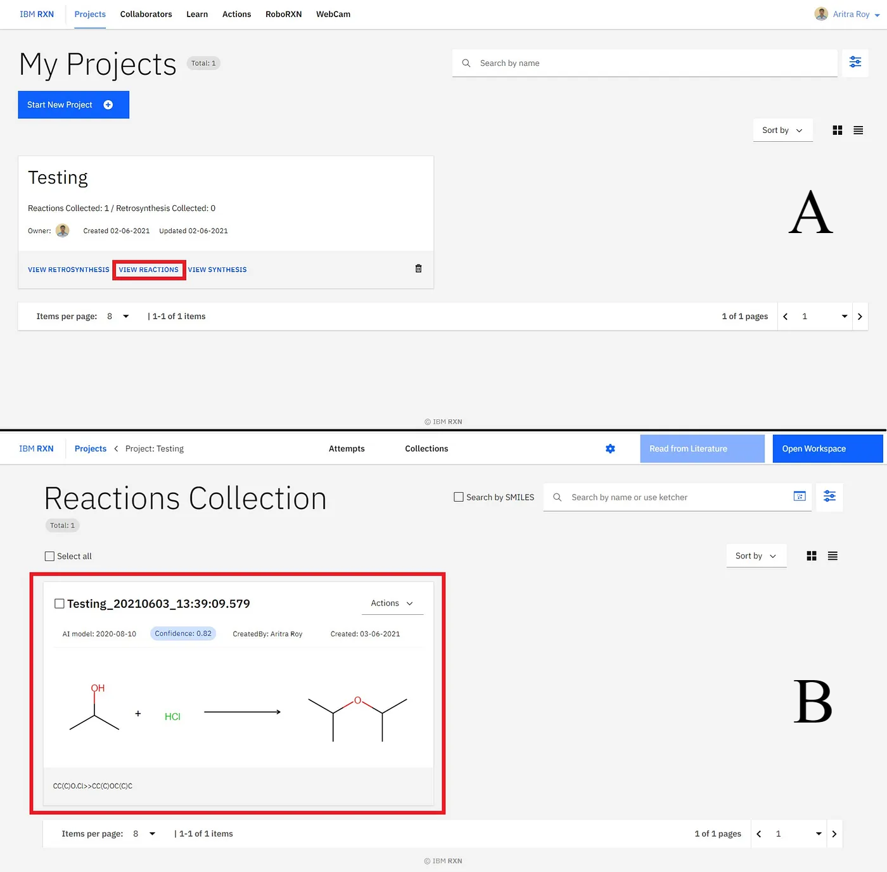

**Figure 17:** Studying collected reactions

⁕ ⁕ ⁕

Thank you for reading.

I hope you found this **_“How to Make Your Chemical Synthesis Absolutely Easier Using AI Advantage”_** article helpful. Please share if you like and leave any comment to let me know your thoughts.

You can connect with me on <i><b><a href="https://www.linkedin.com/in/aritraroy24/" target="_blank">LinkedIn</a></b></i>, <i><b><a href="https://twitter.com/royaritra24" target="_blank">Instagram</a></b></i>, <i><b><a href="https://twitter.com/aritraroy24" target="_blank">Twitter</a></b></i> or <i><b><a href="https://github.com/aritraroy24" target="_blank">GitHub</a></b></i>.

