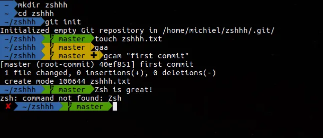
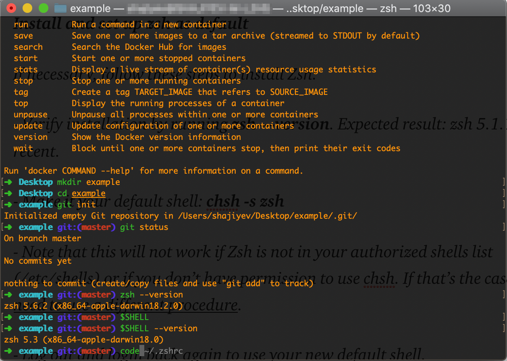
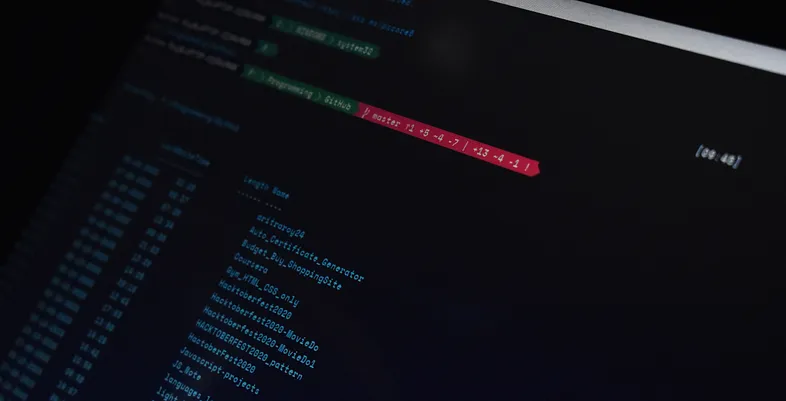
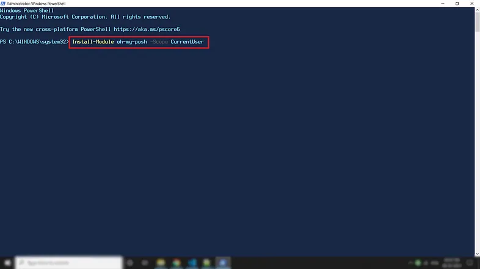
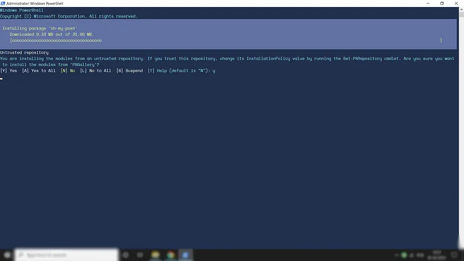
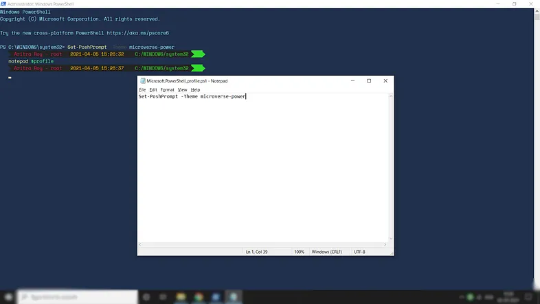
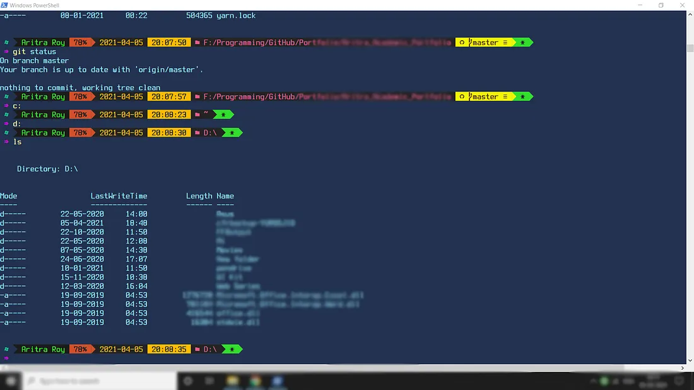
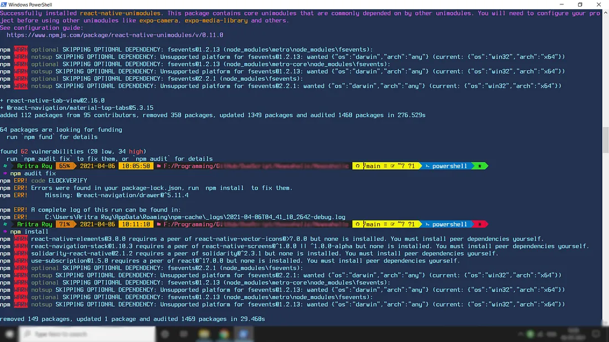
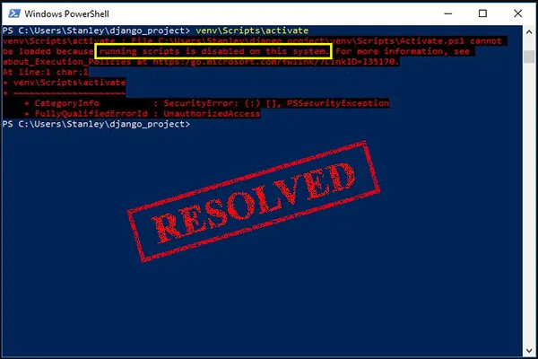

import AllThemesPreview from "./figures/all-available-themes-preview.gif"

<div>

<div class="biggerParagraph">
“Walking through darkness with thoughts full of colors...”
― Prajakta Mhadnak
</div>

_<span style="font-size:30px;">P</span>erhaps the above line is the best description of the most wanted work experience for all the programmers. Every creature in the world decorates its own living space — there we are, human after all!!!. And who doesn’t know IDE and terminals are the living worlds in the field of programming and development? So, each IDE provides a customisable environment (if you are not from Adam-Eve's age — using notepad as an IDE😉). But those who are using the terminal as their living (!working) world was abandoned for years until [**Robby Russell**](https://www.linkedin.com/in/robbyrussell/) built [**oh-my-zsh**](https://ohmyz.sh/). If you are using Ubuntu, you can consider the following tutorial guide written by [**Michiel Mulders**](https://michielmulders.medium.com/) —_

[//]: <> (REFERENCE ARTICLE PART STARTS HERE)

<div> <div>

<a
class="refLink"
href="https://medium.com/wearetheledger/oh-my-zsh-made-for-cli-lovers-installation-guide-3131ca5491fb"
target="_blank">

  <div class="refContainer">
    <div class="refLeft">
      <h4>Oh-My-Zsh! A Work of CLI Magic — Tutorial for Ubuntu</h4>
      <h6>I'm a big fan of the command line interface... I hate using my computer mouse! This motivated me to search for great...</h6>
    </div>
    <div class="refRight">
      <p>
      
      </p>
   </div>
  </div>
</a>

</div> </div>

[//]: <> (REFERENCE ARTICLE PART ENDS HERE)

Or if you are using macOS, then here goes the step by step installation guide for you —

[//]: <> (REFERENCE ARTICLE PART STARTS HERE)

<div> <div>

<a
class="refLink"
href="https://0n3z3r0n3.medium.com/oh-my-zsh-configuration-guide-for-macos-terminal-3ee6003b09d5"
target="_blank">

  <div class="refContainer">
    <div class="refLeft">
      <h4>Oh-My-Zsh Configuration Guide for MacOs Terminal</h4>
      <h6>Enhance your terminal with the power of Oh-my-Zsh plugins</h6>
    </div>
    <div class="refRight">
      <p>
      
      </p>
   </div>
  </div>
</a>

</div> </div>

[//]: <> (REFERENCE ARTICLE PART ENDS HERE)

But Alas!!! If you are using Windows PowerShell, then sorry, oh-my-zsh is not for you. Here [**Jan De Dobbeleer**](https://www.linkedin.com/in/jandedobbeleer/?originalSubdomain=be) came forward with his [_**oh-my-posh**_](https://ohmyposh.dev/) module for us (Windows User). I think you have read about oh-my-posh V2 and [_**posh-git**_](http://dahlbyk.github.io/posh-git/) in my previous article…Not yet? Read my earlier article — you’ll get to know how to install posh-git (!Highly recommended for git users🙌🙌🙌️) —

[//]: <> (REFERENCE ARTICLE PART STARTS HERE)

<div> <div>

<a
class="refLink"
href="/tutorial/blogs/2020/customize-your-windows-powershell">

  <div class="refContainer">
    <div class="refLeft">
      <h4>Customize Your Windows PowerShell With oh-my-posh & posh-git</h4>
      <h6>For an excellent programming experience, customising the working environment is the most wanted thing for a programmer...</h6>
    </div>
    <div class="refRight">
      <p>
      
      </p>
   </div>
  </div>
</a>

</div> </div>

[//]: <> (REFERENCE ARTICLE PART ENDS HERE)

Enough of patience? Hold on✋✋✋!!! I’m diving into the details right now —

## Fundamental Differences Between V2 and V3
• V2 was applicable for only Windows PowerShell. But V3 is available for Windows, macOS and Linux also.<br></br>
• The configuration is changed from $ThemeSettings to .json to ensure easy customisation.<br></br>
• More easy installation procedure.

## oh-my-posh V3: Step-by-Step Guide
#### Installation:
_I’ll be using Windows PowerShell for this guide._ A PowerShell module has already been there for the effortless installation procedure. Just paste the following command in your PowerShell and press enter —
```
Install-Module -Name oh-my-posh
```
Alternatively, you can use the installation command [Figure 1] given by the documentation itself (thereafter same procedure)—
```
Install-Module oh-my-posh -Scope CurrentUser
```

<div><div>



<sup>**Figure 1:** [oh-my-posh](https://github.com/JanDeDobbeleer/oh-my-posh) Module Installation Command</sup>

</div></div>

Though this installation process can be done without the Administrator Mode, it’s better to do all this staff in Administrator Mode. While installing, you can see a confirmation message for the complete installation saying, _‘You are installing the modules from an untrusted repository.’_ You will have the following six options [Figure 2 (Red Box)]—
```
1) [𝙔] 𝙔𝙚𝙨
2) [A] Yes to All  
3) [N] No  
4) [L] No to All  
5) [S] Suspend  
6) [?] Help
```
Type ‘y’ or ‘Y’ [Figure 2 (Yellow Box)] and press enter to allow the module to be installed.

<div><div>


<sup>**Figure 2:** Untrusted Repository warning (Red Box) and the needed input (Yellow Box)</sup>

</div></div>

After that, you can see a window popping up saying that the package is being installed [Figure 3] —

<div><div>



<sup>**Figure 3:** Window saying the package is being installed</sup>

</div></div>

#### Visualising All The Themes:
Now, once you have installed the module, you can view all the available themes provided by the module by using the following command in your PowerShell terminal —
```
Get-PoshThemes
```
oh-my-posh V3 provides a total no of 38 themes. You can see all the available themes are coming up, showing their respective theme-preview [Figure 4] —

<div><div>

<br></br>

<sup>**Figure 4:** All Available theme-preview</sup>

</div></div>

#### Setting Your Theme:
Now you can use the following command to set a theme as your terminal theme (microverse-power is a theme name provided by the oh-my-posh module itself)—
```
Set-PoshPrompt -Theme microverse-power
```
But wait ✋✋✋, it is not done yet. If you leave here, you have to set the theme again when you open the terminal next time. If you want to set the theme as permanent, i.e. when you open the terminal, the theme will be automatically set up for you, then you’ll have to save the theme configuration in the profile. For that, copy-paste the following command in your terminal and hit enter —
```
notepad $profile
```
It will open a notepad window. Copy-paste the above theme-setting command [Figure 5], i.e. —
```
Set-PoshPrompt -Theme microverse-power
```

<div><div>



<sup>**Figure 5:** Setting the theme as permanent</sup>

</div></div>

Save the notepad file and run the command <span style="color:#da552e;">. $PROFILE</span> and finally reload your terminal to see the changes. At this point, you are good to go. Most people will be happy with all the available themes.

<p class="sectionDivider">⁕ ⁕ ⁕</p>

<div class="biggerParagraph">
Getting an error: oh-my-posh command not found?
</div>

It’s because **oh-my-posh no longer support PowerShell Modules**. But don’t worry, they have given the solution. You just have to migrate oh-my-posh to enable it on your device. The process is very simple. Just copy-paste the following commands into your profile file (to use 1_shell)—
```
Import-Module oh-my-posh
oh-my-posh init pwsh --config https://raw.githubusercontent.com/JanDeDobbeleer/oh-my-posh/main/themes/1_shell.omp.json | Invoke-Expression
```
Now, if you want to use other themes, you can change the name of the theme in the link. You can get all the themes on their official website’s [theme section](https://ohmyposh.dev/docs/themes).

<p class="sectionDivider">⁕ ⁕ ⁕</p>

But if you want to be unique, then follow me along. I have customized it to adjust my choice, and here it goes —

```json 
// aritraroy.omp.json
{
  "$schema": "https://raw.githubusercontent.com/JanDeDobbeleer/oh-my-posh/main/themes/schema.json",
  "blocks": [
    {
      "type": "prompt",
      "alignment": "left",
      "segments": [
        {
          "type": "os",
          "style": "plain",
          "foreground": "#5aeea4"
        },
        {
          "type": "session",
          "style": "powerline",
          "powerline_symbol": "\uE0B0",
          "foreground": "#18f123",
          "background": "#242424",
          "properties": {
            "display_host": false,
            "postfix": " "
          }
        },
        {
          "type": "battery",
          "style": "powerline",
          "powerline_symbol": "",
          "foreground": "#193549",
          "background": "#f36943",
          "properties": {
            "battery_icon": "",
            "color_background": true,
            "charged_color": "#50cdff",
            "charging_color": "#ffa32a",
            "discharging_color": "#ff0000",
            "postfix": "\uF295 "
          }
        },
        {
          "type": "time",
          "style": "powerline",
          "powerline_symbol": "\uE0B0",
          "foreground": "#ffe866",
          "background": "#242424",
          "properties": {
            "time_format": " 2006-01-02",
            "prefix": ""
          }
        },
        {
          "type": "time",
          "style": "powerline",
          "powerline_symbol": "",
          "foreground": "#242424",
          "background": "#ffe866",
          "properties": {
            "time_format": "15:04:05",
            "prefix": " "
          }
        },
        {
          "type": "path",
          "style": "powerline",
          "powerline_symbol": " ",
          "foreground": "#f84e78",
          "background": "#242424",
          "properties": {
            "prefix": "\uE5FF  ",
            "style": "full",
            "folder_separator_icon": "/"
          }
        },
        {
          "type": "shell",
          "style": "powerline",
          "powerline_symbol": "\uE0B0",
          "foreground": "#ffffff",
          "background": "#0077c2",
          "properties": {
            "prefix": " \uFCB5 "
          }
        },
        {
          "type": "git",
          "style": "powerline",
          "powerline_symbol": "\uE0B0",
          "foreground": "#462e00",
          "background": "#fffb00",
          "properties": {
            "display_status": true,
            "display_stash_count": true,
            "display_upstream_icon": true,
            "prefix": " "
          }
        },
        {
          "type": "exit",
          "style": "powerline",
          "powerline_symbol": "\uE0B0",
          "foreground": "#242424",
          "background": "#33DD2D",
          "properties": {
            "display_exit_code": false,
            "always_enabled": true,
            "color_background": true,
            "error_color": "#f1184c",
            "prefix": " \ufc8d"
          }
        }
      ]
    },
    {
      "type": "newline"
    },
    {
      "type": "prompt",
      "alignment": "left",
      "segments": [
        {
          "type": "text",
          "style": "plain",
          "foreground": "#ee00e2",
          "properties": {
            "prefix": "",
            "text": "\u21d2"
          }
        }
      ]
    }
  ],
  "final_space": true
}
```
<div><div>
<sup>Customized theme (aritraroy) used by me</sup>
</div></div>

The above code will give you the result [Figure 6] like the following (I’ve blurred the exact folder path for my own reason) —

<div><div>




<sup>**Figure 6:** PowerShell screenshot after installing customized aritraroy theme</sup>

</div></div>

## Customization Procedure:
Basically, oh-my-posh renders your prompt based on the definition of _blocks_ (like Lego), which contain one or more _segments_. Now it’s more comfortable for you(!as a beginner) to modify one theme or merge two or more themes than to build from scratch. I have also combined two themes (**microverse-power** and **jandedobbeleer)**, which gave me the above result.

#### Blocks:
Under [**_General Settings_**](https://ohmyposh.dev/docs/configuration/overview), an essential part is _“blocks”_. Now under _“blocks”_, you can add the following elements —<br></br>
• type: <span style="color:#da552e;">prompt</span> ∣ <span style="color:#da552e;">rprompt</span> ∣ <span style="color:#da552e;">newline</span> <br></br>
• alignment: <span style="color:#da552e;">left</span> ∣ <span style="color:#da552e;">right</span> <br></br>
• vertical_offset: <span style="color:#da552e;">int</span> <br></br>
• horizontal_offset: <span style="color:#da552e;">int</span> <br></br>
• segments: <span style="color:#da552e;">array</span> of one or more <span style="color:#da552e;">segments</span> <br></br>

_**[1]. type:**_ Now, as you see, type can be of three types (I used prompt as type) —
```yaml
𝐚) 𝐩𝐫𝐨𝐦𝐩𝐭: renders one or more segments
𝐛) 𝐫𝐩𝐫𝐨𝐦𝐩𝐭: one or more segments aligned to the right of the cursor
𝐜) 𝐧𝐞𝐰𝐥𝐢𝐧𝐞: inserts a new line
```
_**[2]. alignment:**_ You can align the elements right or left using the alignment option (I used _left_ as alignment).

_**[3]. vertical_offset & horizontal_offset:**_ You can also give vertical and horizontal offset(space) using the vertical_offset and the horizontal_offset options, respectively (I didn’t use these parameters).

_**[4]. segments:**_ Now, segments are the most important part of this script. This part provides many parameters like —

• type: <span style="color:#da552e;">string</span> <br></br>
• style: <span style="color:#da552e;">powerline</span> ∣ <span style="color:#da552e;">plain</span> ∣ <span style="color:#da552e;">diamond</span> <br></br>
• powerline_symbol: <span style="color:#da552e;">string</span> <br></br>
• invert_powerline: <span style="color:#da552e;">boolean</span> <br></br>
• leading_diamond: <span style="color:#da552e;">string</span> <br></br>
• trailing_diamond: <span style="color:#da552e;">string</span> <br></br>
• foreground: <span style="color:#da552e;">string</span> <br></br>
• foreground_templates: <span style="color:#da552e;">array</span> of <span style="color:#da552e;">string</span> values <br></br>
• background: <span style="color:#da552e;">string</span> <br></br>
• background_templates: <span style="color:#da552e;">array</span> of <span style="color:#da552e;">string</span> values <br></br>
• properties: <span style="color:#da552e;">array</span> of <span style="color:#da552e;">Property</span>: <span style="color:#da552e;">string</span> <br></br>

Now I’m not going to discuss all the parameters. I’ll talk about the most common and interesting ones —
```yaml
𝟭) 𝘁𝘆𝗽𝗲:  𝗼𝘀-shows operating system you are using
          𝘀𝗲𝘀𝘀𝗶𝗼𝗻-shows user name and host name
          𝗯𝗮𝘁𝘁𝗲𝗿𝘆-shows battery status
          𝘁𝗶𝗺𝗲-shows date and time
          𝗽𝗮𝘁𝗵-shows the folder path
          𝘀𝗵𝗲𝗹𝗹-shows which type of shell you are using
          𝗴𝗶𝘁-shows git status (enabled with posh-git)
          𝗲𝘅𝗶𝘁-shows the display status (error/succesful)
𝟮) 𝘀𝘁𝘆𝗹𝗲:  𝗽𝗼𝘄𝗲𝗿𝗹𝗶𝗻𝗲-background(previous one)foreground(current one)
          𝗽𝗹𝗮𝗶𝗻-colored text on a transparent background
          𝗱𝗶𝗮𝗺𝗼𝗻𝗱-ifferent starting and ending symbol
𝟯) 𝗽𝗼𝘄𝗲𝗿𝗹𝗶𝗻𝗲_𝘀𝘆𝗺𝗯𝗼𝗹: text character to use when style "powerline" is selected
𝟰) 𝗳𝗼𝗿𝗲𝗴𝗿𝗼𝘂𝗻𝗱 𝗮𝗻𝗱 𝗯𝗮𝗰𝗸𝗴𝗿𝗼𝘂𝗻𝗱: to set foreground and background colour 
𝟱) 𝗽𝗿𝗼𝗽𝗲𝗿𝘁𝗶𝗲𝘀: to set different properties for different type like prefix, postfix, time format, display host, charging colour, discharging colour etc.
```
<div class="citationBlockquote">
_Also, you can use [**Nerd Fonts**](https://www.nerdfonts.com/) to include icons in your text part to look cooler. But all icons are not accepted in all fonts. There is no specific layout in which font will support which icons. You have to go through a try and error process to come up with the best one. You can also find different icons from [charbase.com](https://charbase.com/) —_
</div>

Now, to implement your custom theme, save the file as filename.omp.json and save it in any folder you like. Copy the folder path and change the URL in your profile with the copied path following **filename.omp.json** and again run the <span style="color:#da552e;">. $PROFILE</span> command. Reload your terminal to see your customized theme.

## Note
- • If you somehow came up with an **execution policy error** like Figure 7, please go through the following two articles to avoid that error —

[//]: <> (REFERENCE ARTICLE PART STARTS HERE)

<div> <div>

<a
class="refLink"
href="/tutorial/blogs/2020/customize-your-windows-powershell">

  <div class="refContainer">
    <div class="refLeft">
      <h4>Customize Your Windows PowerShell With oh-my-posh & posh-git</h4>
      <h6>For an excellent programming experience, customising the working environment is the most wanted thing for a programmer...</h6>
    </div>
    <div class="refRight">
      <p>
      
      </p>
   </div>
  </div>
</a>

</div> </div>

[//]: <> (REFERENCE ARTICLE PART ENDS HERE)

[//]: <> (REFERENCE ARTICLE PART STARTS HERE)

<div> <div>

<a
class="refLink"
href="https://arielmu.medium.com/resolved-running-scripts-is-disabled-on-this-system-828b6da40b37"
target="_blank">

  <div class="refContainer">
    <div class="refLeft">
      <h4>Resolved: Running Scripts Is Disabled on This System</h4>
      <h6>Cannot be loaded because running scripts is disabled on this system A great many people receive this error message...</h6>
    </div>
    <div class="refRight">
      <p>
      
      </p>
   </div>
  </div>
</a>

</div> </div>

[//]: <> (REFERENCE ARTICLE PART ENDS HERE)

<div><div>


<sup>**Figure 7:** Execution Policy Error</sup>

</div></div>

- • If you want to know more about the customization of the oh-my-posh module, then kindly go through their [whole documentation](https://ohmyposh.dev/docs/).

<p class="sectionDivider">⁕ ⁕ ⁕</p>

<div class="citationBlockquote">
Thank you for reading.

I hope you found this **_“Oh-My-Posh V3 is Out in the Market”_** article helpful. Please share if you like and leave any comment to let me know your thoughts.

You can connect with me on <i><b><a href="https://www.linkedin.com/in/aritraroy24/" target="_blank">LinkedIn</a></b></i>, <i><b><a href="https://twitter.com/royaritra24" target="_blank">Instagram</a></b></i>, <i><b><a href="https://twitter.com/aritraroy24" target="_blank">Twitter</a></b></i> or <i><b><a href="https://github.com/aritraroy24" target="_blank">GitHub</a></b></i>.

</div>

</div>