import TemplatePreview from "./figures/template-preview.gif"
import UpdatedWebsite from "./figures/my-updated-personal-portfolio-preview.gif"

<div>

<div class="biggerParagraph">
“Create a link through which you can market your dream products. Create a blog or a website of your own depending on what you want to be recognized for. Share your experiences through these media.”
― Israelmore Ayivor, [Shaping the dream](https://www.goodreads.com/book/show/21851495-shaping-the-dream)
</div>

_<span style="font-size:30px;">I</span>f you have a website, you may not have a good reason to update it. But if you don’t have a website, you may be missing the boat. You can easily create content and drive traffic to a website when you have a website. You can also use it to showcase your portfolio, communicate with your clients and get more significant jobs._

## Why Should You Have One?
Your personal website is a great way to showcase your skills, experience, and interests. It is also an excellent way for potential employers to find you. People who have a personal website:

[1]. Are more likely to have a job.<br></br>
[2]. Can get promoted earlier and faster.<br></br>
[3]. Are more likely to be hired than people without a website.

Individuals are visual, so the more you can show (instead of telling), the better. Your resume might say that you “assembled an organization blog following of 15,000 drew in perusers,” however, with your own webpage, you can take somebody directly to the blog and show why it’s so captivating and what separates your work. By highlighting work tests, destinations you’ve chipped away at, articles you’ve composed, whatever, your own landing page can go about as a computerized arrangement of your internet-based work and character. A personal homepage is a possibility to offer individuals more data about themselves, in a more compelling way, than what you can expect to state in your resume.

What? You are going to have a research career, not a job? So, what? You can always showcase your previous projects and papers on your website. It will always help you to collaborate with your fellow researchers.

## How to Build a Personal Website in an Hour
It is possible to build a personal website in 10 minutes. The first step is to create a website using a free website builder. The website builder will provide templates for different websites, such as blogs, portfolios, and e-commerce sites. Once the template is chosen, it will automatically populate its content. Next, the content needs to be edited and updated to reflect users’ personal preferences. Finally, you can add a custom domain name and use free hosting service to complete the site.

Here are a few personal website building website lists -

1: http://www.weebly.com

2: http://www.wix.com

3: http://www.squarespace.com

4: http://www.webflow.com

5: http://www.wordpress.com

6: http://www.websitebuilder.com

7: http://www.webs.com

## What to Put on a Personal Website?
A personal website is a web page created by an individual and typically contains information about themselves. The page typically includes a bio, work experience, and contact information. It’s essential to make sure that the website’s information is accurate and up-to-date. You can add a portfolio of your best work, links to your social media pages and contact information. If possible, it’s also a good idea to add pictures that show off your personality. You can call the website an online version of your CV. Many people have asked me how to start a personal website. While there is no one-size-fits-all approach, here are some best practices that you can follow.

1: Make sure that your website is mobile-friendly.

2: Use a platform that allows you to create a website easily and quickly.

3: Make sure that the website looks professional.

4: Make sure that the website loads fast.

## A Cooler Template Just for You
Consider the following template, which is modern and absolutely free —

<div><div>

<br></br>

<sup>**Figure 1.1:** Template by [Tim Baker](https://github.com/tbakerx)</sup>

</div></div>

Tim Baker originally created the website. But I have modified it to include more components and configured the contact form to work—all you need to do some changes and deploy your website on [netlify.com](https://www.netlify.com/). Follow the following steps to get this excellent template —

#### Step 1: Download the Template
Go to the link to download the code — [**Download Link**](https://github.com/aritraroy24/Portfolio_V1)

Click on the Code button in Green colour in Figure-2.1 and download the code as a ZIP file (Figure-2.2) —

<div><div>

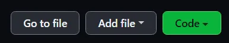

<sup>**Figure 2.1:** Code Button in GitHub</sup>

</div></div>

<div><div>

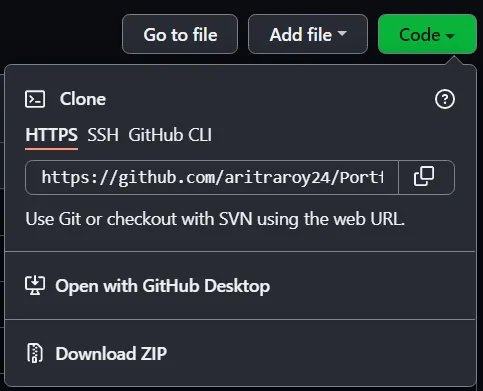

<sup>**Figure 2.2:** Download as ZIP file</sup>

</div></div>

#### Step 2: Setting Up the Environment
- • **Extract the ZIP-File:**<br></br>
Extract the ZIP-File to a suitable location on your computer and navigate inside the folder.

- • **Download and Install Visual Studio Code:**<br></br>
Download VS Code from the following link for your device and install.
https://code.visualstudio.com/Download

- • **Open Downloaded Code in VS Code:**<br></br>
Run Visual Studio Code. Select the folder in which you have previously extracted the downloaded code using the Open Folder option of VS Code (Figure-3.1), and you’ll be able to see a window like Figure-3.2 —

<div><div>

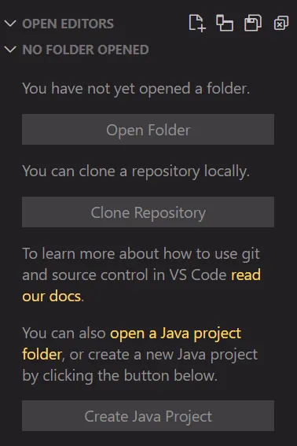

<sup>**Figure 3.1:** Open Folder Using VS Code</sup>

</div></div>

<div><div>

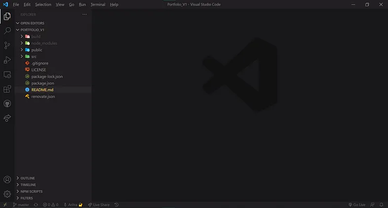

<sup>**Figure 3.2:** Window View After Opening the Folder</sup>

</div></div>

- • **Download NPM and Install:**<br></br>
Download Node Package Manager (Node.js)from the following link and install—
https://nodejs.org/en/download/

- • **Install Required Modules:**<br></br>
Open a terminal inside the extracted folder and give the following command-
npm install

- • **Start Your Environment Locally:**<br></br>
In the same terminal, give the following command to start a local server to see the changes locally. You can visit your website (and also all changes) locally at http://localhost:3000.
npm start

#### Step 3: Make Necessary Changes
- • **Replace Images/Fonts:**<br></br>
Replace the images, and fonts if you like, with your own. All you have to do is replace the photos at **public/images/header-background.jpg**, **public/images/testimonials-bg.jpg** and **public/favicon.ico** with your own. YOU MUST KEEP THE SAME NAMES ON THE IMAGES.

- • **Fill In Your Personal Info:**<br></br>
To populate the website with all of your own data, open the **public/resumeData.json** file and simply replace the data in there with your own. Images for the portfolio section should be put in the **public/images/portfolio** folder.

#### Step 4: Configure the Form:
To configure the form we will be using Formspree to ease our work (Free plan provides 50 form submissions/month). Here are the steps you have to follow to configure your own form —

- • Go to https://formspree.io/
- • Create an account for free
- • Under the **Form** section select the **New Project** option to create a new project.
- • Select the **New Form** option (Figure-4.1), give the form a name and select the previously created project and also select your email address and click **Create Form**—

<div><div>

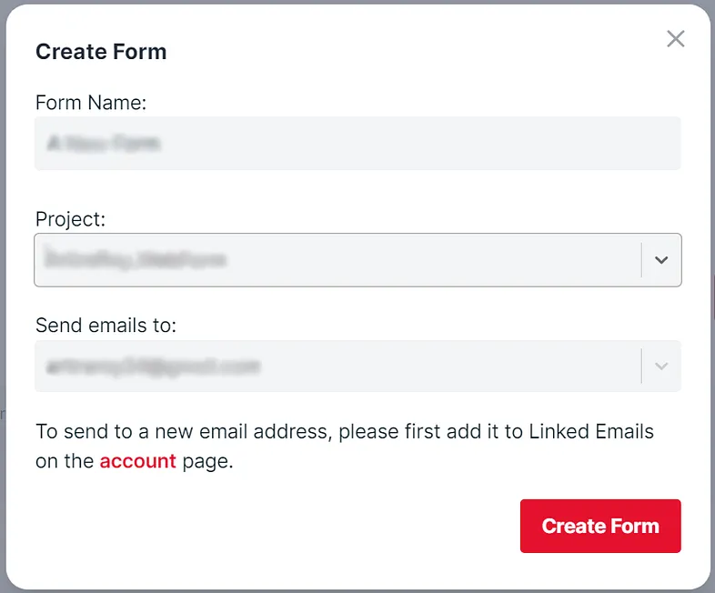

<sup>**Figure 4.1:** Create a New Form</sup>

</div></div>

- • You’ll be redirected to the page similar to Figure 4.2. Copy the form’s endpoint from that page (Figure-4.2).

<div><div>

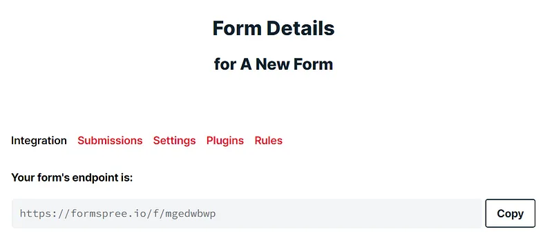

<sup>**Figure 4.2:** Form’s Endpoint</sup>

</div></div>

- • Open VS Code and find the file **Contact.j**s under **src/Components** folder. Replace the form’s endpoint at line 19 with yours.
- • Your form is all set to receive messages.

#### Step 5: Deploy Your Website Online
Now it’s time to host your website online. Don’t worry…hold tight, I’ll guide you all the way. Just follow the following steps —

- • Go to https://netlify.com/ and Sign Up (If you already have an account, just Log In!!!).
- • After email verification (or Google/GitHub/Bitbucket authentication) you will get a page like Figure-5.1. Fill with your own information and hit **Set Up and Continue**.

<div><div>

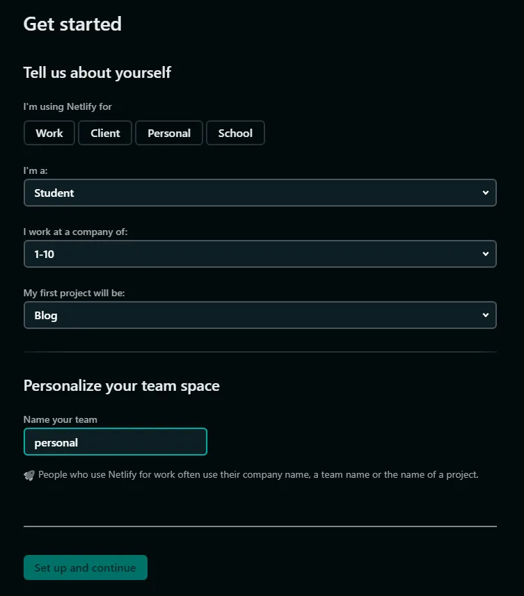

<sup>**Figure 5.1:** Sign Up Questions</sup>

</div></div>

- • You are now ready to drag and drop your project for hosting online. But before that we have to optimize our code. Open your terminal inside your project folder and give the following command —
```
npm run build
```
- • You’ll see a new folder with the name **build** (Figure-5.2) will be generated. Drag and drop the folder to under manual deploy section in netlify page (Figure-5.3).

<div><div>

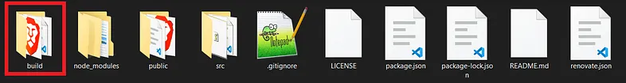

<sup>**Figure 5.2:** Build Folder</sup>

</div></div>

<div><div>

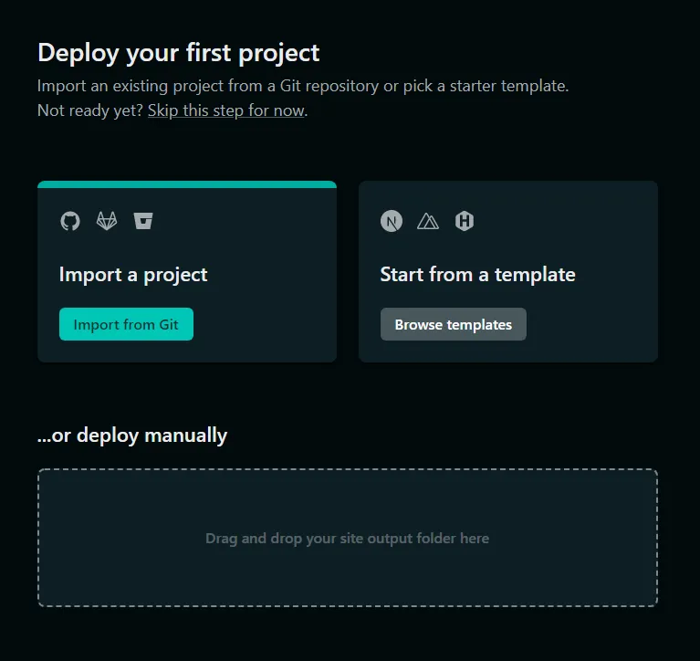

<sup>**Figure 5.3:** Manual Deploy of Website</sup>

</div></div>

- • It will take some time and after finishing you will be taken to the page like Figure-5.4 with a message Published (marked with red box in Figure-5.4)—

<div><div>

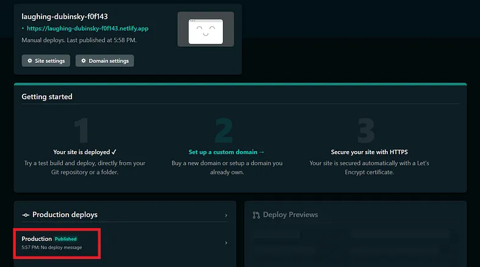

<sup>**Figure 5.4:** Publish Status</sup>

</div></div>

- • It’s time to change your website name. Go to Site Settings (Figure-5.5A) and Click Change site name (Figure-5.5A). One modal will be popped up (Figure-5.5B) and you can change your sitename there and finally hit Save (Figure-5.5B).

<div><div>

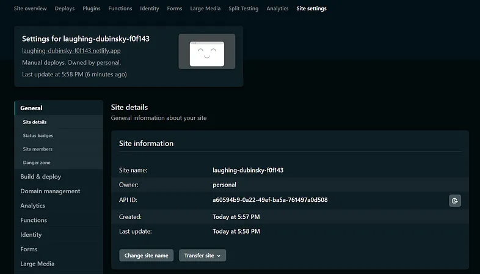

<sup>**Figure 5.5A:** Changing Site Name</sup>

</div></div>

<div><div>

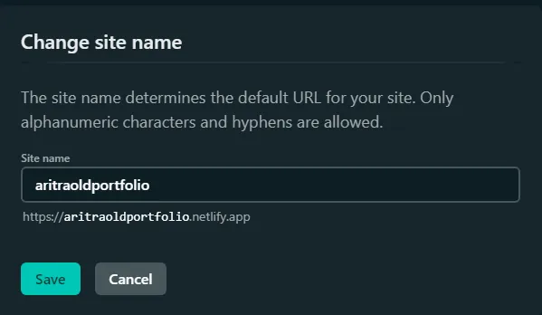

<sup>**Figure 5.5B:** Changing Site Name</sup>

</div></div>

- • Your site is ONLINE now!!! Check with the URL —
```
[Your Site Name].netlify.app
```

- • You can also buy and use a custom domain name if you like from [netlify.com](https://www.netlify.com/) itself or [name.com](https://www.name.com/) or from similar sites.
- • Here is mine after hosting online - [**www.aritraoldportfolio.netlify.app**](https://aritraoldportfolio.netlify.app/)

## Do I Have One for Myself?
Yes!!! I definitely have one. I used to use the previous template before. But I have updated my website with a newer version. Wanna see? Here is it — [**www.aritraroy.live**](/)

<div><div>

<br></br>

<sup>**Figure 6.1:** My Updated Portfolio Website</sup>

</div></div>

<p class="sectionDivider">⁕ ⁕ ⁕</p>

<div class="citationBlockquote">
Thank you for reading.

I hope you found this **_“Personal Website: Why You Should Have One Right Now and How?”_** article helpful. Please share if you like and leave any comment to let me know your thoughts.

You can connect with me on <i><b><a href="https://www.linkedin.com/in/aritraroy24/" target="_blank">LinkedIn</a></b></i>, <i><b><a href="https://twitter.com/royaritra24" target="_blank">Instagram</a></b></i>, <i><b><a href="https://twitter.com/aritraroy24" target="_blank">Twitter</a></b></i> or <i><b><a href="https://github.com/aritraroy24" target="_blank">GitHub</a></b></i>.

</div>

</div>