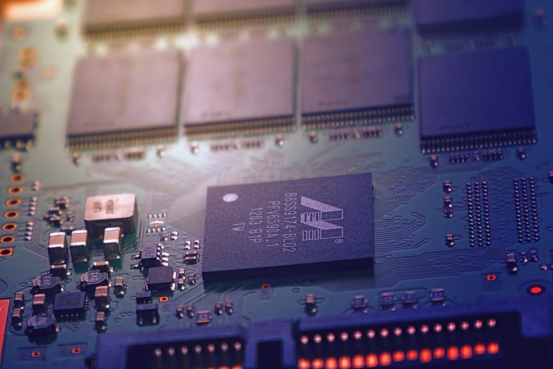
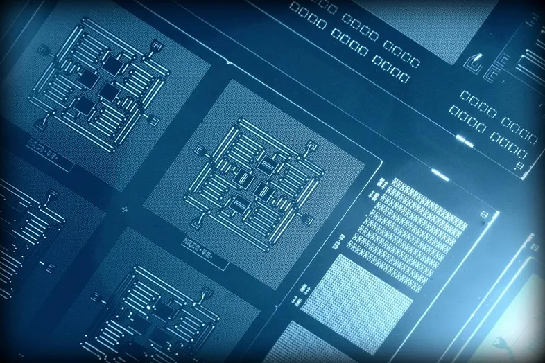

<div>

_<span style="font-size:30px;">Q</span>antum computers could spur the development of breakthroughs in science, medications to save lives, machine learning methods to diagnose illnesses sooner, materials to make more efficient devices and structures, financial strategies to live well in retirement, and algorithms to quickly direct resources such as ambulances._

But what exactly is quantum computing, and what does it take to achieve these quantum breakthroughs? Today we will briefly discuss the quantum computer or quantum computing and the recent progress in this field. This blog will be mainly divided into two parts —

```
1. Basics of quantum computing 
2. Recent progress and competition
```

## 1. Basics of Quantum Computing
#### Why Quantum Computing?
For problems above a specific size and complexity, we don’t have enough computational power on Earth to tackle them, i.e. using only standard classical computers, the solutions can not be achieved. Quantum computers are believed to solve specific [computational problems](https://en.wikipedia.org/wiki/Computational_problem), such as [integer factorisation](https://en.wikipedia.org/wiki/Integer_factorization) (which underlies [RSA encryption](https://en.wikipedia.org/wiki/RSA_encryption)), substantially faster than classical computers. Quantum machines promise to outstrip even the most capable of today’s — and tomorrow’s — supercomputers.

#### The secret of Quantum Computer:
By the last paragraph, you can assume that it’s neither like natural computers nor supercomputers. We have something special in it. So, what is it? It is **quantum bits** or **qubits**, which are typically subatomic particles such as electrons or photons. Some companies, such as **IBM**, **Google**, and **Rigetti** Computing, use superconducting circuits cooled to temperatures colder than deep space. Others, like **IonQ**, trap individual atoms in electromagnetic fields on a silicon chip in ultra-high-vacuum chambers. In both cases, _the goal is to isolate the qubits in a controlled quantum state._

Qubits have some quirky quantum properties that mean a connected group can provide way more processing power than the same number of binary bits. Such two properties are —

<div class="citationBlockquote">
**1) Superposition:** Qubits can represent numerous possible combinations of 1 and 0 at the same time [Fig-1.1]. This ability to simultaneously be in multiple states is called superposition.

**2) Entanglement:** Researchers can generate pairs of qubits that are “entangled,” which means the two members of a pair exist in a single quantum state [Fig-1.2]. Changing the state of one of the qubits will instantaneously change the state of the other one in a predictable way. This happens even if they are separated by very long distances.
</div>

<div><div>

![Superposition [Figure 1.1], Entanglement [Figure 1.2] and Decoherence [Figure 1.3]](./figures/superposition-entanglement-decoherence.png)

<sup>Superposition [Figure 1.1], Entanglement [Figure 1.2] and Decoherence [Figure 1.3]</sup>

</div></div>

You can learn more about quantum computing algorithms from another Medium article by [YK Sugi](https://medium.com/@ykdojo) —

[//]: <> (REFERENCE ARTICLE PART STARTS HERE)

<div> <div>

<a
class="refLink"
href="https://medium.com/better-programming/what-is-a-quantum-computer-explained-with-a-simple-example-b8f602035365"
target="\_blank">

  <div class="refContainer">
    <div class="refLeft">
      <h4>What Is A Quantum Computer?</h4>
      <h6>Explained with a simple example</h6>
    </div>
    <div class="refRight">
      <p>
      
      </p>
   </div>
  </div>
</a>

</div> </div>

[//]: <> (REFERENCE ARTICLE PART ENDS HERE)

#### A Disadvantage of Quantum Computing:
The disadvantage is that quantum machines are way more error-prone than classical computers because of **decoherence**. The interaction of qubits with their environment in ways that cause their quantum behaviour to decay and ultimately disappear is called **decoherence** [Figure 1.3].

#### What is quantum supremacy?
_**Quantum supremacy** is the point at which a quantum computer can complete a mathematical calculation that is demonstrably beyond the reach of even the most powerful supercomputer._ In 2012, John Perskill proposed this terminology. It’s still unclear exactly how many qubits will be needed to achieve this because researchers keep finding new algorithms to boost classical machines’ performance, and supercomputing hardware keeps getting better. But one alternative is “quantum advantage,” which is also now widely used. But to me, “advantage” lacks the punch of “supremacy.” In a race, a horse has an advantage if it wins by a nose. In contrast, a quantum computer’s speed vastly exceeds that of classical computers for specific tasks. At least, that’s true in principle.

Hence, there’s plenty of debate in the research world about just how significant achieving this milestone will be. Rather than wait for supremacy to be declared, companies are already starting to experiment with quantum computers made by companies like **IBM**, **Rigetti**, and **D-Wave**, a Canadian firm. Chinese firms like **Alibaba** are also offering access to quantum machines.

However, if we achieve quantum supremacy, we can do a lot of things. You will be surprised by how many things, which seem to be impossible at this moment, can be done using the quantum computer. Please take a look at the video by multi-award-winning quantum physicist and Professor of Physics and Computer Science at Wilfrid Laurier University, [Shohini Ghose](https://www.wlu.ca/academics/faculties/faculty-of-science/faculty-profiles/shohini-ghose/index.html) —

<div><div>

<iframe src="https://www.youtube.com/embed/QuR969uMICM" title="A beginner&#39;s guide to quantum computing | Shohini Ghose" frameborder="0" allow="accelerometer; autoplay; clipboard-write; encrypted-media; gyroscope; picture-in-picture; web-share" allowfullscreen></iframe>
<br></br>
<sup>What can we do using a quantum computer?</sup>

</div></div>

#### Quantum Computer Developments:
_**Quantum computing models:**_ Several quantum computing models are distinguished by the essential elements in which the computation is decomposed. The four main models of practical importance are-<br></br>
[1] [Quantum gate array](https://en.wikipedia.org/wiki/Quantum_circuit)<br></br>
[2] [One-way quantum computer](https://en.wikipedia.org/wiki/One-way_quantum_computer)<br></br>
[3] [Adiabatic quantum computer](https://en.wikipedia.org/wiki/Adiabatic_quantum_computation)<br></br>
[4] [Topological quantum computer](https://en.wikipedia.org/wiki/Topological_quantum_computer)<br></br>

_**Physical realisations:**_ For physically implementing a quantum computer, many different candidates are being pursued —<br></br>
[1] [Superconducting quantum computing](https://en.wikipedia.org/wiki/Superconducting_quantum_computing)<br></br>
[2] [Trapped ion quantum computer](https://en.wikipedia.org/wiki/Superconducting_quantum_computing)<br></br>
[3] Neutral atoms in [Optical lattices](https://en.wikipedia.org/wiki/Optical_lattice)<br></br>
[4] [Quantum dot](https://en.wikipedia.org/wiki/Quantum_dot) computer, spin-based<br></br>
[5] [Quantum dot](https://en.wikipedia.org/wiki/Quantum_dot) computer, spatial-based etc.<br></br>

However, you can find a detailed explanation in a nutshell of what is a quantum computer in the following video —

<div><div>

<iframe src="https://www.youtube.com/embed/JhHMJCUmq28" title="Quantum Computers Explained – Limits of Human Technology" frameborder="0" allow="accelerometer; autoplay; clipboard-write; encrypted-media; gyroscope; picture-in-picture; web-share" allowfullscreen></iframe>
<br></br>
<sup>Quantum Computer Explained in a nutshell</sup>

</div></div>

If you want to program a quantum computer, you should consider the Medium article by [Dr James Wootton](https://decodoku.medium.com/) —

[//]: <> (REFERENCE ARTICLE PART STARTS HERE)

<div> <div>

<a
class="refLink"
href="https://medium.com/qiskit/how-to-program-a-quantum-computer-982a9329ed02"
target="\_blank">

  <div class="refContainer">
    <div class="refLeft">
      <h4>How to program a quantum computer</h4>
      <h6>How to make Battleships from quantum NOT gates</h6>
    </div>
    <div class="refRight">
      <p>
      
      </p>
   </div>
  </div>
</a>

</div> </div>

[//]: <> (REFERENCE ARTICLE PART ENDS HERE)

## 2. Recent progress and competition
#### Quantum Pioneers:
<div style="text-align:left;">
There are many companies like IBM, Alibaba, Intel, Google, Microsoft, D-Wave Systems, IonQ, Honeywell, etc. Many of these firms work in conjunction with significant university research teams, continuing to accrue significant progress. Each one is trying to claim the title of having the most efficient quantum computer. However, I am briefly describing their success and competition among themselves —

_**IBM:**_ It has launched a website named [IBM Q Experience](https://quantumexperience.ng.bluemix.net/qx/experience) that made a 5 qubit quantum computer publicly available over the Internet. This time, this has been joined by a second 5 qubit machine and a 16 qubit machine. Later in 2017, they announced 20 qubit quantum computer and 50 qubit quantum computer one after another. However, in January 2019, IBM announced its [IBM Q System One](https://newsroom.ibm.com/2019-01-08-IBM-Unveils-Worlds-First-Integrated-Quantum-Computing-System-for-Commercial-Use) as the “world’s first integrated universal approximate quantum computing system designed for scientific and commercial use.

_**Google:**_ In March 2018, Google announced a new 72 qubit quantum processor called [**‘Bristlecone’**](https://ai.googleblog.com/2018/03/a-preview-of-bristlecone-googles-new.html). In June 2019, the director of Google’s Quantum Artificial Intelligence Lab, Hartmut Neven, [revealed that its quantum processors’ power is now increasingly at a doubly exponential rate](https://www.quantamagazine.org/does-nevens-law-describe-quantum-computings-rise-20190618/). This has been termed **“Nevan’s Law”** and suggests that we may reach the point of quantum supremacy — where a quantum computer can outperform any classical computer — by the end of 2019. In October 2019, an engineering team from Google [published a paper in Nature](https://www.nature.com/articles/s41586-019-1666-5) in which they claimed to have achieved quantum supremacy using a quantum processor called **Sycamore**.

_**Alibaba:**_ In July 2015, Alibaba teamed up with the Chinese Academy of Sciences to form the [‘CAS — Alibaba Quantum Computing Laboratory’](https://www.alibabagroup.com/en/news/article?news=p150730). In March 2018, it launched its ‘superconducting quantum computing cloud’ to provide access to an 11 qubit quantum computer.

_**Microsoft:**_ In November 2017, Intel announced the delivery of a [17 qubit test chip](https://newsroom.intel.com/news/intel-delivers-17-qubit-superconducting-chip-advanced-packaging-qutech/) to [QuTech](https://qutech.nl/). In January 2018, at CES, it further announced the delivery of a 49 qubit test quantum processor called [**‘Tangle Lake’**](https://newsroom.intel.com/news/intel-advances-quantum-neuromorphic-computing-research/). In June 2018, Intel reported that it had begun testing a [26 spin qubit chip](https://newsroom.intel.com/news/intel-starts-testing-smallest-spin-qubit-chip-quantum-computing/). According to [Intel’s quantum computing web pages](https://www.intel.com/content/www/us/en/research/quantum-computing.html), the company targets production-level quantum computing within ten years. It anticipates that the technology will start to enter its “commercial phase” around 2025.

_**D-Wave Systems:**_ In 2011, it [sold a 10 million dollar, 128 qubit machine called the **D-Wave One** to Lockheed Martin](https://www.dwavesys.com/news/d-wave-systems-sells-its-first-quantum-computing-system-lockheed-martin-corporation). In 2013, D-Wave next sold a 512 Qubit **D-Wave Two** to NASA and Google. By 2015, D-Wave even broke the 1,000 qubit barrier with its **D-Wave 2X**, and in January 2017 [sold its first 2,000 qubits **D-Wave 2000Q**](https://www.dwavesys.com/press-releases/d-wave%C2%A0announces%C2%A0d-wave-2000q-quantum-computer-and-first-system-order) to cybersecurity firm Temporal Defense Systems. However, notwithstanding all of the milestones mentioned above, D-Wave’s work remains controversial. This is because their hardware is based on an ‘adiabatic’ process called **‘quantum annealing’** that other pioneers have dismissed as **‘restrictive’** and **‘a dead-end’**.

However, [**D-Wave 2000Q**](https://www.dwavesys.com/press-releases/d-wave%C2%A0announces%C2%A0d-wave-2000q-quantum-computer-and-first-system-order) has a massive impact on the field of quantum computing, and you can get an idea of how it looks like and how it works by the following video —
</div>

<div><div>

<iframe src="https://www.youtube.com/embed/60OkanvToFI" title="UNBOXING A QUANTUM COMPUTER! – Holy $H!T Ep 19" frameborder="0" allow="accelerometer; autoplay; clipboard-write; encrypted-media; gyroscope; picture-in-picture; web-share" allowfullscreen></iframe>
<br></br>
<sup>D-Wave 2000Q</sup>

</div></div>

<div style="text-align:left;">
_**IonQ:**_ [IonQ](https://ionq.co/) is a pure-play pioneer in **trapped-ion quantum computin**g. The company claims that its technology ‘combines unmatched physical performance, perfect qubit replication, optical networkability, and highly-optimized algorithms’ to ‘create a quantum computer that is as scalable as it is powerful and that will support a broad array of applications across a variety of industries’.

_**Honeywell:**_ [Honeywell](https://www.honeywell.com/en-us/company/quantum) is another pioneer of trapped-ion quantum computing. In June 2020, Honeywell announced that it had created the [world’s highest performance quantum computer](https://www.honeywell.com/en-us/newsroom/news/2020/06/the-worlds-highest-performing-quantum-computer-is-here).

#### Top Two Rivalries in Quantum Field [Claimed]:
The trade war rivalry between the USA and China is well known. However, since the past few years, both nations are caught up in a heated tech race towards supremacy —
##### Google (2019) — USA:
On 23rd October 2019, Google said that they had achieved quantum supremacy, a long-awaited milestone in quantum computing. They reported using a processor with programmable superconducting qubits to create quantum states on **53 qubits**, corresponding to a computational state-space of dimension ²⁵³ (about 1⁰¹⁶). They named the processor _**Sycamore**_. They claimed that the **Sycamore processor takes about 200 seconds** to sample one instance of a quantum circuit a million times. The equivalent task for a state-of-the-art **classical supercomputer would take approximately 10,000 years**.

They designed the processor Sycamore which consists of a **two-dimensional array of 54 transmon qubits**, where each qubit is tunably coupled to four nearest neighbours in a rectangular lattice [Figure 1.4]. However, IBM published a blog where they stated that the computations in Google’s experiment could be undertaken on a classical computer in two-and-half days, rather than 10,000 years. And also, they added, “Because the original meaning of the term ‘quantum supremacy,’ as proposed by John Preskill in 2012, was to describe the point where quantum computers can do things that classical computers can’t, this threshold has not been met.”
</div>

<div><div>

![The layout of Sycamore [Figure 1.4] and Original photograph of Sycamore [Figure 1.5]](./figures/layout-of-sycamore.png)

<sup>The layout of Sycamore [Figure 1.4] and Original photograph of Sycamore [Figure 1.5]</sup>

</div></div>

##### USTC (2020) — China:
Researchers in China [reported photonic quantum computer](https://science.sciencemag.org/lookup/doi/10.1126/science.abe8770), which harnesses particles of light, or photons, performed a calculation that’s impossible for a conventional computer on 3rd December 2020. **Boson sampling** is considered a strong candidate to demonstrate the quantum computational advantage. They performed Gaussian boson sampling by sending 50 indistinguishable single-mode squeezed states into a 100-mode ultralow-loss interferometer with full connectivity and random matrix — the whole optical setup is phase-locked — and sampling the output using 100 high-efficiency single-photon detectors. They named the photonic quantum computer _**Jiuzhang**_. It generates up to 76 output photon clicks, which yields an output state-space dimension of 1⁰³⁰ and a sampling rate that is faster than using the state-of-the-art simulation strategy and supercomputers by a factor of ~1⁰¹⁴. They claimed it is **capable of performing at least one task 100 trillion times faster than the world’s fastest supercomputers**.

Photons are first sent into a network of channels. There, each photon encounters a series of beam splitters, each of which sends the photon down two paths simultaneously, in what’s called a quantum superposition. According to quantum rules, paths also merge, and the repeated splitting and merging cause the photons to interfere with one another. Finally, the number of photons in each of the network’s output channels is measured at the end [Figure 1.7]. When repeated many times, this process produces a distribution of numbers based on how many photons were found in each output.

<div><div>

![An illustration of the experimental setup for generating squeezed states in Jiuzhang [Figure 1.6]](./figures/experimental-setup-illustration.webp)
![a Schematic diagram of the active phase-locking system in Jiuzhang [Figure 1.7]](./figures/schematic-diagram.webp)
![an Original photograph of Jiuzhang [Figure 1.8]](./figures/original-photo-of-jiuzhang.webp)

<sup>An illustration of the experimental setup for generating squeezed states in Jiuzhang [Figure 1.6], a Schematic diagram of the active phase-locking system in Jiuzhang [Figure 1.7] and an Original photograph of Jiuzhang [Figure 1.8]</sup>

</div></div>

<div class="citationBlockquote">
The most important thing is that they claimed, **Jiuzhang is 10 billion times faster than Google’s**. However, one limitation of Jiuzhang is that it can perform only a single type of task, namely, boson sampling. In contrast, Google’s quantum computer could be programmed to execute a variety of algorithms.
</div>

<p class="sectionDivider">⁕ ⁕ ⁕</p>

## Note:
It is pretty challenging to achieve quantum supremacy so fast. But many companies are trying hard to get an efficient quantum computer to achieve quantum supremacy. It will be beneficial then as it will have significantly lower time complexity for quantum algorithms. Till now, no proof of achieving supremacy is known. Like IBM, Google etc., provides you with free usage of quantum computing. You can try to make a better algorithm to take one step towards Quantum Computing.

Also, If you want to do a completely free course on quantum computing, you can check here —

## References:
• [What is quantum computing (technologyreview.com)](https://www.technologyreview.com/2019/01/29/66141/what-is-quantum-computing/)<br></br>
• [Quantum supremacy](https://www.quantamagazine.org/john-preskill-explains-quantum-supremacy-20191002/)<br></br>
• [Quantum computing models](https://en.wikipedia.org/wiki/Quantum_computing#Quantum_computing_models)<br></br>
• [what is quantum computing (IBM)](https://www.ibm.com/quantum-computing/learn/what-is-quantum-computing/)<br></br>
• [Quantum computing (explainingcomputers.com)](https://www.explainingcomputers.com/quantum.html)<br></br>
• [Supremacy claimed by Google](https://www.nature.com/articles/d41586-019-03213-z)<br></br>
• [Jiuzhang supremacy](https://www.sciencenews.org/article/new-light-based-quantum-computer-jiuzhang-supremacy)<br></br>
• [China's claim (livescience.com)](https://www.livescience.com/china-quantum-supremacy.html)<br></br>

<div><div>

<iframe width="680" height="385" src="https://www.youtube.com/embed/xnmpWfQKPSE?list=PLo4DhXMUkdvU9rZvEQYLdly5dABHvlZuD" title="Quantum Computing - Introduction" frameborder="0" allow="accelerometer; autoplay; clipboard-write; encrypted-media; gyroscope; picture-in-picture; web-share" allowfullscreen></iframe>
<br></br>
<sup>D-Wave 2000Q</sup>

</div></div>

<p class="sectionDivider">⁕ ⁕ ⁕</p>

<div class="citationBlockquote">
Thank you for reading.

I hope you found this **_“Quantum Computing: A Trade War”_** article helpful. Please share if you like and leave any comment to let me know your thoughts.

You can connect with me on <i><b><a href="https://www.linkedin.com/in/aritraroy24/" target="_blank">LinkedIn</a></b></i>, <i><b><a href="https://twitter.com/royaritra24" target="_blank">Instagram</a></b></i>, <i><b><a href="https://twitter.com/aritraroy24" target="_blank">Twitter</a></b></i> or <i><b><a href="https://github.com/aritraroy24" target="_blank">GitHub</a></b></i>.

</div>

</div>