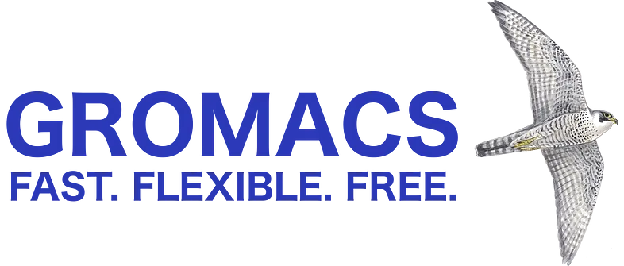

<div>

_<span style="font-size:30px;">T</span>he recent advancement in technologies in the last ten years has opened a new era in computational studies. Many misunderstood theoretical studies with computational— but there is a conceptual difference between these two. Mathematical descriptions and studies about the topic mainly define the former. In contrast, the latter is the study when a computer is well trained to do all types of theoretical calculations and analyses itself upon giving it the instructions. Having robust systems in hand makes it much easier to do computational calculations before doing any experimental work. But what are the softwares to start with? Well, it depends on what type of research work you are doing or going to do. Here, I’ll discuss some most familiar softwares (both open-source and commercial) in this computational research field. So, no more introduction — let’s get into the central part._

<p class="sectionDivider">⁕ ⁕ ⁕</p>

## Molecular/Materials Modelling and Visualisation
#### Avogadro:

<div><div>


<sup>Avogadro Software Logo</sup>

</div></div>

It is an open-source software used in computational chemistry, molecular modeling, bioinformatics, etc. It was first introduced in 2008 and written in C++ language. The source code and documentation are available on [GitHub](https://github.com/cryos/avogadro/). Though Avogadro has its discussion and tutorial website [avogadro.cc](https://avogadro.cc/), the software is available on [SourceForge](https://sourceforge.net/projects/avogadro/) and maintained there. It is extensible via a plugin architecture. You can find a basic tutorial on this software on YouTube —

<div><div>

<iframe width="680" height="385" src="https://www.youtube.com/embed/AScn1OuyBoY?list=PLNbi8bqTMdTbWuTrz_sJQ_A_RauyIIqXh" title="Avogadro with Gaussian Tutorial FREQ" frameborder="0" allow="accelerometer; autoplay; clipboard-write; encrypted-media; gyroscope; picture-in-picture; web-share" allowfullscreen></iframe><br></br>

<sup>Avogadro Tutorial Series</sup>

</div></div>

```yaml
Pros: - Available for Windows, Linux and macOS and in many languages
      - Free and Open-source
      - Supports multi-threaded rendering and computation
      - Easy to understand and work
      - Plugin architecture for developer (commands, Python scripts)
      - Babel chemical file import
Cons: - Sometimes may stop opening files/save them with errors
      - Doesn't provide all features provided by paid one
```

<div class="biggerParagraph">
  Rating: 4.7/5
</div>

#### Spartan:

<div><div>


<sup>Spartan'20 Software Logo</sup>

</div></div>

It is a proprietary software provided by [Wavefunction Inc](https://store.wavefun.com/Spartan_Software_s/12.htm). This software is mainly used in molecular modeling and quantum calculations in computational chemistry. Though in the research field, the software is primarily used for molecular modeling and visualization. The software contains an integrated graphical user interface. Graphical models, especially molecular orbitals, electron density, and electrostatic potential maps, are a routine means of molecular visualization in chemistry education. I have written a complete Spartan tutorial series —

[//]: <> (REFERENCE ARTICLE PART STARTS HERE)

<div> <div>

<a
class="refLink"
href="/tutorial/blogs/2020/basic-introduction-to-computational-chemistry-tools-spartan-part-1">

  <div class="refContainer">
    <div class="refLeft">
      <h4>Basic Introduction to Computational Chemistry Tools: Spartan (Part-1)</h4>
      <h6>Although much of its discovery process is descriptive and qualitative, chemistry is fundamentally quantitative...</h6>
    </div>
    <div class="refRight">
      <p>
      
      </p>
   </div>
  </div>
</a>

</div> </div>

[//]: <> (REFERENCE ARTICLE PART ENDS HERE)

```yaml
Pros: - Available for Windows, Linux and macOS and in many languages
      - Supports multi-core computations
      - Easy to understand and work
      - Provides MMFF, MNDO, Austin Model, PM3 etc. models.
Cons: - Commercial price is high
```
<div class="biggerParagraph">
  Rating: 3.9/5
</div>

#### Materials Studio:

<div><div>


<sup>BIOVIA Materials Studio Logo</sup>

</div></div>

[Materials Studio](https://www.3ds.com/products-services/biovia/products/molecular-modeling-simulation/biovia-materials-studio/) is programming for mimicking and demonstrating materials. It is created and circulated by [BIOVIA](https://www.3ds.com/products-services/biovia/) (some time ago Accelrys), a firm having some expertise in research programming for computational science, bioinformatics, cheminformatics, atomic elements reenactment, and quantum mechanics.

This product is utilized in cutting-edge exploration of different materials, like polymers, carbon nanotubes, impetuses, metals, ceramics, etc., by colleges, research focuses, and innovative organizations. Here is one basic introduction to Materials Studio —

<div><div>

<iframe width="680" height="510" src="https://www.youtube.com/embed/c1klTPfhJV8" title="An Introduction to Materials Studio" frameborder="0" allow="accelerometer; autoplay; clipboard-write; encrypted-media; gyroscope; picture-in-picture; web-share" allowfullscreen></iframe><br></br>

<sup>Introduction to Materials Studio</sup>

</div></div>

```yaml
Pros: - Available for Windows
      - Supports multi-core computations
      - Easy to understand and work and has wide range of capability
      - Provides CASTEP, DMol3, CCDC etc. more than 8 packages
      - Materials building and visualisation tool is excellent
Cons: - Commercial price is very much high
      - Not available for Linux and macOS
```

<div class="biggerParagraph">
  Rating: 3.6/5
</div>

#### SAMSON:

<div><div>


<sup>SAMSON Logo</sup>

</div></div>

SAMSON(Software for Adaptive Modeling and Simulation Of Nanosystems) is one of the most quickly growing platforms for integrated molecular design. SAMSON’s goal is to make it faster for everyone to design drugs, materials, and nanosystems. It is being developed by [OneAngstrom](https://www.oneangstrom.com/) and previously by the NANO-D group at the French Institute for Research in Computer Science and Automation (INRIA). It gives many features completely free of cost like —

- • Build structures
- • Create visualizations
- • Create animations
- • Export HD moviesCompute in the cloud
- • Share documents online
- • Develop and distribute extensions
- • Community support
- • 1-minute movie length
- • 25-command history
- • 1 free extension

To get the free package one will have to register at the SAMSON Connect [sign-up page](https://www.samson-connect.net/signUp.html). There are many features other than the above-mentioned ones. But one will have to pay to avail of those features.

<div><div>

<iframe width="680" height="385" src="https://www.youtube.com/embed/ZmUtdQwZzU0?list=PLCpSqhcVhfx4sZAs0Q_nBwanS78jTjVm0" title="SAMSON Tutorials - Essentials 1 - Introduction to SAMSON Connect" frameborder="0" allow="accelerometer; autoplay; clipboard-write; encrypted-media; gyroscope; picture-in-picture; web-share" allowfullscreen></iframe><br></br>

<sup>SAMSON Tutorial</sup>

</div></div>

```yaml
Pros: - Free package upto a limitation
      - Available for Windows, Linux, macOS
      - Modern viewport with gorgeous animations
Cons: - Free package comes with very limited features
```
<div class="biggerParagraph">
  Rating: 4.2/5
</div>

## Molecular Docking & Dynamics
#### AutoDock Vina:

[AutoDock Vina](http://vina.scripps.edu/) is an open-source program for doing atomic docking. It was planned and carried out by Dr. [Oleg Trott](http://www.olegtrott.com/) in the Molecular Graphics Lab at The Scripps Research Institute. AutoDock Vina automatically calculates the grid maps and clusters the results in a way transparent to the user.

AutoDock Vina achieves approximately two orders of magnitude speed-up compared to the molecular docking software previously developed in their lab ([AutoDock 4](http://autodock.scripps.edu/)) while also significantly improving the accuracy of the binding mode predictions, judging by our tests on the training set used in AutoDock 4 development. You can use AutoDock Vina free from their site, [vina.scripps.edu](http://vina.scripps.edu/download.html) free for academic purposes.


<div><div>

<iframe width="680" height="510" src="https://www.youtube.com/embed/-GVZP0X0Tg8" title="AutoDock Vina Video Tutorial" frameborder="0" allow="accelerometer; autoplay; clipboard-write; encrypted-media; gyroscope; picture-in-picture; web-share" allowfullscreen></iframe><br></br>

<sup>AutoDock Vina Video Tutorial</sup>

</div></div>

```yaml
Pros: - Available for Windows, Linux and macOS
      - Supports multi-core computations for faster calculations
      - Easy to understand and work and has wide range of capability
      - Free for academic purposes
      - World Community Grid has thousand of previous projects
Cons: - Not so much accurate in identifying ligand binding poses
```
<div class="biggerParagraph">
  Rating: 4.9/5
</div>

#### GOLD:

<div><div>


<sup>GOLD Docking Software Logo</sup>

</div></div>

It is a GA-based docking program that collaborates with the University of Sheffield, GlaxoSmithKline, and the Cambridge Crystallographic Data Centre. GOLD has proven success in virtual screening, lead optimization, and identifying the correct binding mode of active molecules. But it is commercial software, and if you want to use it, you have to buy the license from their [site](https://www.ccdc.cam.ac.uk/solutions/csd-discovery/components/gold/).

```yaml
Pros: - Available for Windows, Linux and macOS
      - Supports multi-core computations for faster calculations
      - Easy to understand and work and has wide range of capability
Cons: - It is a proprietary software
```

<div class="biggerParagraph">
  Rating: 4.1/5
</div>

#### GROMACS:

<div><div>



<sup>GROMACS Logo</sup>

</div></div>

It is an atomic elements bundle, for the most part, intended for reproductions of proteins, lipids, and nucleic acids. It was initially evolved in the Biophysical Chemistry division of the University of Groningen and is presently kept up with supporters in colleges and examination focuses worldwide. [GROMACS](https://www.gromacs.org/) is one of the quickest and most famous programming bundles accessible and can run on focal handling units (CPUs) and illustrations preparing units (GPUs). It is free, open-source programming delivered under the GNU General Public License (GPL) and beginning with rendition 4.6, the GNU Lesser General Public License (LGPL). It is freely available for download at [manual.gromacs.org](https://manual.gromacs.org/2021.3/download.html).

<div><div>

<iframe width="680" height="384" src="https://www.youtube.com/embed/rYZ1p5lXNyc" title="GROMACS TUTORIAL: Your first Simulation Made Easy!" frameborder="0" allow="accelerometer; autoplay; clipboard-write; encrypted-media; gyroscope; picture-in-picture; web-share" allowfullscreen></iframe><br></br>

<sup>GROMACS Tutorial</sup>

</div></div>

```yaml
Pros: - Available for Windows, Linux and macOS
      - Supports multi-core computations for faster calculations
      - Easy to understand and work and has wide range of capability
Cons: - Has a limitation of speeding up
      - Little buggy
      - Has only command line interface i.e. CLI
```
<div class="biggerParagraph">
  Rating: 4.6/5
</div>

#### NAMD:

<div><div>


<sup>NAMD Logo</sup>

</div></div>

Nanoscale Molecular Dynamics (NAMD, in the past Not Another Molecular Dynamics Program) is PC programming for sub-atomic elements recreation, composed utilizing the Charm++, equal programming model. It is noted for its similar productivity and is normally used to reenact huge frameworks (a vast number of atoms). It has been created by the joint effort of the Theoretical and Computational Biophysics Group (TCB) and the Parallel Programming Laboratory (PPL) at the University of Illinois at Urbana–Champaign. [NAMD](https://www.ks.uiuc.edu/Development/Download/download.cgi?PackageName=NAMD) is also freely available for non-commercial use.

<div><div>

<iframe width="680" height="384" src="https://www.youtube.com/embed/IArpsQsZ95U" title="NAMD Tutorial #1 - Simulation of a Simple Protein" frameborder="0" allow="accelerometer; autoplay; clipboard-write; encrypted-media; gyroscope; picture-in-picture; web-share" allowfullscreen></iframe><br></br>

<sup>NAMD Tutorial — Simulation of a Simple Protein</sup>

</div></div>

```yaml
Pros: - Available for Windows, Linux, macOS, Unix
      - Can scale beyond 500,000 processor cores
      - With VMD it is widely used for hybrid QM/MM simulations
Cons: - User must know Charm++ as NAMD can't be built without it.
```
<div class="biggerParagraph">
  Rating: 4.9/5
</div>

## Quantum Chemistry
#### Gaussian:

<div><div>


<sup>Gaussian Logo</sup>

</div></div>

Gaussian is a broadly helpful computational science programming bundle at first delivered in 1970 by [John Pople](https://en.wikipedia.org/wiki/John_Pople) and his examination bunch at Carnegie Mellon University as Gaussian 70. It has been constantly refreshed from that point forward. The latest version is Gaussian 16, and it is now authorized by [Gaussian.inc](https://gaussian.com/contact/). The name begins from Pople’s utilization of Gaussian orbitals to accelerate sub-atomic electronic construction computations rather than utilizing Slater-type orbitals, a decision made to further develop execution on the restricted figuring limits of then-current PC equipment for Hartree–Fock estimations. However, it is commercial software, and you can buy the license from the [Gaussian website](http://gaussian.com/gaussian16/). Gaussian 16 can also be run using their GUI-based software [GaussView](https://gaussian.com/gaussview6/).

<div><div>

<iframe width="680" height="384" src="https://www.youtube.com/embed/mm-LY_R5JM4" title="GaussView DFT calculations and Optimizing molecule using Gaussian software" frameborder="0" allow="accelerometer; autoplay; clipboard-write; encrypted-media; gyroscope; picture-in-picture; web-share" allowfullscreen></iframe><br></br>

<sup>Gaussian DFT Calculation Tutorial Using GaussView Software</sup>

</div></div>

```yaml
Pros: - Available for Windows, Linux, macOS, Unix
      - Does all type of Semi-emperical, DFT, SCF etc. methods
Cons: - Commercial software.
      - Not so good for CASSCF or MCSCF calculations
```

<div class="biggerParagraph">
  Rating: 4.1/5
</div>

#### ORCA:

<div><div>


<sup>ORCA Logo</sup>

</div></div>

ORCA is an ab initio quantum chemistry program package developed by the research group of [Frank Neese](https://en.wikipedia.org/wiki/Frank_Neese) at Max Plant Institute in 2012. This package contains modern electronic structure methods including DFT calculations, many-body perturbations, coupled-cluster methods, multireference methods, and semi-empirical calculations. Its main field of application is larger molecules, transition metal complexes, and their spectroscopic properties. The free version is available only for academic use at academic institutions. One has to register at [orcaforum](https://orcaforum.kofo.mpg.de/) to freely download the ORCA package. Basic ORCA inputs can be learned from [ORCA Input Library](https://sites.google.com/site/orcainputlibrary/).

<div><div>

<iframe width="680" height="385" src="https://www.youtube.com/embed/-_F8yzV_DSw?list=PLJIwRG-f5Gjd95jUG4cGjfSxs2gQfQAza" title="Avogadro + ORCA Tutorial: 1. Introduction &amp; Installation of Avogadro" frameborder="0" allow="accelerometer; autoplay; clipboard-write; encrypted-media; gyroscope; picture-in-picture; web-share" allowfullscreen></iframe><br></br>

<sup>ORCA Tutorial</sup>

</div></div>

```yaml
Pros: - Free package for academic use 
      - Available for Windows, Linux, macOS
      - Does all type of Semi-emperical, DFT, SCF etc. methods
Cons: - Comparatively new in the computational world (since 2012)
```

<div class="biggerParagraph">
  Rating: 4.7/5
</div>

#### Quantum ESPRESSO:

<div><div>


<sup>Quantum ESPRESSO Logo</sup>

</div></div>

Quantum ESPRESSO is a suite for first-standards electronic-structure estimations and materials displaying, circulated free of charge and as free programming under the GNU General Public License. It depends on useful thickness hypothesis, plane-wave premise sets, and pseudopotentials (standard monitoring and ultrasoft). The latest version, QE-6.8, was released on 20 July 2021. The software can be downloaded for free from their [official site](https://www.quantum-espresso.org/download).

<div><div>

<iframe width="680" height="385" src="https://www.youtube.com/embed/-_F8yzV_DSw?list=PLJIwRG-f5Gjd95jUG4cGjfSxs2gQfQAza" title="Avogadro + ORCA Tutorial: 1. Introduction &amp; Installation of Avogadro" frameborder="0" allow="accelerometer; autoplay; clipboard-write; encrypted-media; gyroscope; picture-in-picture; web-share" allowfullscreen></iframe><br></br>

<sup>ORCA Tutorial</sup>

</div></div>

```yaml
Pros: - Free package for academic use 
      - Available for Windows, Linux, macOS
      - Does all type of Semi-emperical, DFT, SCF etc. methods
Cons: - Comparatively new in the computational world (since 2012)
```

<div class="biggerParagraph">
  Rating: 4.7/5
</div>

## Skeletal Structure Drawing
#### ChemDraw:

<div><div>


<sup>ChemDraw Logo</sup>

</div></div>

I don’t think you can find a chemist (!not only computational people) without using this software. It is a particle manager initially created in 1985 by David A. Evans and Stewart Rubenstein (later by the cheminformatics organisation CambridgeSoft). The organisation was offered to [PerkinElmer](https://www.perkinelmer.com/) in the year 2011. ChemDraw, alongside Chem3D and ChemFinder, is important for the ChemOffice set-up of projects and is accessible for Macintosh and Microsoft Windows. You can get the licence for the software from the [PerkinElmer website](https://perkinelmerinformatics.com/products/research/chemdraw/).

<div><div>

<iframe width="680" height="384" src="https://www.youtube.com/embed/a9r4Ofnc-Ro" title="ChemDraw Basics" frameborder="0" allow="accelerometer; autoplay; clipboard-write; encrypted-media; gyroscope; picture-in-picture; web-share" allowfullscreen></iframe><br></br>

<sup>ChemDraw Basics Tutorial</sup>

</div></div>

```yaml
Pros: - Available for Windows, macOS
      - Chemical structure to name conversion and vice versa
      - NMR & Mass spectrum simulation
      - Exporting to diff. image file type
Cons: - No Linux version
      - Commercial software
```

<div class="biggerParagraph">
  Rating: 4.9/5
</div>

## References:
All the references are listed in [this PDF](https://www.scribd.com/document/520990797/References).

<p class="sectionDivider">⁕ ⁕ ⁕</p>

<div class="citationBlockquote">
Thank you for reading.

I hope you found this **_“Top 12 Softwares to Enhance Your Research in Computational Lab”_** article helpful. Please share if you like and leave any comment to let me know your thoughts.

You can connect with me on <i><b><a href="https://www.linkedin.com/in/aritraroy24/" target="_blank">LinkedIn</a></b></i>, <i><b><a href="https://twitter.com/royaritra24" target="_blank">Instagram</a></b></i>, <i><b><a href="https://twitter.com/aritraroy24" target="_blank">Twitter</a></b></i> or <i><b><a href="https://github.com/aritraroy24" target="_blank">GitHub</a></b></i>.

</div>

</div>