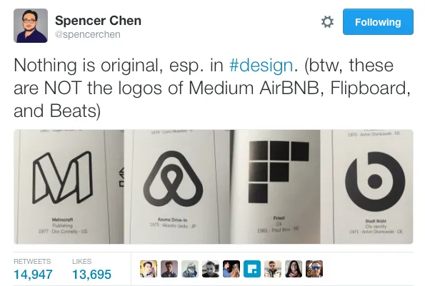
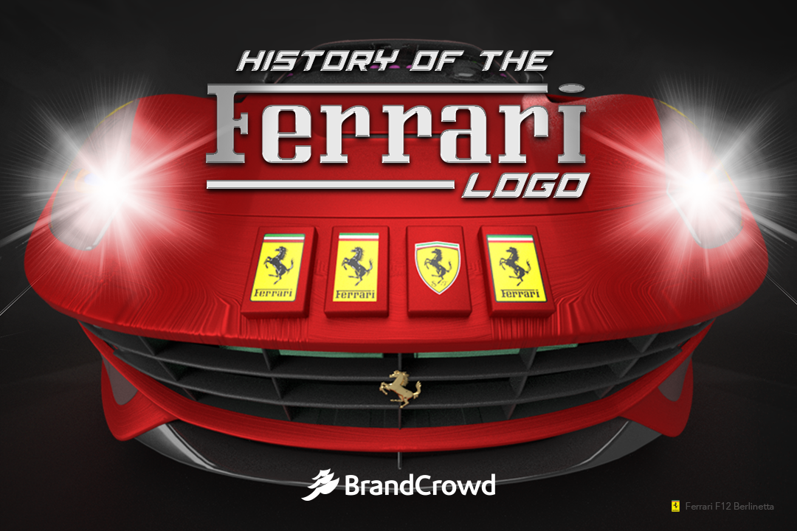
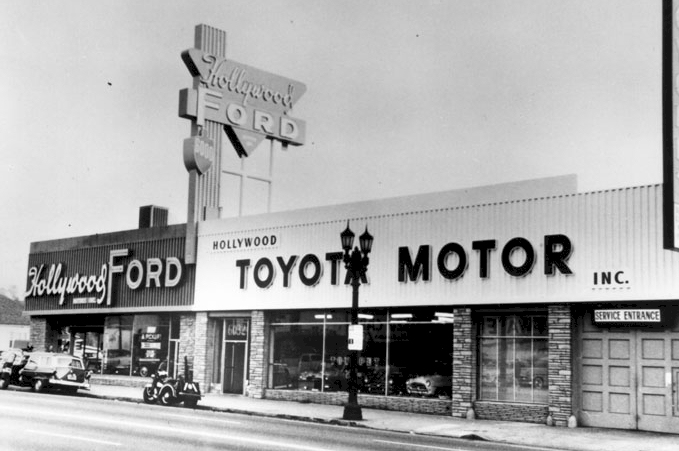
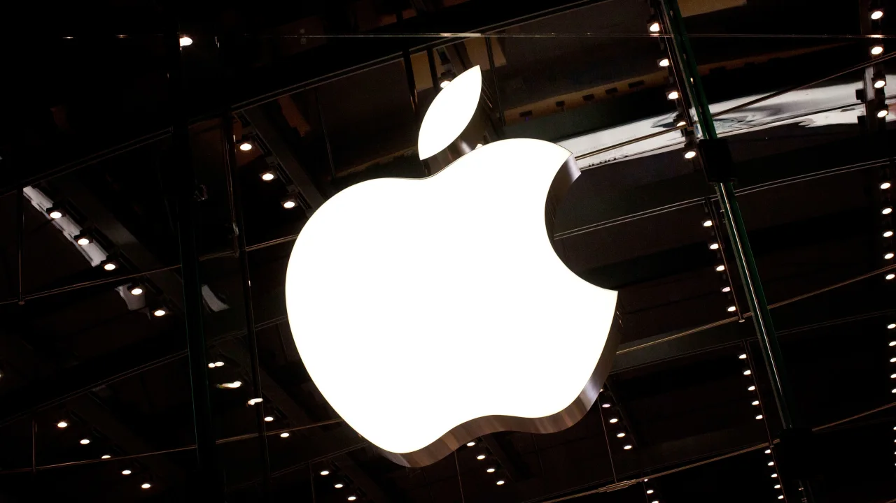
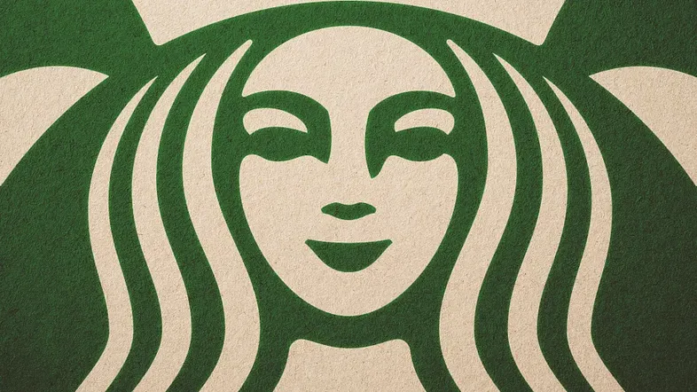
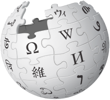

import Hyundai from "./figures/hyundai.gif"
import Ferrari from "./figures/ferrari.gif"
import Lamborghini from "./figures/lamborghini.gif"
import Toyota from "./figures/toyota.gif"
import Apple from "./figures/apple.gif"
import Microsoft from "./figures/microsoft.gif"
import LG from "./figures/lg.gif"
import Micromax from "./figures/micromax.gif"
import Amazon from "./figures/amazon.gif"
import Alibaba from "./figures/alibaba.gif"
import Flipkart from "./figures/flipkart.gif"
import Pepsi from "./figures/pepsi.gif"
import Starbucks from "./figures/starbucks.gif"
import Wikipedia from "./figures/wikipediagif.gif"
import Walmart from "./figures/walmart.gif"

<div>

_<span style="font-size:30px;">L</span>ogos have become an integral part of companies’ brand identities. A widely and instantly recognised logo is a valuable intangible asset for a corporation and is thus trademarked for intellectual property protection in most situations. Depending on your design philosophy, simple logos comprising only essential elements are often the most challenging and successful._

## What Is A Logo?
According to Wikipedia, _a logo is a graphic mark or symbol used to promote public identification and recognition_. It may be of an abstract or figurative design or include the name it represents as in a [wordmark](https://en.wikipedia.org/wiki/Wordmark).

## Purpose Of A Logo:
Logos are intended to be the face of a company. They’re meant to visually communicate the unique identity of the brand and what it represents. Without purpose, a logo is merely a design. If it’s borrowed or completely original, it makes no difference if it’s unrelatable. In the end, _a meaningful logo is a symbol of what you stand for and what you aspire to do or be that attracts me to stand with you_. You can learn more about the purpose of a logo by reading the article by [Brian Solis](https://medium.com/@briansolis) —

[//]: <> (REFERENCE ARTICLE PART STARTS HERE)

<div> <div>

<a
class="refLink"
href="https://blog.prototypr.io/what-is-the-purpose-of-a-logo-its-more-than-design-it-s-about-purpose-c7dfdc783d1e"
target="_blank">

  <div class="refContainer">
    <div class="refLeft">
      <h4>What is the purpose of a logo? It’s more than design…it’s about purpose</h4>
      <h6>My friend Spencer Chen, VP of marketing and business development for Alibaba, blew up Twitter recently by observing...</h6>
    </div>
    <div class="refRight">
      <p>
      
      </p>
   </div>
  </div>
</a>

</div> </div>

[//]: <> (REFERENCE ARTICLE PART ENDS HERE)

<p class="sectionDivider">⁕ ⁕ ⁕</p>

## Top Logo Secrets:
The consensus among designers is that logos should be unique, scalable, simple, and work well in monochrome. But, there is more to gauge quality than these common prerequisites. Hence we can find an exciting story behind most of the company logos —

#### Hyundai
<div><div>

<br></br>

<sup>**Figure 1:** Logo of the Hyundai Company</sup>

</div></div>

The Hyundai Motor Company is a South Korean multinational automotive manufacturer headquartered in Seoul (founded in 1967). Most the people misunderstand Huyndai company logo as the first letter of the company name, i.e. **H**, but actually, it’s wrong. If one gives a closer look at the logo(Figure 1), they can see _**two men are shaking hands with each other, representing the bonding between the customer and the company. Also, the circle represents that Hyundai is for all the people around the world**_.

#### Ferrari
<div><div>

<br></br>

<sup>**Figure 2:** Logo of the Ferrari Company</sup>

</div></div>

Ferrari S.p.A. is an Italian luxury sports car manufacturer based in Maranello, Italy, founded by Enzo Ferrari in 1939. Enzo Ferrari has once narrated the story behind his brand’s signature mark —

<div class="citationBlockquote">
_“The horse was painted on the fuselage of the fighter plane of Francesco Baracca— a heroic airman of the first world war. In ’23, I met count Enrico Baracca, the hero’s father, and then his mother, countess Paulina, who said to me one day, ‘Ferrari, put my son’s prancing horse on your cars. It will bring you good luck’. The horse was and still is, black, and I added the canary yellow background, which is the color of Modena.”_
</div>
<br></br>
Here, Modena is a city in Italy where the Ferrari factory is situated. Also, as we can see, the Ferrari is one of the most lovable luxury sports car, the myth about the good luck sign is pretty much applicable here. You can read more about the history of the Ferrari logo from the following article —

[//]: <> (REFERENCE ARTICLE PART STARTS HERE)

<div> <div>

<a
class="refLink"
href="https://www.brandcrowd.com/blog/history-of-the-ferrari-logo/"
target="_blank">

  <div class="refContainer">
    <div class="refLeft">
      <h4>History of The Ferrari Logo</h4>
      <h6>This horse seems to be everywhere. You've seen the Ferrari logo on books, television, movies, speed tracks, and many...</h6>
    </div>
    <div class="refRight">
      <p>
      
      </p>
   </div>
  </div>
</a>

</div> </div>

[//]: <> (REFERENCE ARTICLE PART ENDS HERE)

#### Lamborghini
<div><div>

<br></br>

<sup>**Figure 3:** Logo of the Lamborghini Company</sup>

</div></div>

Automobili Lamborghini S.p.A. is an Italian brand and manufacturer of luxury sports cars and SUVs based in Sant’Agata Bolognese (founded in 1963). Mainly there are two reasons behind the logo —
```
1) The company’s founder Ferruccio Lamborghini had a passion for bullfighting and he would regularly attend bullfighting events. Therefore, he believed that this was the perfect image to use on his company’s logo as it was a reflection of himself.

2) The bull(Figure 3) represents Lamborghini sports cars’ power, speed, and prestige.
```

#### Toyota
<div><div>

<br></br>

<sup>**Figure 4:** Logo of the Toyota Company</sup>

</div></div>
Toyota Motor Corporation is a Japanese multinational automotive manufacturer headquartered in Toyota, Aichi, Japan (founded in 1937). To see the meaning behind the Toyota logo, one need look no further than Toyota’s explanation—

<div class="citationBlockquote">
_“The two perpendicular ovals inside the larger oval represent the heart of the customer and the heart of the company. They are overlapped to represent a mutually beneficial relationship and trust between each other. The overlapping of the two perpendicular ovals inside the outer oval symbolizes “T” for Toyota, as well as a steering wheel, representing the vehicle itself. The outer oval symbolizes the world embracing Toyota. Each oval is contoured with different stroke thicknesses, similar to the “brush” art known in Japanese culture.”_
</div>
<br></br>
Also, the Toyota logo represents all the letters present in the name Toyota(Figure 4). In addition to this, Toyota designed the logo to look the same when viewed normally and when viewed inversed (as it would be when viewed through a rear-view mirror). To know more about the Toyota logo, consider reading the following article —

[//]: <> (REFERENCE ARTICLE PART STARTS HERE)

<div> <div>

<a
class="refLink"
href="https://blog.logomyway.com/history-toyota-logo/"
target="_blank">

  <div class="refContainer">
    <div class="refLeft">
      <h4>Toyota Logo and Its History</h4>
      <h6>The Toyota Logo and some History behind this auto giant. One of the top automotive manufacturers in the world, Toyota...</h6>
    </div>
    <div class="refRight">
      <p>
      
      </p>
   </div>
  </div>
</a>

</div> </div>

[//]: <> (REFERENCE ARTICLE PART ENDS HERE)

#### Apple
<div><div>

<br></br>

<sup>**Figure 5:** Evolution and Current Logo of Apple Inc.</sup>

</div></div>

I don’t think Apple Inc. requires an introduction. However, it was founded by Steve Jobs in 1976, and now it has become the most loved tech company in the world. At first, the Apple logo was featuring Isaac Newton under the fabled apple tree. But after that, in 1977, Rob Janoff created the Apple logo that we can see now(Figure 5).

At first, it was thought that in the Bible, Adam and Eve are tempted, by Satan, to taste the fruit from the tree of knowledge. Eve, like Snow White, gives in to temptation and takes a bite of an apple. Once Adam and Eve had their first taste of knowledge, they knew that they were naked and ashamed. Hence The apple symbol — and the Apple computers logo — symbolises knowledge.

But, Rob Janoff explained the meaning of the logo himself in an interview back in 2009—

<div class="citationBlockquote">
_“The reason for the bite is that it’s there for scale, so that a small Apple logo still looks like an apple, and not a cherry! As of why it’s an apple? It results in Steve Jobs working in an orchard when he was a boy and decided to name it after his favourite brand of apple, McIntosh.”_
</div>
<br></br>
You can read more from the following article written by Holden Frith —

[//]: <> (REFERENCE ARTICLE PART STARTS HERE)

<div> <div>

<a
class="refLink"
href="https://edition.cnn.com/2011/10/06/opinion/apple-logo/index.html"
target="_blank">

  <div class="refContainer">
    <div class="refLeft">
      <h4>Unraveling the tale behind the Apple logo</h4>
      <h6>If beauty is indeed truth, as John Keats claimed, then this story ought to be true: The logo on the back of your iPhone...</h6>
    </div>
    <div class="refRight">
      <p>
      
      </p>
   </div>
  </div>
</a>

</div> </div>

[//]: <> (REFERENCE ARTICLE PART ENDS HERE)

#### Microsoft
<div><div>

<br></br>

<sup>**Figure 6:** Evolution and Current Logo of Microsoft Corporation</sup>

</div></div>

Microsoft Corporation is an American multinational technology company with headquarters in Redmond, Washington (founded by Bill Gates in 1975). The Windows™ logo symbolises an actual window with four(4) panes. However, the four separate coloured panes represent four different things —
```
1) Light Blue is symbolising what Microsoft wants Windows to be, slick and quick, yet cool and easy on the eye and easy to use.

2) Orange/red is Microsoft's Office products. Red means business, because it suggests a busy life, quick and hot, which means Office is meant to get things done nice and quick.

3) Green is Microsoft Gaming, mainly XBox. Green is fun and the 'Go!' colour, meaning maximum fun. Yellow is still unclear, But I believe it represents Microsoft Hardware.

4) Yellow is bold and strong, which is what Microsoft hardware is build to be, long-lasting and efficent.
```
#### LG
<div><div>

<br></br>

<sup>**Figure 7:** Evolution and Current Logo of LG Electronics Inc.</sup>

</div></div>

LG Electronics Inc. is a South Korean multinational electronics company headquartered in Yeouido-dong, Seoul, South Korea (founded in 1958). LG represents the **“Life’s Good”** slogan. _The letters “L” and “G” in a circle symbolise the world, future, youth, humanity, and technology. Their philosophy is based on Humanity. Also, it represents LG’s efforts to keep close relationships with our customers around the world._

#### Micromax
<div><div>

<br></br>

<sup>**Figure 8:** Evolution and Current Logo of Micromax Informatics</sup>

</div></div>

Micromax Informatics, or Micromax, is an Indian multinational electronics company specialising in smartphones, laptops, consumer electronics, and home appliances, founded in March 2000.

The very first logo with a recognisable “O” character represents history. After that, a new emblem was adopted. It is inspired by a hand holding a mobile phone. However, the latest logo(Figure 8) of Micromax with a punchline nothing like anything reflects the young company’s innovative, dynamic, bold yet fun elements. _The fist in the logo doesn't only represent **the company’s aggressive plans to knock all its competitors out of its way to become the leader** but also has its name’s first two letters in it — the **M** and the **I**._

#### Amazon
<div><div>

<br></br>

<sup>**Figure 9:** Evolution and Current Logo of Amazon.com</sup>

</div></div>

Amazon.com, Inc. is an American multinational technology company based in Seattle, Washington, which focuses on e-commerce, cloud computing, digital streaming, and artificial intelligence. Amazon has changed its logo many times. But the current logo(Figure 9), introduced in 2020, has an arrow from a to z in the amazon word. _This arrow represents that **Amazon sells everything from “A” to “Z”**. The arrow also looks like a smile depicting Amazon can convey that they are a trustworthy, friendly company._

#### Alibaba
<div><div>

<br></br>

<sup>**Figure 10:** Logo and Founder of Alibaba Group</sup>

</div></div>

Alibaba Group Holding Limited, also known as Alibaba Group and as Alibaba.com, is a Chinese multinational technology company specialising in e-commerce, retail, Internet, and technology (founded in 1999 by [Jack Ma](https://en.wikipedia.org/wiki/Jack_Ma)). _The logo’s focal point is the large letter “a” in lowercase, with the outline of a human face inside it. The face supposedly depicts a satisfied customer, as indicated by the broad grin._

#### Flipkart
<div><div>

<br></br>

<sup>**Figure 11:** Evolution and Current Logo of Flipkart Company</sup>

</div></div>

Flipkart is an e-commerce company headquartered in Bangalore, Karnataka, India, and registered in Singapore (founded in 2007). _The company has chosen to retain its signature yellow colour, as it represents qualities that Flipkart represents, like imaginative, lively, friendly and inclusive. The letter F -as denoting **“playfulness”** and **“speed”**. The font used in the logo is Riona, which is contemporary but appealing to everybody. The shopping bag represents the freedom to choose products that a consumer likes._

#### Pepsi
<div><div>

<br></br>

<sup>**Figure 12:** Evolution and Current Logo of Pepsi Company</sup>

</div></div>

PepsiCo, Inc. is American multinational food, snack, and beverage corporation famous for marketing and distributing grain-based snack foods, beverages, and other products. Though it has changed its logo many times, the current logo was introduced in 2008. _The logo(Figure 12) looks like a simple globe with three colours, but there is more to it, and hence it has cost **$1,000,000**. It is claimed that the new logo represents **Earth’s magnetic field, feng shui, Pythagoras, geodynamics, renaissance and more**. In short, it is some Da Vinci Code._

#### Starbucks
<div><div>

<br></br>

<sup>**Figure 13:** Evolution and Current Logo of Starbucks Corporation</sup>

</div></div>

Well, Starbucks Corporation is an American multinational chain of coffeehouses and roastery reserves founded in 1971. The original Starbucks logo was the image of a “twin-tailed mermaid”, or siren. Greek mythology has it that sirens lured sailors to a shipwreck off the island's coast in the South Pacific, sometimes referred to as Starbuck Island. The original Starbucks founders used the logo to lure coffee lovers from everywhere. However, the mermaid or siren’s upper body was completely exposed, even baring a fully visible navel.

But the current logo(Figure 13) only focuses on the siren with no wordmark, and also, the hair covers the body and naval of the siren. Steve Murray, creative director in the Starbucks Global Creative Studio, also said —

<div class="citationBlockquote">
“This new evolution of the Starbucks logo … embraces and respects our heritage and, at the same time, evolves us to a point where we will feel it’s more suitable for the future. The new interpretation of the logo … gives us the freedom and flexibility to think beyond coffee but make no mistake … we will continue to be the world’s leading purveyor of the highest-quality coffee.”
</div>
<br></br>
You can learn more about the Starbucks logo and its history from the following articles —

[//]: <> (REFERENCE ARTICLE PART STARTS HERE)

<div> <div>

<a
class="refLink"
href="https://www.logogenie.net/blog/starbucks-logo-a-brief-history-of-their-logo-design-evolution-and-what-makes-it-so-great"
target="_blank">

  <div class="refContainer">
    <div class="refLeft">
      <h4>Starbucks logo: A brief logo history and what makes it so great!</h4>
      <h6>Out of the few historic logo designs in modern-day time, Starbucks rightfully made its way to the top. The...</h6>
    </div>
    <div class="refRight">
      <p>
      
      </p>
   </div>
  </div>
</a>

</div> </div>

[//]: <> (REFERENCE ARTICLE PART ENDS HERE)

[//]: <> (REFERENCE ARTICLE PART STARTS HERE)

<div> <div>

<a
class="refLink"
href="https://medium.com/fast-company/the-starbucks-logo-has-a-secret-youve-never-noticed-dca0e319b19a"
target="_blank">

  <div class="refContainer">
    <div class="refLeft">
      <h4>The Starbucks Logo Has A Secret You’ve Never Noticed</h4>
      <h6>Look closely at the Siren. She looks perfect. But by design, she’s not.</h6>
    </div>
    <div class="refRight">
      <p>
      
      </p>
   </div>
  </div>
</a>

</div> </div>

[//]: <> (REFERENCE ARTICLE PART ENDS HERE)

#### Wikipedia
<div><div>

<br></br>

<sup>**Figure 14:** Evolution and Current Logo of Wikipedia</sup>

</div></div>

The current Wikipedia logo(Figure 14) is an incomplete globe constructed of jigsaw pieces with a few ones missing at the top. The globe is slightly rotated, reminding the position of the Earth. _The Wikipedia logo symbol is meant to reflect the company’s never-flagging (and, based on the goal, never-ending) striving to embrace the world and cover all possible subjects. The missing jigsaw pieces stand for the impossibility of this mission of seizing the unseizable. The glyphs symbolise the website’s multilingualism._ You can read more about the Wikipedia logo and its history from a Wikipedia's page itself —

[//]: <> (REFERENCE ARTICLE PART STARTS HERE)

<div> <div>

<a
class="refLink"
href="https://en.wikipedia.org/wiki/Wikipedia:Wikipedia_logos"
target="_blank">

  <div class="refContainer">
    <div class="refLeft">
      <h4>Wikipedia: Wikipedia logos</h4>
      <h6>Wikipedia had a series of logos in its history before arriving at the current puzzle logo. Wikipedia's first true logo...</h6>
    </div>
    <div class="refRight">
      <p>
      
      </p>
   </div>
  </div>
</a>

</div> </div>

[//]: <> (REFERENCE ARTICLE PART ENDS HERE)

#### Walmart
<div><div>

<br></br>

<sup>**Figure 15:** Evolution and Current Logo of Walmart</sup>

</div></div>

Walmart Inc. is an American multinational retail corporation that operates a chain of hypermarkets, discount department stores, and grocery stores from the United States founded in 1969. As for the hidden message of the Walmart logo, it is considered that _it symbolises six sparks. And each spark, in turn, represents ideas, which are making the company successful. They also remind Sam Walton (founder of Walmart), who believed in himself and his success. This kind of inspiration that we all seek today and customer inspiration is also a part of Walmart’s logo meaning._

<p class="sectionDivider">⁕ ⁕ ⁕</p>

<div class="citationBlockquote">
Thank you for reading.

I hope you found this **_“Top Logo Secrets: You Don’t Know About”_** article helpful. Please share if you like and leave any comment to let me know your thoughts.

You can connect with me on <i><b><a href="https://www.linkedin.com/in/aritraroy24/" target="_blank">LinkedIn</a></b></i>, <i><b><a href="https://twitter.com/royaritra24" target="_blank">Instagram</a></b></i>, <i><b><a href="https://twitter.com/aritraroy24" target="_blank">Twitter</a></b></i> or <i><b><a href="https://github.com/aritraroy24" target="_blank">GitHub</a></b></i>.

</div>

</div>