

_Iou can boost the excitement of the research process, then why NOT? And, here you are…to take the fresh juice without peeling the fruit. Don’t worry, this article is just for you. But before starting — a short intro, please?_

Google chrome extensions are the most necessary kits in the toolbox of academic researchers. This is because they help make the research processes as seamless as possible. Researchers can use chrome extensions for citation assistance, bookmarking references, getting related paper recommendations, finding free versions of expensive journals, and many more. Getting bored? So easily? Okkk…let’s jump into the main part then. In the following, you can find the top 12 chrome extensions just for you —

## 1. Science Research Assistant

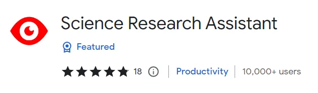

Science Research Assistant Chrome Extension

The Science Research Assistant extension for Google Chrome helps you to find relevant papers. It also helps you to find papers on a specific topic and in a particular journal, author, or date range. You can even narrow your search results by language if desired! This extension is helpful if you’re looking for a specific paper or want to see what research has been done on a topic. It’s also beneficial for finding papers in different languages than your own.

#### Key Features:
- • Keyword research
- • Trends tracker
- • Customizable algorithm

Link: 👉 [Science Research Assistant](https://chrome.google.com/webstore/detail/science-research-assistan/ceacgaccjcomdbnoodjpllihjmeflfmg?hl=en)

## 2. Mendeley Web Importer

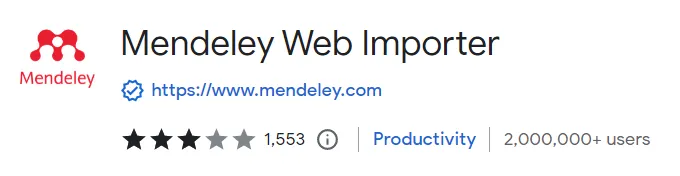

Mendeley Web Importer Chrome Extension

Mendeley is an excellent tool for organizing your research. Without it finding and managing papers on the web can be challenging. With this extension, you’ll be able to import any paper from Mendeley directly into Google Drive or Evernote, so they’re easily accessible whenever you need them. You can also use it to import papers into Dropbox and Google Docs, which is helpful if you have multiple accounts with those services. This extension allows users to add personal annotations before importing their papers into other platforms.

#### Key Features:
- • Citation and paper management
- • Real-time document synchronization.
- • Access to more than 250 million datasets over 2,000 data repositories.

Link: 👉 [Mendeley Web Importer](https://chrome.google.com/webstore/detail/mendeley-web-importer/dagcmkpagjlhakfdhnbomgmjdpkdklff?hl=en)

## 3. Google Scholar Button

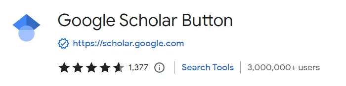

Google Scholar Button Chrome Extension

Google Scholar Button is a great way to find scholarly literature on any subject. You can limit your search by field, journal, or author. For example, if you’re looking for biology research papers, Google Scholar can help you find them.

You can also use Chrome Extensions like this one so that when you type in the name of an author or journal name from their list (like Nature), then it will automatically show up as well as all other related questions about a said topic without having to scroll through each page here manually and there just because they aren’t relevant anymore.
#### Key Features:
- • Chrome extension button
- • Query transfers from web search to scholar
- • Citation generator

Link: 👉 [Google Scholar Button](https://chrome.google.com/webstore/detail/google-scholar-button/ldipcbpaocekfooobnbcddclnhejkcpn?hl=en)

## 4. Formplus

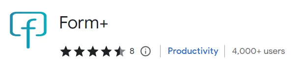

Formplus Chrome Extension

Formplus is a Chrome extension that allows you to fill out forms online. It can create and administer various surveys, polls, and quizzes for your research. You can send out mobile-friendly forms and enjoy embeddable surveys. The extension also allows you to collect digital signatures from peer reviewers and others in order to validate their identities when needed.
#### Key Features:
- • Mobile-friendly surveys, questionnaires, and polls
- • Multiple form fields.
- • Digital signatures (E-signatures)
- • Google sheets integration
- • Teams and Collaboration

Link: 👉 [Formplus](https://chrome.google.com/webstore/detail/form%20/kkhmpnfekpgmeljnlcfnabmpanhdmfjg?hl=en)

## 5. Google Dictionary (by Google)

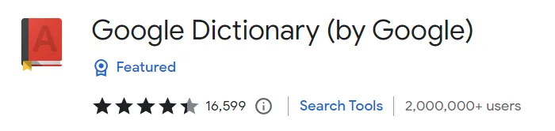

Google Dictionary (by Google) Chrome Extension

The Google Dictionary extension is a great way to ensure you understand your reading. When you find an unfamiliar word or phrase in an article, this Chrome extension will help by providing definitions and translations. You can also click on the word or phrase to get a description, which is useful if there are multiple meanings.

This Chrome extension helps by allowing users to define words. At the same time, they read articles online and offline via mobile devices using their phones’ cameras (the latter requires installing Google Translate).

#### Key Features:
- • Definitions
- • Storing history of words

Link: 👉 [Google Dictionary (by Google)](https://chrome.google.com/webstore/detail/google-dictionary-by-goog/mgijmajocgfcbeboacabfgobmjgjcoja?hl=en)

## 6. Cite This For Me: Web Citer

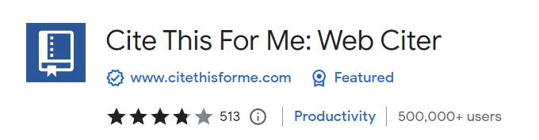

Cite This For Me: Web Citer Chrome Extension

Cite This For Me is an extension that automatically generates citations. It’s easy to install and use so that you can get started immediately — and it’s free!

Cite This For Me makes research more effortless than ever by helping you find the sources you need, organize your paper so that it’s clear who did what and when (and even how), and ensure any citations are correct. In addition to being helpful for students and academics alike, Cite This For Me can also be used by businesses looking for reliable references on their websites or blog posts.

#### Key Features:
- • Citation-generation
- • Plagiarism checker
- • Proofreader and Spell check

Link: 👉 [Cite This For Me: Web Citer](https://chrome.google.com/webstore/detail/cite-this-for-me-web-cite/nnnmhgkokpalnmbeighfomegjfkklkle?hl=en)

## 7. Evernote Web Clipper

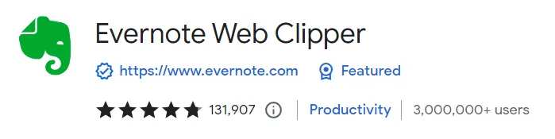

Evernote Web Clipper Chrome Extension

Evernote web clipper enables researchers to take screenshots of relevant web pages and save them to their Evernote account. When you find any helpful information on the web, all you have to do is clip it to Evernote. It has several features that improve your overall user experience.

#### Key Features:
- • Full-page clipping
- • Bookmark resources
- • Screenshots and custom clips

Link: 👉 [Evernote Web Clipper](https://chrome.google.com/webstore/detail/evernote-web-clipper/pioclpoplcdbaefihamjohnefbikjilc)

## 8. Similar Sites - Discover Related Websites

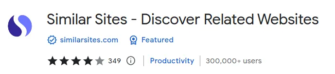

Similar Sites - Discover Related Websites Chrome Extension

This is an excellent extension for finding relevant pages and websites. It can help you find related pages, similar pages, and even similar pages to your current page. This is especially helpful if you’re looking to build a knowledge base or blog, as it will let you know how many others are writing about the same topic.

#### Key Features:
- • Similar websites in a click

Link: 👉 [Similar Sites - Discover Related Websites](https://chrome.google.com/webstore/detail/similar-sites-discover-re/necpbmbhhdiplmfhmjicabdeighkndkn?hl=en)

## 9. EquatIO

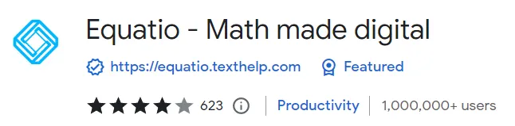

EquatIO Chrome Extension

EquatIO enables users to create mathematical equations, formulas, and quizzes in their research papers seamlessly. All you need to do is input a variation of the expression into your system, and EquatIO will transform this into an accurate on-screen formula. You can also use the voice feature in your computer to input mathematical equations. You can create digital quizzes and input responses directly.

#### Key Features:
- • Google applications support
- • Chemistry formula prediction
- • Voice dictation and handwriting recognition
- • Predictive texting

Link: 👉 [EquatIO](https://chrome.google.com/webstore/detail/equatio-math-made-digital/hjngolefdpdnooamgdldlkjgmdcmcjnc)

## 10. Unpaywall

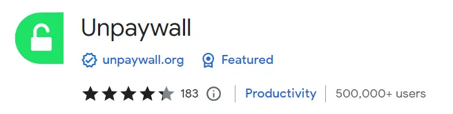

Unpaywall Chrome Extension

As the name suggests, Unpaywall is an open-access resource for more than twenty million free academic articles, including dissertations, thesis, and research publications. When you add the Chrome extension to your browser, it provides free access to relevant primary and secondary data sources that improve the quality of your systematic investigation. And the best part? It’s free!

#### Key Features:
- • Free access to research literature from top libraries.
- • Directly from university and government web servers

Link: 👉 [Unpaywall](https://chrome.google.com/webstore/detail/unpaywall/iplffkdpngmdjhlpjmppncnlhomiipha?hl=en)

## 11. Altmetric for Pubmed and Google Scholar

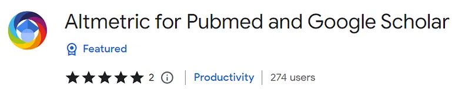

Altmetric for Pubmed and Google Scholar Chrome Extension

Altmetric is a tool that helps you track the online attention your research receives. It collects and analyzes mentions of your research online, allowing you to see how many times your research has been tweeted, shared on Facebook, or linked to other websites.

Altmetric also tracks citations — that is, citations of the original source (for example: “Molecular Biology of RNA”) with additional information added in parentheses (e.g., “Michael Bader & Martin Karplus; Journal Article: Proceedings Of The National Academy Of Sciences USA 10/2–22/93). You can find this information through Altmetric’s web interface or through email alerts sent by their service when new papers mention your work!

#### Key Features:
- • Altmetric score in search result

Link: 👉 [Altmetric for Pubmed and Google Scholar](https://chrome.google.com/webstore/detail/altmetric-for-pubmed-and/moognpmgdkhdnljndnbbfahhajjhjjac)

## 12. Sci-Hub X Now!

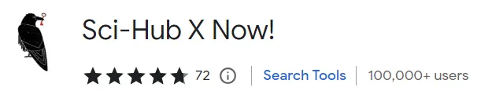

Sci-Hub X Now! Chrome Extension

Sci-Hub is the most controversial project in modern science. The goal of Sci-Hub is to provide unrestricted access to all scientific knowledge. Sci-Hub has revolutionized science by making all paid knowledge free. This chrome extension is the official extension of the Sci-Hub project for easy access to restricted research articles.

#### Key Features:
- • Access to restricted research articles
- • Database of 88,343,822 research articles and books

Link: 👉 [Sci-Hub X Now!](https://chrome.google.com/webstore/detail/sci-hub-x-now/gmmnidkpkgiohfdoenhpghbilmeeagjj)

⁕ ⁕ ⁕

Thank you for reading.

I hope you found this **_“Top 12 Chrome Extensions to Boost Your Research Productivity”_** article helpful. Please share if you like and leave any comment to let me know your thoughts.

You can connect with me on <i><b><a href="https://www.linkedin.com/in/aritraroy24/" target="_blank">LinkedIn</a></b></i>, <i><b><a href="https://twitter.com/royaritra24" target="_blank">Instagram</a></b></i>, <i><b><a href="https://twitter.com/aritraroy24" target="_blank">Twitter</a></b></i> or <i><b><a href="https://github.com/aritraroy24" target="_blank">GitHub</a></b></i>.

