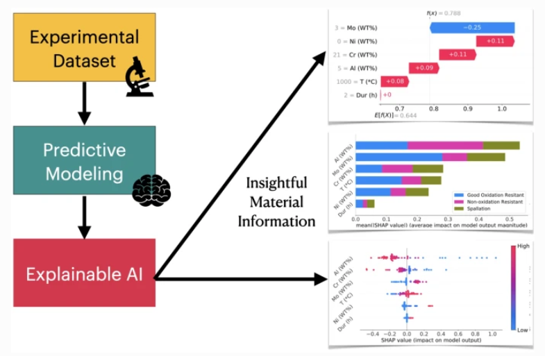
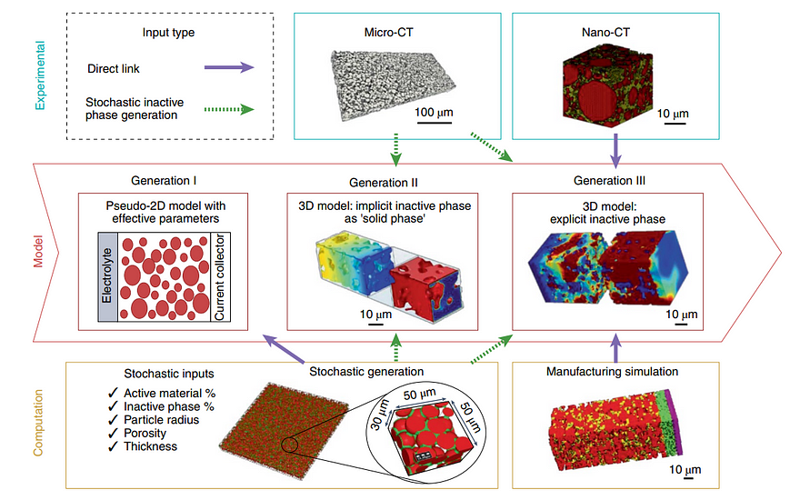
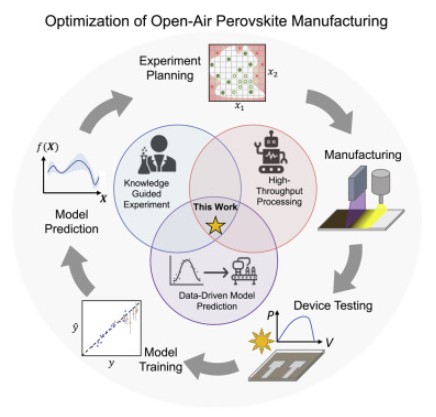
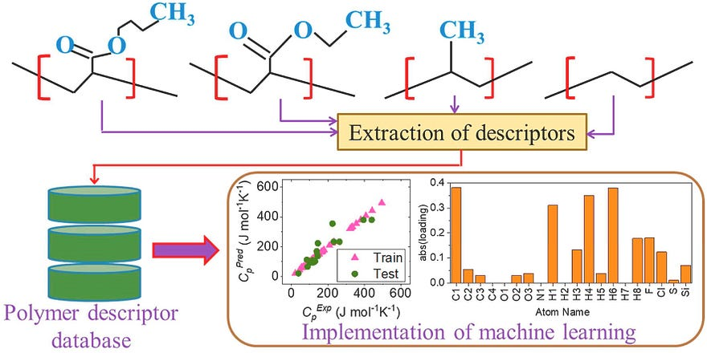
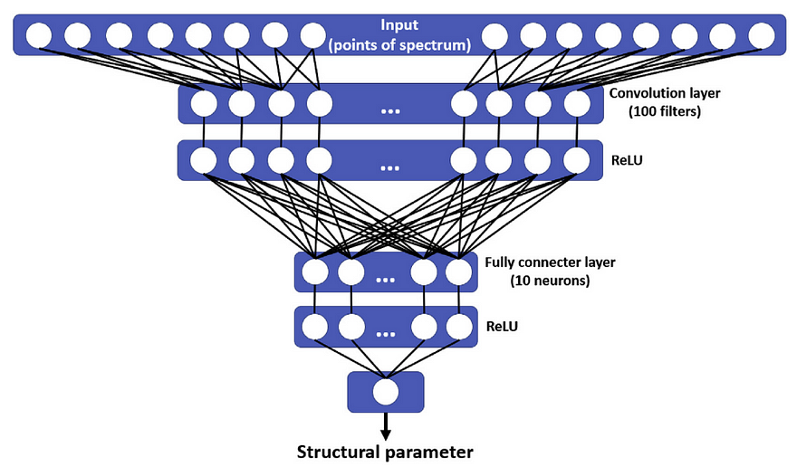

"I don't advocate for a world without AI, I call for a world where AI is used responsibly."
― Abhijit Naskar, [Visvavictor: Kanima Akiyor Kainat](https://www.goodreads.com/work/quotes/170542933-visvavictor-kanima-akiyor-kainat)

_Most likely people from all over the world are avidly craving for the above-mentioned thing in this digital era of **Artificial Intelligence**. Hence in most cases, we can hear the advance of a more sustainable life achieved by the usage of AI. Today I'm going to talk about **how Artificial intelligence (AI) is being used to design new materials with specific properties, such as high strength or low toxicity or anything else**. This has the potential to revolutionize the materials industry, as it could lead to the development of new materials for a wide range of applications, from batteries to medical devices._

AI can be used to screen vast libraries of potential materials and identify those with the desired properties. This is a much faster and more efficient process than traditional methods of materials discovery, which can take years or even decades. As AI technology continues to develop, we can expect to see even more innovative new materials being developed in the years to come. These materials could have a major impact on our world, making it cleaner, healthier, and more sustainable.

⁕ ⁕ ⁕

## Example of Recent AI Usage in Materials Science
#### 2023
_**[1]. Predicting FeCrAl Alloy Oxidation:**_ Indranil Roy from Lehigh University and his co-workers published a paper⁽¹⁾ in January 2023 that combines experimental and artificial intelligence methods to predict the oxidation resistance of FeCrAl alloys. They trained a neural network using experimental data and used an explainable artificial intelligence tool to gain insights into material behaviour. The study found that high aluminum and chromium content in FeCrAl alloys creates a protective oxide layer, while the presence of molybdenum leads to the formation of a thick oxide scale that is vulnerable to spallation.

Graphical abstract of the journal paper "Understanding oxidation of Fe-Cr-Al alloys through explainable artificial intelligence"

## 2022
_**[2]. X-ray CT, Nano-CT and AI:**_ In April 2022, researchers at the University of California, San Diego, combined [X-ray computed tomography (CT)](https://www.nature.com/articles/s43586-021-00015-4) and [nano-CT](https://pubmed.ncbi.nlm.nih.gov/26815120/), with artificial intelligence, to enhance battery research and modelling⁽²⁾. X-ray CT is a type of imaging that allows us to see inside batteries without damaging them. It uses contrast from the materials' absorption to create detailed images. Recently, smaller CT systems called nano-CT have been developed, which can see tiny details as small as 50 nanometers. With the help of artificial intelligence and machine learning, nano-CT has become a powerful tool for studying battery materials and understanding how their structure affects their performance. By combining different CT imaging techniques, we can create models that predict how batteries behave on different scales.

Relationship between experimental tomography data, cell model and computation of electrochemical data in battery systems.

_**[3]. Machine Learning for Solar Cell Manufacturing:**_ Zhe Liu and his coworkers from the Massachusetts Institute of Technology published a paper⁽³⁾ in April 2022 about a new way to improve the manufacturing process of perovskite solar cells using machine learning. They used a technique called rapid spray plasma processing and developed a framework that combines human observations and machine learning to select the best process conditions. With limited experiments, they achieved an efficiency improvement of 18.5% in solar cell devices. Their approach outperformed traditional methods and showed faster improvements in the manufacturing process.

Graphical abstract of the journal paper "Machine learning with knowledge constraints for process optimization of open-air perovskite solar cell manufacturing"

## 2021
_**[4]. Predicting Cell Activities with Machine Learning:**_ In February 2021, a paper was published by Maram Y. Al-Safarini from Zarqa University and Hamdy H. El-Sayed from Sohag University⁽⁴⁾. The paper discusses a machine learning method that aims to predict the future activities and interactions of biological cells. The stability and development of these cells rely on the binding free energy of residues found at their interfaces. By extracting key features from cells and components through an ecosystem-based experiment, the proposed method calculates predictions using standardized data, providing valuable insights without the need for real-world experiments.

_**[5]. Predicting Polymer Specific Heat:**_ Rahul Bhowmik from Air Force Research Laboratory and his co-workers published a paper⁽⁵⁾ in April 2021 on predicting the specific heat at constant pressure (Cₚ) of polymers using machine learning. Cₚ is an important factor in understanding how materials conduct heat. The study used decision tree and principal component analysis methods to investigate and predict Cₚ at room temperature. Despite a limited dataset, the results showed promise in designing new polymers with desired Cₚ values. The research also explored the relationship between polymer properties and Cₚ, which could lead to the development of novel materials with tailored characteristics.

Graphical abstract of the journal paper "Prediction of the specific heat of polymers from experimental data and machine learning methods"

## 2020
_**[6]. Super-Compressible Meta-Material:**_ For researchers over at [TU Delft](https://www.tudelft.nl/en/) in the Netherlands, AI was instrumental in their development of a super-compressible [metamaterial](https://en.wikipedia.org/wiki/Metamaterial)⁽⁶⁾ out of what is typically a brittle and fragile material. With this new metamaterial, objects like bicycles or furniture could be made out of this super-compressible substance and then squished down into something that would fit into your pocket. "Metamaterial design has relied on extensive experimentation and a trial-and-error approach," said the study's co-author Miguel Bessa, who is an assistant professor in materials science and engineering at TU Delft. "We argue in favour of inverting the process by using machine learning for exploring new design possibilities while reducing experimentation to an absolute minimum.

<iframe src="https://www.youtube.com/embed/cWTWHhMAu7I" title="YouTube video player" frameborder="0" allow="accelerometer; autoplay; clipboard-write; encrypted-media; gyroscope; picture-in-picture; web-share" allowfullscreen></iframe>
  
TU Delft - Researchers design new material by using Artificial Intelligence only.

_**[7]. ML for XANES Spectrum Prediction:**_ A.A. Guda and his co-workers published a paper⁽⁷⁾ in October 2020, where they applied machine learning methods to predict the structural parameters of a system using its XANES spectrum. They used two approaches: direct prediction, where the ML model predicts structural parameters from the spectrum, and inverse prediction, where the ML model approximates the spectrum based on the structural parameters. The study focused on predicting the geometry of a CO2 molecule adsorbed on Ni2+ surface sites in a metal-organic framework. The researchers discussed the advantages, disadvantages, and challenges of overfitting caused by differences between experimental data and the learning dataset.

Sketch diagram of the neural network used for prediction of structural parameters.

These are just a handful of journal papers I discussed in this article. Numerous peer-reviewed articles have been published already, and the number is rising like an epsilon graph.

## The Benefits of Using AI to Create New Materials
There are several benefits to using AI to create new materials-

• AI can help to accelerate the discovery process. Traditional methods of materials discovery can be time-consuming and expensive. AI can help to speed up the process by identifying promising candidates more quickly.

• AI can assist to improve the efficiency of the discovery process. AI can be used to screen large datasets of potential materials, which can help to identify those with the desired properties. This can help to reduce the number of experiments that need to be performed, which can save time and money.

• It can also help to enhance the quality of the discovery process and also be used to predict the properties of potential materials, which can help to avoid wasting time and resources on materials that are not likely to be successful.

## The Challenges of Using AI to Create New Materials
There are also some challenges to using AI to create new materials. One challenge is that AI models can be complex and difficult to develop. Another challenge is that AI models can be biased, which can lead to the discovery of materials that are not as effective as they could be.

## The Future of AI in Materials Science
The future of AI in materials science is very promising. As AI technology continues to develop, we can expect to see even more innovative and groundbreaking materials being developed using AI. AI has the potential to revolutionize the materials industry, and it is already having a significant impact.

## Conclusion
AI is a powerful tool that can be used to create new materials with specific properties. This has the potential to revolutionize the materials industry and lead to the development of new materials that can improve our lives in a sustainable way.

## References

(1) Roy, I.; Feng, B.; Roychowdhury, S.; Ravi, S. K.; Umretiya, R. V.; Reynolds, C.; Ghosh, S.; Rebak, R. B.; Hoffman, A. Understanding Oxidation of Fe-Cr-Al Alloys through Explainable Artificial Intelligence. MRS Commun. 2023, 13 (1), 82–88. [10.1557/s43579-022-00315-0](https://doi.org/10.1557/s43579-022-00315-0).

(2) Scharf, J.; Chouchane, M.; Finegan, D. P.; Lu, B.; Redquest, C.; Kim, M.-C.; Yao, W.; Franco, A. A.; Gostovic, D.; Liu, Z.; Riccio, M.; Zelenka, F.; Doux, J.-M.; Meng, Y. S. Bridging Nano- and Microscale X-Ray Tomography for Battery Research by Leveraging Artificial Intelligence. Nat. Nanotechnol. 2022, 17 (5), 446–459. [10.1038/s41565-022-01081-9](https://doi.org/10.1038/s41565-022-01081-9).

(3) Liu, Z.; Rolston, N.; Flick, A. C.; Colburn, T. W.; Ren, Z.; Dauskardt, R. H.; Buonassisi, T. Machine Learning with Knowledge Constraints for Process Optimization of Open-Air Perovskite Solar Cell Manufacturing. Joule 2022, 6 (4), 834–849. [10.1016/j.joule.2022.03.003](https://doi.org/10.1016/j.joule.2022.03.003).

(4) Al-Safarini, M. Y.; El-Sayed, H. H. The Role of Artificial Intelligence in Revealing the Results of the Interaction of Biological Materials with Each Other or with Chemicals. Mater. Today 2021, 45, 4954–4959. [10.1016/j.matpr.2021.01.387](https://doi.org/10.1016/j.matpr.2021.01.387).

(5) Bhowmik, R.; Sihn, S.; Pachter, R.; Vernon, J. P. Prediction of the Specific Heat of Polymers from Experimental Data and Machine Learning Methods. Polymer (Guildf.) 2021, 220 (123558), 123558. [10.1016/j.polymer.2021.123558](https://doi.org/10.1016/j.polymer.2021.123558).

(6) Bessa, M. A.; Bostanabad, R.; Liu, Z.; Hu, A.; Apley, D. W.; Brinson, C.; Chen, W.; Liu, W. K. A Framework for Data-Driven Analysis of Materials under Uncertainty: Countering the Curse of Dimensionality. Comput. Methods Appl. Mech. Eng. 2017, 320, 633–667. [10.1016/j.cma.2017.03.037](https://doi.org/10.1016/j.cma.2017.03.037).

(7) Guda, A. A.; Guda, S. A.; Martini, A.; Bugaev, A. L.; Soldatov, M. A.; Soldatov, A. V.; Lamberti, C. Machine Learning Approaches to XANES Spectra for Quantitative 3D Structural Determination: The Case of CO2 Adsorption on CPO-27-Ni MOF. Radiat. Phys. Chem. Oxf. Engl. 1993 2020, 175 (108430), 108430. [10.1016/j.radphyschem.2019.108430](https://doi.org/10.1016/j.radphyschem.2019.108430).

⁕ ⁕ ⁕

Thank you for reading.

I hope you found this **_“AI-ML Powered Materials Design Breakthrough: Is the Colorful Future of Materials Science Near?”_** article helpful. Please share if you like and leave any comment to let me know your thoughts.

You can connect with me on <i><b><a href="https://www.linkedin.com/in/aritraroy24/" target="_blank">LinkedIn</a></b></i>, <i><b><a href="https://twitter.com/royaritra24" target="_blank">Instagram</a></b></i>, <i><b><a href="https://twitter.com/aritraroy24" target="_blank">Twitter</a></b></i> or <i><b><a href="https://github.com/aritraroy24" target="_blank">GitHub</a></b></i>.

