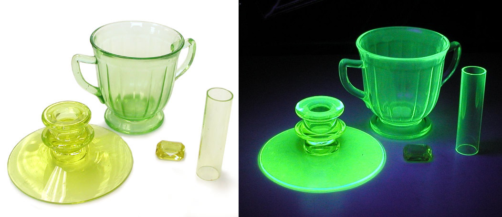
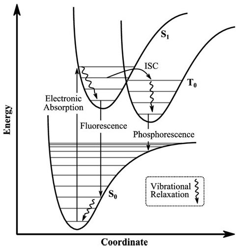

“Broken glass. It's just like glitter, isn't it?” ― Pete Doherty

_But, what if the whole glass is like glitter? Uranium glass is a type of glass that contains trace amounts of uranium oxide added to give it a distinctive green or yellow glow under ultraviolet light. Though it may sound hazardous, uranium glass is completely safe to handle and enjoy when proper precautions are taken. In this article, we'll explore the history of uranium glass, how it glows, common types and colours, safety information, and where to buy or collect your own pieces of this radiant glassware._

⁕ ⁕ ⁕

## A Brief History of Uranium Glass
The radioactive element, [Uranium (₉₂U)](https://en.wikipedia.org/wiki/Uranium) was [discovered in 1789](https://world-nuclear.org/information-library/nuclear-fuel-cycle/introduction/what-is-uranium-how-does-it-work.aspx) by a German chemist, [Martin Klaproth](https://en.wikipedia.org/wiki/Martin_Heinrich_Klaproth). According to [Museum of Radiation and Radioactivity](https://www.orau.org/health-physics-museum/index.html) Uranium was first used to colour glass in the 1830s. It became very popular for this purpose until the limitation by the Cold War in the years running from the 1940s to the 1990s. London-based [Powell Whitefriars Glass](http://www.theglassmuseum.com/powell.htm) company was one of the very first companies to market these glass. Some other manufacturer companies are-

• Adams & Company

• Baccarat & Cambridge Glass Company

• Steuben Glass

Buckley et al (1980)¹ estimated that there were at least 4,160,000 pieces of decorative uranium glass produced in the US between 1958 and 1978 and 15,000 drinking glasses from 1968 to 1972.

## Common Types and colours

Figure 1.1 - Uranium glasses in normal light and UV light

### Vaseline Glass
The most common colour of uranium glass is pale yellowish-green, which in the 1930s led to the nickname "Vaseline glass", based on a perceived resemblance to the appearance of Vaseline-brand petroleum jelly as formulated at that time. The main characteristic of this type of glass is they are transparent in nature.
### Depression Glass
Sometimes additional colourant (probably iron) has been used in addition to the uranium to produce more green colour. These glasses are less popular and usually called Depression Glass.
### Custard Glass
Opaque, dense yellowish off-white colour, which glows a bright yellow. Usually these are not transparent.
### Burmese Glass
Opaque glass that shades from pink to yellow.

## Is Uranium Glass Safe?
Uranium glass is completely safe to own, display, and use for drinking or dining as long as some basic precautions are followed. Although some uranium glass was created with natural uranium, after World War II, using depleted uranium (DU) became more common. DU comes with the benefit of mostly releasing [alpha radiation which can’t penetrate the skin](https://www.epa.gov/radtown/depleted-uranium#:~:text=Like%20the%20natural%20uranium%20ore,not%20considered%20a%20serious%20hazard.) so isn’t considered a serious hazard outside of the body.

## How to Identify Uranium Glass?
Vaseline glass is one type of uranium glass that can be easily identified with the naked eye if you know what to look for, which is glass that has a colour a wad of petroleum jelly. To uncover the radioactive potential of clearer glass, though, you might need an ultraviolet light and a dark environment.

## Where to Buy a Uranium Glass?
For enthusiasts looking to start their own collection, uranium glass can be readily found at antique stores, flea markets, online auctions, and specialty dealers. Mid-century pieces from the 1930s-50s are quite abundant, while rarer 19th century and Art Nouveau-style pieces also exist. When shopping for uranium glass, a UV blacklight flashlight is an essential tool to identify genuine pieces. A good place to find Uranium glasses online is [ebay](https://www.ebay.com/sch/i.html?_nkw=uranium+glass&_oaa=1&_dcat=870&_sop=12).

⁕ ⁕ ⁕

## Chemistry Behind the Glory
### Fundamental Explanation
The fluorescent property of uranium glass comes from the diuranate form of uranium added during production. Natural uranium contains a small percentage of uranium-235 atoms (the isotope capable of nuclear fission). When UV light strikes uranium-235 atoms, they fluorescence, emitting photons in the visible spectrum that we see as a greenish-yellow glow.

The uranium content of most glass is low—usually just trace amounts around 1-2%. But it is enough to produce the brilliant fluorescence. Other compounds like lead oxide may also be added to enhance the glass's workability and shine.

The uranium-235 atom absorbs the energy from the UV light and becomes excited. This excited atom then releases some of its energy in the form of photons in the visible spectrum. These photons are what we see as the greenish-yellow glow of uranium glass.

[uranium-235] + UV light → [excited uranium-235] → [uranium-235] + photons (visible light)

### Franck-Condon Principle

Figure 1.2 - Franck-Condon energy level diagram with Fluorescence and Phosphorescence

The Franck-Condon principle states that when an electron in a molecule is excited, the nuclei do not have time to move significantly. This means that the electron will transition to a new higher energy level, i.e., excited state (S₁), but the nuclei will remain in the same vibrational state, i.e., ground state (S₀ ). This is because the nuclei cannot move quickly enough to adjust to the new energy level of the electron. As a result, the most likely outcome of the transition is that the electron will move to a new energy level, but the nuclei will remain in the same vibrational state.

In the case of uranium glass, the absorption of UV light causes an electronic transition in the uranium-235 atom. The Franck-Condon principle predicts that the probability of this transition will be highest when the vibrational state of the atom matches the vibrational state of the excited state.  When the excited uranium-235 atom decays back to its ground state, there can be two options [Figure 1.2] - 

• S₁ → T₀ → S₀ [Shows Phosphorescence] (where T₀ is the triplet ground state)

• S₁ → S₀ [Shows Fluorescence]

For the first type, the excited electron goes to triplet ground state (T₀) through a process called Inter System Crossing (ISC). Then finally it comes back to singlet ground state, i.e., S₀. At the time of coming to singlet ground state from triplet ground state it emits its energy in terms of photon particles which is called Phosphorescence. However, this total process takes time and not instantaneous.

**However, for the second process the excited electron directly comes to singlet ground state and the process is instantaneous. While coming to the ground state, the excited electron also emits its energy in terms of photon particles which is called Fluorescence. As the glory of the uranium glass is instantaneous, i.e., if UV light fells on the glass, it starts to glow, this process is fluorescence.**

## References
[1] Buckley et al. Environmental Assessment of Consumer Products Containing Radioactive Material. Nuclear Regulatory Commission. NUREG/CR-1775. 1980.   
[2] [Wikipedia](https://en.wikipedia.org/wiki/Uranium_glass)

⁕ ⁕ ⁕

Thank you for reading.

I hope you found this **_“What Is Uranium Glass: Know the Chemistry Behind Its Glory”_** article helpful. Please share if you like and leave any comment to let me know your thoughts.

You can connect with me on <i><b><a href="https://www.linkedin.com/in/aritraroy24/" target="_blank">LinkedIn</a></b></i>, <i><b><a href="https://twitter.com/royaritra24" target="_blank">Instagram</a></b></i>, <i><b><a href="https://twitter.com/aritraroy24" target="_blank">Twitter</a></b></i> or <i><b><a href="https://github.com/aritraroy24" target="_blank">GitHub</a></b></i>.

