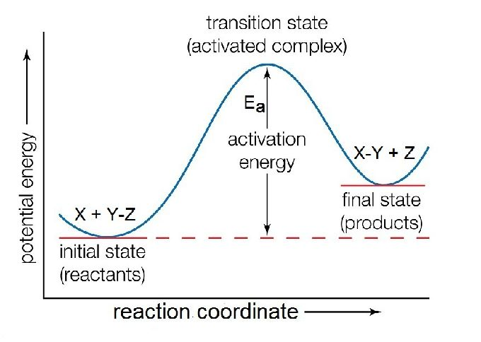

“AI will be a critical enabler of human space exploraton and of humans becoming a multi planetary species.” ― Hendrith Vanlon Smith Jr, CEO of Mayflower-Plymouth, Business Essentials

_Chemistry is a complex field that requires deep understanding of concepts and ability to apply knowledge to solve real-world problems. Recent advances in AI have led to new tools like [ChatGPT](https://chat.openai.com/ "ChatGPT"), [Claude2](https://claude.ai/chat/) and [Bard](https://bard.google.com/) that can help students in mastering chemistry. In this blog, we will discuss the benefits of AI assistants for learning chemistry, drawbacks of ChatGPT, advantages of more advanced Claude2 and Bard, and see some examples of how these tools can enable mastery over chemistry._

‚Åï ‚Åï ‚Åï

## Benefits of Using AI Assistants for Mastering Chemistry

### Personalized Learning:

AI assistants can tailor the learning experience based on each student's individual needs and learning style. By analyzing the student's performance and progress, the AI can provide targeted content and exercises to help them grasp challenging concepts more effectively. This personalized approach enhances the student's understanding and retention of chemistry principles.

### Instant Answers and On-Demand Tutoring:

AI assistants can provide immediate answers to chemistry questions, acting as a virtual tutor available 24/7. Students no longer have to wait for teacher feedback or search for solutions elsewhere. This real-time support ensures that students can overcome obstacles in their learning journey promptly.

### Reinforcement and Practice:

AI assistants offer multiple explanations and practice questions for various chemistry topics. Students can review the material at their own pace and gain a deeper understanding of the subject through repeated exposure to relevant content. This reinforcement helps solidify their knowledge and improves their problem-solving skills.

### Bridging Theory with Real-World Applications:

AI assistants can facilitate the connection between theoretical concepts and their real-world applications. Through interactive simulations, practical examples, and case studies, students can better grasp how chemistry principles play a role in various industries and everyday life. This practical relevance enhances their motivation and engagement with the subject.

### Access to Latest Discoveries and Information:

If any AI assistant has access to browse the internet, it can stay updated with the latest advancements in the field of chemistry. By providing access to current research papers, news articles, and discoveries, students can keep themselves informed about cutting-edge developments. This exposure to the latest information fosters curiosity and a deeper appreciation for the dynamic nature of chemistry.

Although this article will be all about AI assistant, we can use AI for various other chemistry problems, like, finding the suitable reaction path using retrosynthesis or predicting the products of a reaction. Check out my another article on this-

[//]: <> (REFERENCE ARTICLE PART STARTS HERE)

 

<a
class="refLink"
href="/tutorial/blogs/2021/how-to-make-chemical-synthesis-easier-using-ai">

  

    

      <h4>How to Make Your Chemical Synthesis Absolutely Easier Using AI Advantage</h4>
      <h6>Get More Effective But Quick Result in Your Next Synthesis</h6>
    

    

      

      
      

   

  

</a>

 

[//]: <> (REFERENCE ARTICLE PART ENDS HERE)

## ChatGPT: Sid the sloth

ChatGPT, developed by [OpenAI](https://openai.com/), gained significant attention upon its market release in December 2022, primarily due to its natural language processing capabilities and ability to generate human-like responses. However, despite its initial success, ChatGPT faces significant limitations when you want to use it for free. And if you are a student, most likely you'll not try to waste $20/month if there are better free alternatives. These limitations can be attributed to factors such as slow response times, outdated knowledge, lack of external references, and the absence of visual aids like structures and equations. These challenges are particularly evident in the free version of ChatGPT, making it less suitable for comprehensive chemistry education.

### Slow Response Time:

One of the primary hindrances with ChatGPT's free version is the slow response time of 10-20 seconds. This delay disrupts the flow of learning and can be frustrating for students seeking immediate answers or explanations. It significantly affects the learning experience in a subject that demands quick comprehension and engagement.

### Outdated Knowledge:

Another major limitation of ChatGPT is its reliance on pre-2021 data. Chemistry is a dynamic and rapidly evolving field, with constant advancements and discoveries. By being limited to outdated information, ChatGPT may provide inaccurate or incomplete explanations for recent developments in chemistry.

### Lack of External References:

Although with the help of a Chrome extension, [WebChatGPT](https://chrome.google.com/webstore/detail/webchatgpt-chatgpt-with-i/lpfemeioodjbpieminkklglpmhlngfcn), ChatGPT can browse the internet. But, the most of the time the references are either not that relevant or completely wrong in compared to the details provided by a similar free competitor, _Bard_.

### Absence of Visual Aids:

Visual aids, such as molecular structures, chemical equations, and diagrams, play a vital role in understanding complex chemistry concepts. Unfortunately, ChatGPT's free version lacks support for visuals, making it challenging for users to comprehend certain topics that heavily rely on graphical representations. Without access to visual aids, students may struggle to grasp spatial relationships, molecular geometries, and reaction mechanisms, impeding their overall understanding of chemistry.

### Word Limit:

As of now with the free model of ChatGPT, approximately 4000 words (not documented on OpenAI website) can be generated at once. Whereas, with Claude2, you can generate approximately 75000 words at once.

  - Not only this, many people have reported a significant degradation of the
  quality of the responses by ChatGPT 4, which is the paid version!!! [Tweet
  Link](https://twitter.com/svpino/status/1681614284613099520)

## Claude2 and Bard: Thoroughbred for the horse racing game

Advanced systems like Claude2 and Bard are better equipped for learning chemistry. There are various reasons why you should start using these tools right now-

• Faster conversations enable more engaged, interactive learning (Bard & Claude2)

• Can browse internet to provide accurate, current information, and analyse websites (Bard)

• Allow uploading documents like PDF, Excel or Text files for analyzing the data (Claude2)

• Image recognition (Bard)

## Handful of Examples

### Browse internet for faster solution using Bard

üëâ **Prompt:**
How to handle "link 9999 error in Gaussian software"?

**Bard's Reply:**  

**Original Solution:** [ResearchGate Link](https://www.researchgate.net/post/How-to-fix-error-link-9999-in-gaussian-Its-coming-as-I-add-a-solvent-IEFPCM-DCE-Model-to-the-job-without-the-solvent-optimization-is-sucessfulWhy)

üëâ **Prompt:**
Give the summary of the journal paper "Expanding the Frontiers of Higher-Order Cycloadditions" by Roald Hoffmann. Write key points from each heading. The link for the paper is - [Give Journal Link]. Write at least three sentences for each section. Also, summarize the whole paragraphs under one heading, don't write the first three lines.

**Bard's Reply:**  

  

**Original Paper:** [Journal Link](https://pubs.acs.org/doi/full/10.1021/acs.accounts.9b00498)

### Uploading documents for analyzing data using Claude2

üëâ **Prompt:**
Show the first 10 row data in a table format and find out the SMILE codes for the molecules which have nucleophilicity greater than 42

**Claude2's Reply:**  

  

**Original CSV File:** [Download File](https://www.4shared.com/s/fOW9gEQKGku)

üëâ **Prompt:**  
Read the PDF document and answer the questions-  
1.How many reference articles are there in the paper?  
2.What substrate is used for the synthesis and from where it was bought?  
3.What the DOS of the structure indicates - is it metallic or insulator or semiconductor?  
4.Who is the first author of the paper and how many authors are there in total?  
5.What are the keywords of the paper?

**Claude2's Reply:**  

**Original PDF File:** [Download File](https://www.4shared.com/s/fIu-sJP3rjq)

### Understanding an image or graph

üëâ **Prompt:**  
What is this molecule? Give some properties of this molecule.

  

**Bard's Reply:** (copy-pasted here)
  
The molecule in the image is naphthalene. It is a white, crystalline solid with a
characteristic mothball odor. Naphthalene is a hydrocarbon, meaning it is made up
of only hydrogen and carbon atoms. It has a molecular formula of C10H8.

Naphthalene is a relatively simple molecule, but it has some interesting properties. It is a very flammable solid, and it can be used as a fuel. Naphthalene is also an effective insect repellent, and it is often used in mothballs.

Here are some other properties of naphthalene:

• Melting point: 80.1°C (176.2°F)  
• Boiling point: 218°C (424°F)  
• Density: 1.14 g/cm3  
• Soluble in alcohol, ether, and benzene  
• Insoluble in water

Naphthalene is a versatile molecule with a variety of uses. It is a common ingredient in mothballs, and it is also used in the production of nylon and other plastics. Naphthalene is a safe and effective substance when used properly, but it can be harmful if inhaled in large quantities.

üëâ **Prompt:**  
Describe the plot from the image.

  

**Bard's Reply:** (copy-pasted here)
  
Sure, I can help you with that.

The plot from the image shows a chemical reaction that takes place in a reaction coordinate system. The reaction coordinate system is a curve that shows the potential energy of the reactants and the activation energy of the reactants. The potential energy of the reactants is the energy they have before they react. The activation energy is the energy that the reactants need to have in order to react.

The plot shows that the potential energy of the reactants (X + Y-Z) increases as they approach the transition state (activated complex). The transition state is the highest energy point in the reaction. Once the reactants reach the transition state, they have enough energy to react and form the products (X-Y+Z). The potential energy of the products is lower than the potential energy of the reactants, so the reaction is exothermic.

The activation energy for this reaction is represented by the vertical distance between the initial state (reactants) and the transition state. The activation energy is a measure of how difficult it is for the reactants to react. A higher activation energy means that the reactants need more energy to react.

The plot also shows that the reaction is not spontaneous. This means that the reactants will not react on their own. They need to be given some energy in order to reach the transition state and react. This energy can be provided by heat, light, or a catalyst.

I hope this helps! Let me know if you have any other questions.

## Barriers which AI Chatbots have to cross

### Limitations in Complex Problem Solving

Chemistry often involves multistep problem-solving processes that demand a deep understanding of principles and their applications.

### Chemistry Problems Often Involve Multistep Solutions

In many cases, chemistry problems require students to apply a series of concepts to arrive at a solution. AI chatbots may provide step-by-step explanations, but they may lack the ability to elucidate the underlying principles and connections between steps.

### Plagiarism and Cheating Risks in Academic Settings

The ease of obtaining quick answers from AI chatbots might tempt students to misuse them, leading to academic integrity issues.

### Chemistry Demands Analytical Skills and Creative Thinking

Chemistry is not solely about memorizing facts; it requires analytical skills to interpret data and think critically about chemical processes. AI chatbots focus on providing specific answers, potentially hindering students' development of these vital skills.

### Don't take it for granted

Any model whether it's ChatGPT or Bard or Claude2 hasn't gone so far to give 100% accurate data all the time. So, it's one's responsibility to double-check the piece of information.

## Conclusion

While ChatGPT introduces AI for learning, advanced tools like Claude2 and Bard enable true mastery of chemistry. With rigorous STEM knowledge, latest information, visuals and real-world applications, they provide the horsepower required to excel in chemistry. Forget ChatGPT - use Claude2 or Bard for mastering chemistry with unprecedented speed and accuracy.

‚Åï ‚Åï ‚Åï

## If you are not a resident of UK/USA

Claude2 is only available in UK and USA as of now. But still you will be able to use it with a simple hack-  
• Run your favourite VPN server.  
• Set your location to UK or USA.  
• Create a Claude2 account using [this link](https://claude.ai/login).  
• You can now turn of your VPN server as long as you are logged in.  

‚Åï ‚Åï ‚Åï

Thank you for reading.

I hope you found this **_“Forget ChatGPT: Use Powerful Claude2 and Bard for Mastering Chemistry”_** article helpful. Please share if you like and leave any comment to let me know your thoughts.

You can connect with me on <i><b><a href="https://www.linkedin.com/in/aritraroy24/" target="_blank">LinkedIn</a></b></i>, <i><b><a href="https://twitter.com/royaritra24" target="_blank">Instagram</a></b></i>, <i><b><a href="https://twitter.com/aritraroy24" target="_blank">Twitter</a></b></i> or <i><b><a href="https://github.com/aritraroy24" target="_blank">GitHub</a></b></i>.

