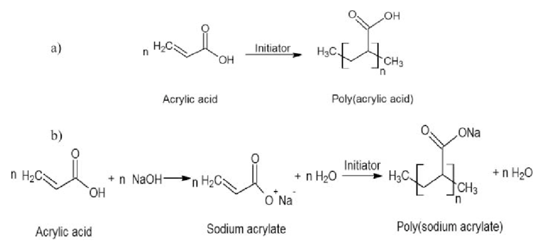

“Life is more fun if you play games.” ― Roald Dahl, My Uncle Oswald

_This fun becomes marvellous when it comes to play with gel blasters. These are also known as gel ball blasters, soft gel guns, gel shooter, gel marker, hydro marker, hydro blaster, water bead blaster or gelsoft, which are a new type of tactical toy that is gaining popularity worldwide. These colourful blasters use water-absorbent polymer balls as ammo instead of plastic bullets or paintballs. This innovative ammo type makes gel blasters an exciting, safe option for outdoor nerf-style play. But are gel blasters just a fad, or are they here to stay as a new form of competitive shooting sport? Let's take a look at the science behind gel blaster ammo and the pros and cons of this chemistry-inspired toy._

⁕ ⁕ ⁕

## Origin of Gel Blasters
Gel ball blasters were first introduced in China as a substitute for airsoft guns, which have been banned in the country since 2008. They were also seen as a better alternative to foam dart guns. Gel ball blasters have since become increasingly popular in other countries with airsoft-unfriendly laws, such as Malaysia, Vietnam, and Australia. In Australia, they quickly gained a large following among enthusiasts.

## Design & Its Evolution
Gel ball blasters closely resemble airsoft guns, using a coil spring-loaded piston air pump to shoot gel beads. They can be manually cocked or driven by an electric motor-gearbox powered by batteries, similar to AEGs in airsoft. The gel beads' unique properties, such as their light weight and larger size, result in lower muzzle velocity, making them safer and less likely to cause property damage. Gel beads are affordable, easy to transport, and require minimal preparation. 

Early designs had top-mounted hoppers, but the latest design, introduced in late 2016, features bottom-mounted magazines with built-in motors for a more realistic and popular gameplay experience. In early 2020, the "Kublai P1" was introduced as a gas-powered gel ball blaster, resembling a Glock pistol and utilizing gas blowback technology like airsoft pistols. It uses [refrigerant gas](https://en.wikipedia.org/wiki/Refrigerant_gas) or propane to charge a gas canister within a spring-follower magazine, and various manufacturers have since released their own versions of gas blowback pistols.

## Different Types of Gel Blasters
### Pistol: 

Gel Blaster Pistol

Gel blaster pistols offer a compact and lightweight design, providing easy handling and portability. However, they sacrifice some range and speed compared to other types, usually having an effective range of around 65 feet and firing gel balls at speeds up to 150 Feet Per Second (FPS). Their smaller magazine capacity makes them ideal for quick maneuvering but may require more frequent reloading.

### Rifle: 

Gel Blaster Rifle

Rifles are the largest and require more effort to aim compared to pistols. Despite their reduced portability, they excel in both range and speed. With an average effective range exceeding 80 feet and firing speeds reaching around 250 FPS (some models even reaching 300 FPS), rifles are suitable for players who prioritize accuracy and hitting targets at longer distances.

### Sub-machine gun (SMG): 

Gel Blaster sub-machine gun (SMG)

Gel blaster sub-machine guns are a balance between pistols and rifles, offering full automatic fire and enhanced portability. Their compact size is advantageous in close-quarter battles, while still maintaining a firing speed similar to rifles at approximately 250 FPS. Additionally, SMGs boast the largest magazine capacity among all blaster types, making them suitable for sustained fire during intense gameplay.

## Where You Can Buy One & Its Approximate Price
The best place is to buy from online. Here are some few websites from where you can get yours-  
• [tactoys.com](https://www.tactoys.com/)  
• [amazon](https://www.amazon.com/)  
• [getblaster.com](https://gelblaster.com/)  
• [gelblastergun.com](https://gelblastergun.com/)

Depending on the type and popularity its price can be from $20 to $200. However, you will always want to add some accessories and tactical gears which can be in between $10 and 450.

## Is Gel Blaster Gun Safe to Play With?
Gel blaster guns are generally safer than airsoft or paintball guns, but they still carry risks. They can cause injuries, especially if sensitive areas like the eyes or ears are hit. To ensure safety, always wear eye protection, avoid shooting at the face, use appropriate safety clothing, and follow local laws and regulations. Keep the gun unloaded when not in use and use only approved gel balls. Additionally, keep the gun away from children and use it responsibly under adult supervision.

⁕ ⁕ ⁕

## Not the Gun, But the Gel
As a chemist, we are more interested in the polymer used as the ammo, isn't it? - and this article is mainly about that. I can't find a single article discussing about this thing - so, here is the one. 
### What Is It Actually?
The polymer used as the ammo in the gel blasters is sodium polyacrylate, also known as **waterlock**. It is a sodium salt of polyacrylic acid with the chemical formula [−CH₂−CH(CO₂Na)−]ₙ. The IUPAC name of this polymer is **poly(sodium prop-2-enoate)**. The chemical structure of this polymer is as follows-

Sodium Polyacrylate chemical structure

### History
In the 1960s, the U.S. Department of Agriculture (USDA) developed super-absorbent polymers (SAP) like sodium polyacrylate. These polymers could retain hundreds of times their weight in water, far more than fiber-based materials like tissue paper or cotton, which could only hold 20 times their weight. The USDA aimed to improve water conservation in soil through this technology. Companies like Dow Chemical, Hercules, General Mills Chemical, and DuPont were early adopters of this innovation. 

### Synthesis
With the help of initiator, NaOH and right pH of the solution sodium polyacrylate can be synthesized¹. The reaction path is described in the following schematic diagram-

Schematic representation of sodium polyacrylate synthesis.

### Applications
**Consumer Products**  
Sodium polyacrylate is used as an absorbent and thickener in diapers, feminine hygiene products, and agriculture to absorb fluids, prevent leakage and rashes, and help soil retain moisture.

**Industrial Applications**  
In the petroleum industry, sodium polyacrylate is used as a drilling fluid for its viscosity and lubricating properties. It also coats wires as an insulator against moisture damage.

**Environmental Remediation**  
It can absorb and extract heavy metal pollutants from wastewater through a process that allows the metals to be recycled.

**Drug Delivery**  
Recent research shows promise for sodium polyacrylate microcapsules to protect and deliver probiotics through the harsh acidic conditions of the digestive system.

## References
[1] Khanlari, Samaneh & Dubé, Marc. (2015). Effect of pH on Poly(acrylic acid) Solution Polymerization. Journal of Macromolecular Science. 52. 10.1080/10601325.2015.1050628. 

[2] [Wikipedia](https://en.wikipedia.org/wiki/Gel_blaster)

[3] "History of Super Absorbent Polymer Chemistry | M² Polymer Technologies Inc". | M² Polymer Technologies Inc. 21 February 2019. Retrieved 26 April 2020.

⁕ ⁕ ⁕

Thank you for reading.

I hope you found this **_“Gel Blaster: Should You Have Fun with This Colourful Chemistry?”_** article helpful. Please share if you like and leave any comment to let me know your thoughts. Also, subscribe to my **Newsletter** to get notification of my latest posts.

You can connect with me on <i><b><a href="https://www.linkedin.com/in/aritraroy24/" target="_blank">LinkedIn</a></b></i>, <i><b><a href="https://twitter.com/royaritra24" target="_blank">Instagram</a></b></i>, <i><b><a href="https://twitter.com/aritraroy24" target="_blank">Twitter</a></b></i> or <i><b><a href="https://github.com/aritraroy24" target="_blank">GitHub</a></b></i>.

