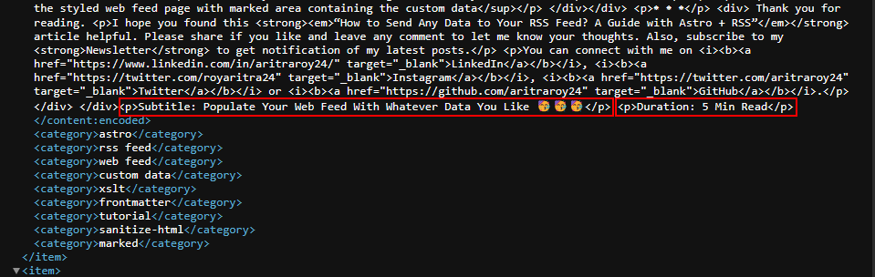
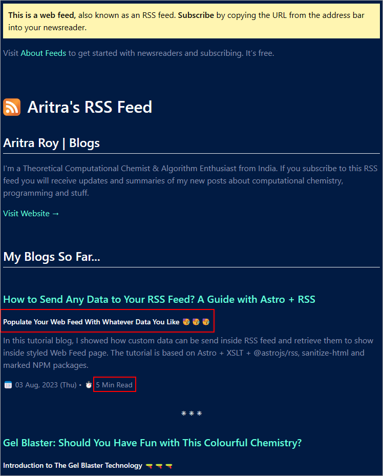
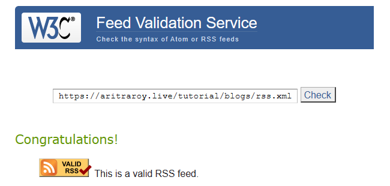

<div>

<div class="biggerParagraph">
“What's on your newsfeed is feeding your mind.” ― Jay Shetty, Think Like a Monk: Train Your Mind for Peace and Purpose Every Day
</div>

_<span style="font-size:30px;">S</span>ocial media newsfeeds aim to maximize engagement, often prioritizing popular content over educational value. In contrast, a customized RSS feed allows you to selectively subscribe to sources that enrich your mind with substantive ideas. By carefully curating thought-provoking sources aligned to your interests, an RSS feed provides focused knowledge to stimulate intellectual curiosity. Tailoring your RSS feed with enlightening sources fuels personal growth by making the most of your limited time._

Not only this, but also if you have a personal website with an RSS feed, it can help you stand out from the crowd in many ways. Having an RSS feed allows more frequent and efficient content indexing by search engines, establishes freshness signals, and improves website crawling - all beneficial for SEO. Furthermore, by curating an RSS feed with engaging topical content on your personal site, you can build a loyal audience and earn quality backlinks by getting your content shared and syndicated. In short, maintaining an active RSS feed fuels better SEO and allows personal websites to flourish by reaching the right readers.

I assume that you have a basic knowledge of [Astro](https://astro.build/), one of the fastest growing SSG (not only limited to this now 🤯) and its [Content Collection](https://docs.astro.build/en/guides/content-collections/). So, without further introduction let's jump into the main part ——

<p class="sectionDivider">⁕ ⁕ ⁕</p>

## Valid Parameters in RSS Feed for a Blog Post Item
### Required Parameters
• **title:** title of the blog post

• **description:** description of the post

• **pubDate:** publication date of the blog post

• **link:** link to the blog post

### Optional Parameters
• **categories:** Catergories related to the post in an array

•  **author:** email address of the author of the post

• **commentsUrl:** URL of a web page that contains comments on the item

• **source:** An object that defines the title and url of the original feed for items that have been republished from another source.

• **enclosure:** An object to specify properties for an included media source with three required values: url, length, and type

**See 👉:** [@astrojs/rss Documentation](https://www.npmjs.com/package/@astrojs/rss#rssfeeditem)

## How to Ship Any Data to RSS Feed: The Tutorial
### Important Points to Keep in Mind
• The **customData** variable is used only for passing valid XML attributes like **\<language>en\</language>**, **\<atom:link />** etc. and it can not be passed inside an item tag. In this context, one thing to keep in mind about using customData variable that **`customData variable should be explicitly used here to pass custom valid XML attributes. No other variable xyz or myData etc. can be used here.`**

• Each blog data is parsed inside a **content tag** in the final XML code. So, our custom data should also be inside the post's corresponding content tag.

• Each item has to contain only one content tag. If multiple content tags are passed, only one will be available in the final XML data.

### Deep Diving into the code
#### Frontmatter Structure & Goal
I have several data associated with each of my blog post. The following is my frontmatter of this article --
```javascript
---
isDraft: false
title: "How to Send Any Data to Your RSS Feed? A Guide with Astro + RSS"
subtitle: "Populate Your Web Feed With Whatever Data You Like 🥳🥳🥳"
description: "In this tutorial blog, I showed how custom data can be send inside RSS feed and retrieve them to show inside styled Web Feed page. The tutorial is based on Astro + XSLT + @astrojs/rss, sanitize-html and marked NPM packages."
duration: "8 Min Read"
cover: "./any-data-in-rss.png"
tags: ["astro", "rss feed", "web feed", "custom data", "xslt", "frontmatter", "tutorial", "sanitize-html", "marked"]
pubDate: 2023-08-03
type: "BlogPost"
---
```
Out of all the items in the frontmatter, only title, description, cover image (enclosure), tags and publication date (pubDate) can be send to RSS feed by default. But, I want to send subtitle and duration (readeing time) of the post along with title, description, tags and pubDate, and show them on my styled webfeed page.

#### JavaScript Code to Send Data in RSS Feed
I have used [ES6 template literals](https://developer.mozilla.org/en-US/docs/Web/JavaScript/Reference/Template_literals) to merge all the custom data which should be shipped in the feed. However, before sending the data all of them should be converted to proper HTML syntax using marked and sanitize-html NPM packages. I have also attached a prefix to each of them ('Subtitle: ' and 'Duration: ') The complete javascript code is given below, and you can see, for each item, custom data like subtitle and duration are being passed through **content**--

```javascript
// package import
import rss from '@astrojs/rss';
import sanitizeHtml from 'sanitize-html';
import { marked } from 'marked';

// function import
import { getCollection } from 'astro:content';
import { formatPosts } from '@js/utils'

export async function get(context) {
    const allBlogs = await getCollection("blogs");
    const formattedBlogs = formatPosts(allBlogs);
    return rss({
        xmlns: { atom: "http://www.w3.org/2005/Atom" },
        title: 'Aritra Roy | Blogs',
        description: 'I\'m a Theoretical Computational Chemist & Algorithm Enthusiast from India. If you subscribe to this RSS feed you will receive updates and summaries of my new posts about computational chemistry, programming and stuff.',
        site: context.site,
        author: "Aritra Roy",
        commentsUrl: "https://github.com/aritraroy24/astro-portfolio-comments/discussions",
        source: {
            title: "Aritra Roy | Blog RSS Feed",
            url: "https://aritraroy.live/tutorial/blogs/rss.xml"
        },
        items: formattedBlogs.map((blog) => ({
            title: blog.data.title,
            description: blog.data.description,
            pubDate: blog.data.pubDate,
            link: `/tutorial/blogs/${blog.slug}`,
            categories: blog.data.tags,
            content: `${[sanitizeHtml(marked.parse(blog.body)) + sanitizeHtml(marked.parse("Subtitle: " + blog.data.subtitle)) + sanitizeHtml(marked.parse("Duration: " + blog.data.duration))]}`,
        })),
        customData: `<atom:link href="https://aritraroy.live/tutorial/blogs/rss.xml" rel="self" type="application/rss+xml" />`,
        // stylesheet: '/rss/blog-rss-styles.xsl',
    });
}
```
As of now, the stylesheet (commented out) is not linked to the RSS feed, so that the parsed data can be viewed easily. Following is the screenshot of the content data [custom data is marked with a red rectangle] of this article encoded inside the feed.

<div><div>



<sup>Screenshot of the content section with marked area containing custom data in an unstyled RSS feed</sup>

</div></div>

#### Retrieve Custom Data to Show in Styled Web Feed
Now, we can see our each of the custom data is inside the **\<content:encoded>\</content:encoded>** element under a \<p>\</p> tag of an item. Here, we have to use some logic in our **XSLT** code to get our required data. The steps are like following--

• Storing the whole text of each 𝗰𝗼𝗻𝘁𝗲𝗻𝘁 element of an item inside a variable

• Getting the required value using the 𝘀𝘂𝗯𝘀𝘁𝗿𝗶𝗻𝗴-𝗯𝗲𝗳𝗼𝗿𝗲 and 𝘀𝘂𝗯𝘀𝘁𝗿𝗶𝗻𝗴-𝗮𝗳𝘁𝗲𝗿 functions

**'\<p>Subtitle: '** and **'\<p>Duration: '** are used to get the string after this parameters till a closing **\</p>** tag. Following is the code for all items --
```xml
<xsl:for-each select="/rss/channel/item">
<xsl:variable name="allContent" select="*[name()='content:encoded']" />
<div class="py-5">
    <h3 class="mb-0">
    <a target="_blank">
        <xsl:attribute name="href">
        <xsl:value-of select="link" />
        </xsl:attribute>
        <xsl:value-of select="title" />
    </a>
    </h3>
    <h5 class="text-white">
    <xsl:value-of
        select="substring-before(substring-after($allContent, '&lt;p&gt;Subtitle: '), '&lt;&#47;p&gt;')" />
    </h5>
    <p class="text-gray blog-description">
    <xsl:value-of select="description" />
    </p>
    <small class="text-gray">
    <xsl:variable name="pubDate" select="substring(pubDate, 6, 11)" /> 📅 <xsl:value-of
        select="concat(substring($pubDate, 1, 2), ' ', substring($pubDate, 4, 3), ', ', substring(pubDate, 12, 5), ' (', substring(pubDate, 1, 3), ')')" />
    • ⏱️ <xsl:value-of
        select="substring-before(substring-after($allContent, '&lt;p&gt;Duration: '), '&lt;&#47;p&gt;')" />
    </small>
</div>
<div class="width-full d-flex flex-justify-center flex-items-center">
    <smalll class="text-white">⁕ ⁕ ⁕</smalll>
</div>
</xsl:for-each>
```
Some headings, website description and styles are added later on which can be found in [this GitHub gist](https://gist.github.com/aritraroy24/e50f9f7135ecddda1206396033225b18).

#### Final View & Feed Validation
A screenshot of the styled web feed page is given below, and the red rectangular areas are indicating custom data (subtitle and duration) appeared on the page. However, the complete styled RSS feed page can be viewed on [my website](https://aritraroy.live/tutorial/blogs/rss.xml).
<div><div>



<sup>Screenshot of the styled web feed page with marked area containing the custom data</sup>

</div></div>

Now, it's time for feed validation, and for that I used [W3C Feed Validation Service](https://validator.w3.org/feed/). And yes, you gussed it right, my feed is valid--

<div><div>
<a href="http://validator.w3.org/check.cgi?url=https%3A//aritraroy.live/tutorial/blogs/rss.xml">

</a>
<sup>Screenshot of feed validation from W3C Feed Validation Service</sup>

</div></div>

<p class="sectionDivider">⁕ ⁕ ⁕</p>

<div class="citationBlockquote">
Thank you for reading.

I hope you found this **_“How to Send Any Data to Your RSS Feed? A Guide with Astro + RSS”_** article helpful. Please share if you like and leave any comment to let me know your thoughts. Also, subscribe to my **Newsletter** to get notification of my latest posts.

You can connect with me on <i><b><a href="https://www.linkedin.com/in/aritraroy24/" target="_blank">LinkedIn</a></b></i>, <i><b><a href="https://twitter.com/royaritra24" target="_blank">Instagram</a></b></i>, <i><b><a href="https://twitter.com/aritraroy24" target="_blank">Twitter</a></b></i> or <i><b><a href="https://github.com/aritraroy24" target="_blank">GitHub</a></b></i>.

</div>

</div>