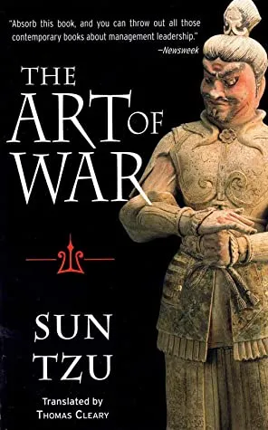

## 1. The 7 Habits of Highly Effective People

The 7 Habits of Highly Effective People by Stephen Covey

**Writer:** Stephen Covey

**1ˢᵗ Publishing Year:** 1989

This famous self-help book has sold more than 25 million copies worldwide. Covey’s 7 habits are: be proactive, begin with the end in mind, put first things first, think win-win, seek first to understand, then to be understood, synergize, and sharpen the saw. This book is a guide to personal and professional development, and it encourages the reader to take responsibility for their own lives and make the right choices to create the life they want.

👉 Buy from [Amazon](https://amzn.to/3D75AtH)

## 2. Think and Grow Rich

Think and Grow Rich by Napoleon Hill

**Writer:** Napoleon Hill

**1ˢᵗ Publishing Year:** 1937

This book is considered a classic in the field of personal development. Hill’s book is based on the idea that our thoughts and beliefs shape our reality and that by changing our thoughts and opinions, we can change our reality. He describes a specific method for developing the right mind, which he calls “Mastermind”, and offers practical advice for success in any field.

👉 Buy from [Amazon](https://amzn.to/3WsZaMA)

## 3. The Power of Now

The Power of Now by Eckhart Tolle

**Writer:** Eckhart Tolle

**1ˢᵗ Publishing Year:** 1999

This book became a bestseller and is considered a classic in the field of spiritual development. Tolle’s book encourages the reader to live in the moment and let go of the past and the future. It teaches that the present is the only place where true power resides and that we can find peace, happiness and contentment by living in the present by living in the present.

👉 Buy from [Amazon](https://amzn.to/3HpV5Ek)

## 4. The Power of Now

The 4-Hour Workweek by Timothy Ferriss

**Writer:** Timothy Ferriss

**1ˢᵗ Publishing Year:** 2007

This book is a guide to getting more freedom and changes in your life through shopping and lifestyle. Ferriss offers practical advice on starting a business, outsourcing and managing your finances, as well as strategies for living a healthy and fulfilling life.

👉 Buy from [Amazon](https://amzn.to/3iVhLD5)

## 5. The 5 Love Languages

The 5 Love Languages by Gary Chapman

**Writer:** Gary Chapman

**1ˢᵗ Publishing Year:** 1992

This book is a guide to understanding and improving communication and relationships. Chapman describes five different “love languages” that people use to show and receive love: words of affirmation, actions, receiving gifts, quality time, and physical touch. She encourages readers to get to know their own love languages ​​and the love languages ​​of their partners and use this knowledge to improve their relationships.

👉 Buy from [Amazon](https://amzn.to/3XRb6IU)

## 6. The Art of war

The Art of war by Sun Tzu

**Writer:** Sun Tzu

**1ˢᵗ Publishing Year:** 2014

The Art of war, a former Chinese agreement, is considered classic, planned and direct. Sun Tzu's book is led to winning the war and the related plan and method. Its principles have been applied in business, sports and personal development, enabling a deeper understanding of the nature of power and conflict.

👉 Buy from [Amazon](https://amzn.to/3ZTLXiJ)

## 7. The Power of Positive Thinking

The Power of Positive Thinking by Norman Vincent Peale

**Writer:** Norman Vincent Peale

**1ˢᵗ Publishing Year:** 1952

This book is a classic in positive psychology. Pea scriptures are directions to develop the correct thinking essential to success in life. It offers practical advice to develop positive conditions, such as seeing the check and its conviction and encourages the reader to believe in their own rights.

👉 Buy from [Amazon](https://amzn.to/3QX8LKa)

## 8. The Secret

The Secret by Rhonda Byrne

**Writer:** Rhonda Byrne

**1ˢᵗ Publishing Year:** 2006

This book is a guide to building passion and how to use it to create the life you want. Byrne’s book focuses on the fact that our thoughts and feelings create our reality, and by focusing on positive thoughts and feelings, we can attract positive experiences into our lives. It offers practical tips for using the Law of Attraction in all areas of life, including health, finances, and relationships.

👉 Buy from [Amazon](https://amzn.to/3ZP2c0B)

## 9. The Power of Intention

The Power of Intention by Wayne Dyer

**Writer:** Wayne Dyer

**1ˢᵗ Publishing Year:** 2006

This book is a guide to using the power of intention to create the life you want. Dyer teaches that intention is a force that can be harnessed to manifest our desires, and by creating clear, positive goals, we can attract positive experiences and results in our lives. It offers practical advice on setting goals and provides exercises to develop the ability to manifest our desires.

👉 Buy from [Amazon](https://amzn.to/3iQ2bJa)

## 10. Man's Search For Meaning

Man’s Search For Meaning by Viktor Frankl

**Writer:** Viktor Frankl

**1ˢᵗ Publishing Year:** 1946

This book is a memoir of Viktor Frankl’s experiences as a Holocaust survivor and psychic. Frankl’s book is a powerful exploration of the human capacity for resilience and the search for meaning in the face of suffering. It teaches that our ability to find purpose in our lives is the key to our survival and that we can overcome even the most difficult situations by finding our purpose.

👉 Buy from [Amazon](https://amzn.to/3WoRc76)

⁕ ⁕ ⁕

Finally, these books are essential for anyone who wants to improve themselves, whether in their professional or personal life. They provide readers with a variety of ideas, techniques, and strategies that can be applied in various areas of life. These books have stood the test of time and have helped millions of people live more fulfilling lives.

⁕ ⁕ ⁕

Thank you for reading.

I hope you found this **_“Top 10 Must-Read Self-Help Books for Personal and Professional Development in 2023”_** article helpful. Please share if you like and leave any comment to let me know your thoughts.

You can connect with me on <i><b><a href="https://www.linkedin.com/in/aritraroy24/" target="_blank">LinkedIn</a></b></i>, <i><b><a href="https://twitter.com/royaritra24" target="_blank">Instagram</a></b></i>, <i><b><a href="https://twitter.com/aritraroy24" target="_blank">Twitter</a></b></i> or <i><b><a href="https://github.com/aritraroy24" target="_blank">GitHub</a></b></i>.

