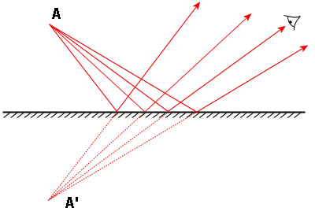
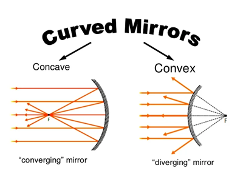

“Good morning, mirror! Where’s your smile?” ― Lana M. Rochel, Kill Your Darlings: Long Poem

_Whether the mirror smiles or not, definitely at some point in our lives we either smiled or cried in front of it. Mirrors are simple yet fascinating devices that have been used for centuries. In this blog, we'll explore the fascinating world of mirrors, delving into the physics behind their reflection and the different types available. Mirrors are objects that reflect light in a way that creates an image of the object in front of them. Get ready to reflect on the science of mirrors!_

⁕ ⁕ ⁕

## Origin of the Word 'Mirror'

The word "mirror" has an interesting origin. It comes from the Latin word "mirus," which means "remarkable" or "wondrous." This Latin word can be traced back to the Proto-Indo-European root "\*smei(h₂)-," which means "to laugh" and is also the root of the English word "smile." From the Latin "mirus," we get the words "miraculum" (meaning "wonder" or "miracle") and "mirari" (meaning "to wonder at").

These words then became "mirer" in Old French (and "mirar" in Spanish), meaning "to look at." The Old French word "mireor" (Modern French "miroir") meant "a thing that one looks at," eventually leading to the Middle English word "mirour" and finally the Modern English word "mirror."

So, the word "mirror" ultimately comes from an ancient root related to laughter and wonderment, reflecting the idea of something remarkable or wondrous to behold [1].

## Types of Mirror

The physics behind mirrors involves the principles of reflection and refraction. When light hits a smooth surface, it bounces off at the same angle as it hit the surface. This is known as the law of reflection [3]. And based on the the reflection, there are two main types of mirrors: plane mirrors and curved mirrors.

### Plane Mirror

These are flat mirrors that reflect light in a straight line. They produce an image that is the same size as the object and appears to be the same distance behind the mirror as the object is in front of it [2].

Plane mirror [Image source: Wikipedia]

### Curved Mirror

These mirrors have a curved surface and can be either concave or convex. Concave mirrors are curved inwards, while convex mirrors are curved outwards.

#### Concave Mirror

These mirrors reflect light inwards, creating a focused image. The image can be real (formed by actual rays of light) or virtual (formed by the apparent intersection of reflected rays). As they tend to collect and refocus parallel incoming rays of light toward a focus point, they are also called converging mirrors. This is due to the light being reflected at different angles at different spots on the mirror, as the normal (perpendicular line) to the mirror surface varies across the curved shape. The rays hitting the outer edges reflect at steeper angles compared to those near the center, causing the reflected rays to converge or come together at the focus in front of the mirror.

#### Convex Mirror

A convex mirror, also known as a diverging mirror, is a curved mirror with a reflective surface that bulges outwards, towards the light source. These mirrors possess a unique property – they reflect light outwards, preventing them from being used to focus light. Unlike converging mirrors, convex mirrors always form a virtual image, as the focal point (F) and the center of curvature (2F) are imaginary points located "inside" the mirror, rendering them unreachable.

Consequently, images formed by convex mirrors cannot be projected onto a screen since the image lies within the mirror itself. Interestingly, the image produced is smaller than the object, but as the object moves closer to the mirror, the image size increases. This characteristic of convex mirrors finds practical applications in various scenarios where a wider field of view is desired, such as rear-view mirrors in vehicles [4].

Curved mirror diagrams: concave and convex [Image source: peda.net]

## Applications of Mirrors

Mirrors have numerous applications in various fields, including:

**Optics and Telescopes:** Concave and convex mirrors are used in telescopes and other optical instruments to focus or diverge light.

**Decorative Purposes:** Plane mirrors are commonly used for decorative purposes in homes and buildings.

**Automotive Industry:** Convex mirrors are used as side-view mirrors in vehicles to provide a wider field of view.

**Solar Energy:** Concave mirrors are used in solar energy systems to concentrate sunlight onto a small area.

## Bonus: Chemistry Behind Mirror Production

While the main focus of this blog is on the physics of mirrors, it's worth mentioning the chemistry involved in their production. Mirrors are typically made by depositing a thin layer of a reflective material, such as aluminum or silver, onto a flat surface made of glass. This process is known as silvering or aluminizing. Finally, a layer of copper is added for durability and paint is applied to protect the metal coating from damage before the mirror is acid washed and heat treated to complete the manufacturing process [5].

## Conclusion

Mirrors are fascinating objects that not only reflect our physical appearance but also demonstrate the principles of optics and physics. From plane mirrors to curved mirrors, each type serves a unique purpose and has its own set of applications. Whether you're admiring your reflection or using a mirror in scientific or decorative applications, remember to appreciate the physics behind these optical wonders.

⁕ ⁕ ⁕

## References

[1] [Reddit thread](https://www.reddit.com/r/etymology/comments/5fsjnr/comment/damvnzr/?utm_source=share&utm_medium=web3x&utm_name=web3xcss&utm_term=1&utm_content=share_button)

[2] [Plane Mirror: Wikipedia](https://en.wikipedia.org/wiki/Plane_mirror)

[3] [How Mirrors Work](https://science.howstuffworks.com/innovation/everyday-innovations/mirror2.htm)

[4] [Curved Mirror: Wikipedia](https://en.wikipedia.org/wiki/Curved_mirror)

[5] [How Mirrors Are Made - Then And Now](https://www.mirror-shop.co.uk/how-mirrors-are-made.irs#:~:text=Modern%20mirrors%20are%20largely%20produced,not%20bond%20directly%20with%20glass.)

⁕ ⁕ ⁕

Thank you for reading.

I hope you found this **_“Unveiling the Magic of Mirrors: A Reflection on Optical Wonders”_** article helpful. Please share if you like and leave any comment to let me know your thoughts. Also, subscribe to my **Newsletter** to get notification of my latest posts.

You can connect with me on <i><b><a href="https://www.linkedin.com/in/aritraroy24/" target="_blank">LinkedIn</a></b></i>, <i><b><a href="https://twitter.com/royaritra24" target="_blank">Instagram</a></b></i>, <i><b><a href="https://twitter.com/aritraroy24" target="_blank">Twitter</a></b></i> or <i><b><a href="https://github.com/aritraroy24" target="_blank">GitHub</a></b></i>.

